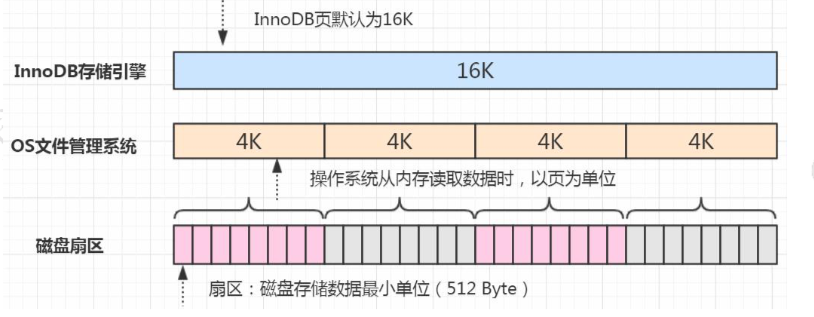
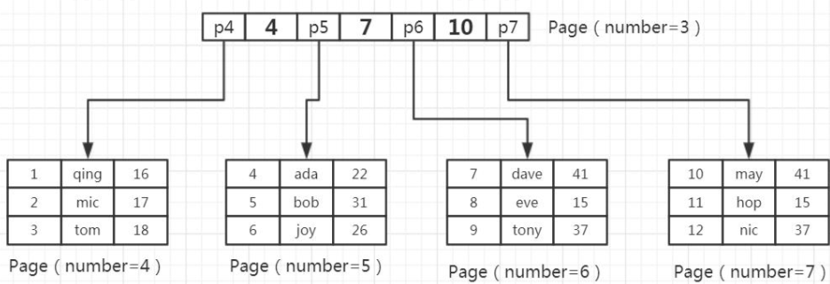
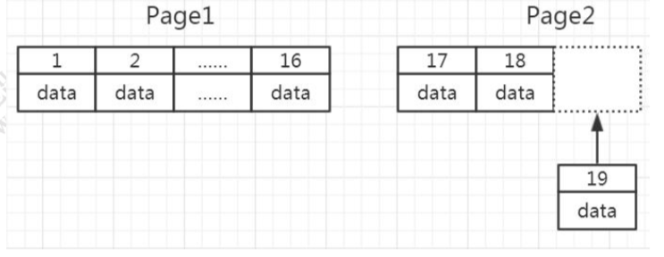
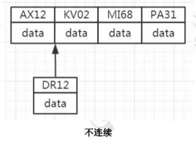

# InnoDB 逻辑存储结构

MySQL 的存储结构分为 5 级:表空间、段、簇、页、行。


## 表空间(Table Space)

表空间可以看做是 InnoDB 存储引擎逻辑结构的 最高层，所有的数据都存放在表空间中。分为:系统表空间、独占表空间、通用表空间、 临时表空间、Undo 表空间。

## 段 Segment

表空间是由各个段组成的，常见的段有

- 数据段、
- 索引段、
- 回滚段等，

段是一个逻辑 的概念。一个 ibd 文件(独立表空间文件)里面会由很多个段组成。

创建一个索引会创建两个段

- 一个是索引段:leaf node segment，索引段管理非叶子节点的数据。
- 一个是数据段: non-leaf node segment。数据段管理叶子节点的数据。

 也就是说，一个表的段数，就是索引的个数乘以 2。

## 簇 Extent

一个段(Segment)又由很多的簇(也可以叫区)组成，每个区的大小是 1MB(64 个连续的页)。
每一个段至少会有一个簇，一个段所管理的空间大小是无限的，可以一直扩展下去， 但是扩展的最小单位就是簇。

## 页 Page

为了高效管理物理空间，对簇进一步细分，就得到了页。簇是由连续的页(Page) 组成的空间，一个簇中有 64 个连续的页。 (1MB/16KB=64)。这些页面在物理上和 逻辑上都是连续的。

跟大多数数据库一样，InnoDB 也有页的概念(也可以称为块)，每个页默认 16KB。 页是 InnoDB 存储引擎磁盘管理的最小单位，通过` innodb_page_size `设置。

一个表空间最多拥有 2^32 个页，默认情况下一个页的大小为 16KB，也就是说一个 表空间最多存储 `64TB` 的数据。

注意，文件系统中，也有页的概念。

操作系统和内存打交道，最小的单位是页 Page。文件系统的内存页通常是 4K。



查看页大小

```
SHOW VARIABLES LIKE 'innodb_page_size';
```

假设一行数据大小是 1K，那么一个数据页可以放 16 行这样的数据。

举例:一个页放 3 行数据。



往表中插入数据时，如果一个页面已经写完，产生一个新的叶页面。如果一个簇的 所有的页面都被用完，会从当前页面所在段新分配一个簇。

如果数据不是连续的，往已经写满的页中插入数据，会导致叶页面分裂:

连续



不连续



#### 行 Row

InnoDB 存储引擎是面向行的(row-oriented)，也就是说数据的存放按行进行存 放。

https://dev.mysql.com/doc/refman/5.7/en/innodb-row-format.html

- `Antelope[ˈæntɪləʊp`](羚羊)(羚羊)是 InnoDB 内置的文件格式，有两种行格式: REDUNDANT[rɪˈdʌndənt] Row Format
  COMPACT Row Format(5.6 默认)
- Barracuda[ˌbærəˈkjuːdə](梭子鱼)是 InnoDB Plugin 支持的文件格式，新增了 两种行格式:

DYNAMIC Row Format(5.7 默认)


- innodb_file_format 在配置文件中指定;

- row_format 则在创建数据表时指定。

```
show variables like "%innodb_file_format%"; 
SET GLOBAL innodb_file_format=Barracuda;
```

在创建表的时候可以指定行格式。

```
CREATE TABLE tf1
(c1 INT PRIMARY KEY) ROW_FORMAT=COMPRESSED KEY_BLOCK_SIZE=8;
```

查看行格式:

```
SHOW TABLE STATUS LIKE 'student' \G;
```

