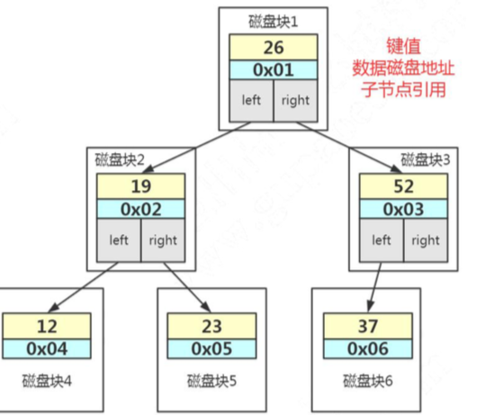

# 索引

**查看数据和索引的大小**

```sql
select
CONCAT(ROUND(SUM(DATA_LENGTH/1024/1024),2),'MB') AS data_len,
CONCAT(ROUND(SUM(INDEX_LENGTH/1024/1024),2),'MB') as index_len 
from
information_schema.TABLES
where table_schema='notes' and table_name='user_innodb';
```


当我们用树的结构来存储索引的时候，访问一个节点就要跟磁盘之间发生一次 IO。 InnoDB 操作磁盘的最小的单位是一页(或者叫一个磁盘块)，大小是 16K(16384 字节)。

那么，一个树的节点就是 16K 的大小。

如果我们一个节点只存一个键值+数据+引用，例如整形的字段，可能只用了十几个 或者几十个字节，它远远达不到 16K 的容量，所以访问一个树节点，进行一次 IO 的时候， 浪费了大量的空间。

所以如果每个节点存储的数据太少，从索引中找到我们需要的数据，就要访问更多 的节点，意味着跟磁盘交互次数就会过多。

如果是机械硬盘时代，每次从磁盘读取数据需要 10ms 左右的寻址时间，交互次数 越多，消耗的时间就越多。



比如上面这张图，我们一张表里面有 6 条数据，当我们查询 id=37 的时候，要查询两个子节点，就需要跟磁盘交互 3 次，如果我们有几百万的数据呢?这个时间更加难以 估计。

**解决方案**

- **让每个节点存储更多的数据。**
- 节点上的关键字的数量越多，我们的指针数也越多，也就是意味着可以有更多的分叉(我们把它叫做“路数”)。

因为分叉数越多，树的深度就会减少(根节点是 0),这样，我们的树是不是从原来的高瘦高瘦的样子，变成了矮胖矮胖的样子?

这个时候，我们的树就不再是二叉了，而是多叉，或者叫做多路。