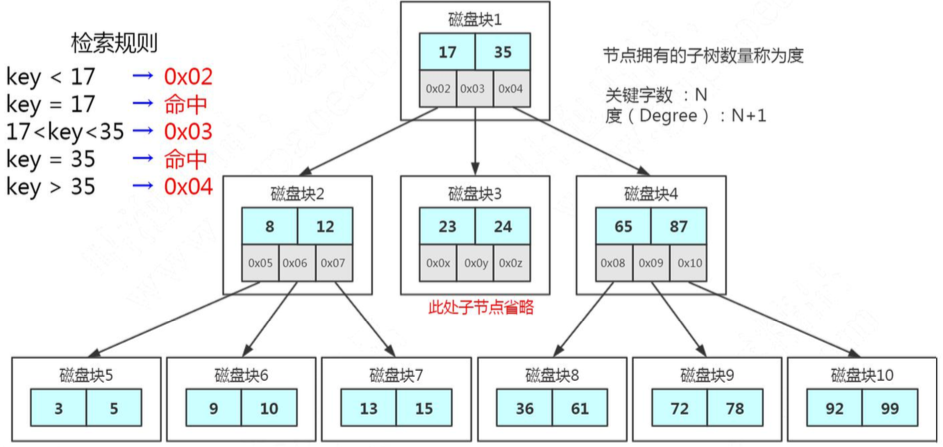

# 多路平衡查找树(B Tree)(分裂、合并)

Balanced Tree
这个就是我们的多路平衡查找树，叫做 B Tree(B 代表平衡)。
跟 AVL 树一样，B 树在枝节点和叶子节点存储键值、数据地址、节点引用。

它有一个特点:**分叉数(路数)永远比关键字数多 1。**

比如我们画的这棵树，每个节
点存储两个关键字，那么就会有三个指针指向三个子节点。

B Tree 的查找规则是什么样的呢? 比如我们要在这张表里面查找 15。

- 因为 15 小于 17，走左边。
- 因为 15 大于 12，走右边。
- 在磁盘块 7 里面就找到了 15，只用了 3 次 IO。

https://www.cs.usfca.edu/~galles/visualization/Algorithms.html

比如 Max Degree(路数)是 3 的时候，我们插入数据 1、2、3，在插入 3 的时候， 本来应该在第一个磁盘块，但是如果一个节点有三个关键字的时候，意味着有 4 个指针， 子节点会变成 4 路，所以这个时候必须进行分裂。把中间的数据 2 提上去，把 1 和 3 变 成 2 的子节点。

如果删除节点，会有相反的合并的操作。

注意这里是分裂和合并，跟 AVL 树的左旋和右旋是不一样的。

我们继续插入 4 和 5，B Tree 又会出现分裂和合并的操作。

从这个里面我们也能看到，在更新索引的时候会有大量的索引的结构的调整，所以 解释了为什么我们不要在频繁更新的列上建索引，或者为什么不要更新主键。

节点的分裂和合并，其实就是 InnoDB 页的分裂和合并。