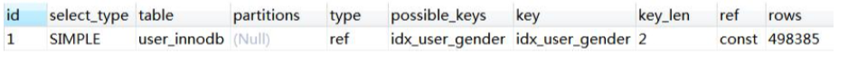
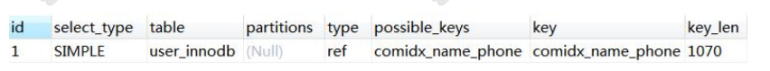
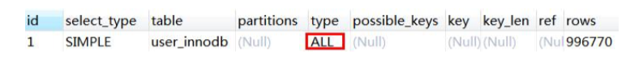
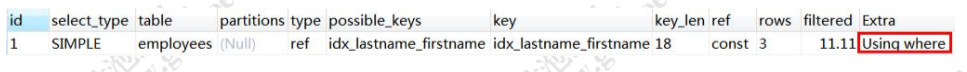
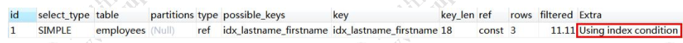

# 索引使用原则

我们容易有以一个误区，就是在经常使用的查询条件上都建立索引，索引越多越好， 那到底是不是这样呢?

- **建立索引，要使用离散度(选择度)更高的字段。**
-  **联合索引最左匹配**
- 覆盖索引
-  索引条件下推(ICP)

## 列的离散(sàn)度

第一个叫做列的离散度，我们先来看一下列的离散度的公式:

```
count(distinct(column_name)) : count(*)，
```

列的全部不同值和所有数据行的比例。 数据行数相同的情况下，分子越大，列的离散度就越高。

**简单来说，如果列的重复值越多，离散度就越低，重复值越少，离散度就越高。**

了解了离散度的概念之后，我们再来思考一个问题，我们在 name 上面建立索引和 在 gender 上面建立索引有什么区别。

当我们用在 gender 上建立的索引去检索数据的时候，由于重复值太多，需要扫描的 行数就更多。例如，我们现在在 gender 列上面创建一个索引，然后看一下执行计划。

```
ALTER TABLE user_innodb DROP INDEX idx_user_gender;
ALTER TABLE user_innodb ADD INDEX idx_user_gender (gender); -- 耗时比较久 EXPLAIN SELECT * FROM `user_innodb` WHERE gender = 0;
```



```
show indexes from user_innodb;
```

而 name 的离散度更高，比如“青山”的这名字，只需要扫描一行。

```
ALTER TABLE user_innodb DROP INDEX idx_user_name; ALTER TABLE user_innodb ADD INDEX idx_user_name (name); EXPLAIN SELECT * FROM `user_innodb` WHERE name = '青山';
```

查看表上的索引，Cardinality [kɑ:dɪ'nælɪtɪ] 代表基数，代表预估的不重复的值的数量。索引的基数与表总行数越接近，列的离散度就越高。

```
show indexes from user_innodb;
```

如果在 B+Tree 里面的重复值太多，MySQL 的优化器发现走索引跟使用全表扫描差不了多少的时候，就算建了索引，也不一定会走索引。

##  联合索引最左匹配

前面我们说的都是针对单列创建的索引，但有的时候我们的多条件查询的时候，也 会建立联合索引。单列索引可以看成是特殊的联合索引。

比如我们在 user 表上面，给 name 和 phone 建立了一个联合索引。

```sql
ALTER TABLE user_innodb DROP INDEX comidx_name_phone;
ALTER TABLE user_innodb add INDEX comidx_name_phone (name,phone);
```


联合索引在 B+Tree 中是复合的数据结构，它是按照从左到右的顺序来建立搜索树的 (name 在左边，phone 在右边)。

从这张图可以看出来，name 是有序的，phone 是无序的。当 name 相等的时候， phone 才是有序的。

这个时候我们`使用 where name= '青山' and phone = '136xx '`去查询数据的时候， B+Tree 会优先比较 name 来确定下一步应该搜索的方向，往左还是往右。如果 name 相同的时候再比较 phone。

但是如果查询条件没有 name，就不知道第一步应该查哪个 节点，因为建立搜索树的时候 name 是第一个比较因子，所以用不到索引。

## 什么时候用到联合索引

 所以，我们在建立联合索引的时候，一定要把最常用的列放在最左边。
 比如下面的三条语句，能用到联合索引吗?

- 使用两个字段，可以用到联合索引:

```
EXPLAIN SELECT * FROM user_innodb WHERE name= '权亮' AND phone = '15204661800';
```



- 使用左边的 name 字段，可以用到联合索引:

```
EXPLAIN SELECT * FROM user_innodb WHERE name= '权亮'
```


- 使用右边的 phone 字段，无法使用索引，全表扫描:

```
EXPLAIN SELECT * FROM user_innodb WHERE phone = '15204661800'
```



## 如何创建联合索引

两个查询很慢:

```
SELECT * FROM user_innodb WHERE name= ? AND phone = ?; 
SELECT * FROM user_innodb WHERE name= ?;
```

按照我们的想法，一个查询创建一个索引，所以我们针对这两条 SQL 创建了两个索 引，这种做法觉得正确吗?

```
CREATE INDEX idx_name on user_innodb(name);
CREATE INDEX idx_name_phone on user_innodb(name,phone);
```

相当于建立了两个联合索引(name),(name,phone)。

如果我们创建三个字段的索引 index(a,b,c)，相当于创建三个索引:

- index(a)
- index(a,b)
- index(a,b,c)

用 where b=? 和 where b=? and c=? 和 where a=? and c=?是不能使用到索引
的。不能不用第一个字段，不能中断。

#### 这里就是 MySQL 联合索引的最左匹配原则。

## 覆盖索引

回表:

> 非主键索引，我们先通过索引找到主键索引的键值，再通过主键值查出索引里面没 有的数据，它比基于主键索引的查询多扫描了一棵索引树，这个过程就叫回表。

```
select * from user_innodb where name = '青山';
```


在辅助索引里面，不管是单列索引还是联合索引，如果 select 的数据列只用从索引 中就能够取得，不必从数据区中读取，这时候使用的索引就叫做覆盖索引，这样就避免 了回表。

```
-- 创建联合索引
ALTER TABLE user_innodb DROP INDEX comixd_name_phone;
ALTER TABLE user_innodb add INDEX `comixd_name_phone` (`name`,`phone`);
```

```
EXPLAIN SELECT name,phone FROM user_innodb WHERE name= '青山'AND phone='13666666666'; 
EXPLAIN SELECT name FROM user_innodb WHERE name= '青山' AND phone = ' 13666666666'; 
EXPLAIN SELECT phone FROM user_innodb WHERE name= '青山' AND phone = ' 13666666666';
```

Extra 里面值为“Using index”代表使用了覆盖索引。


select * ，用不到覆盖索引。

##  索引条件下推(ICP)

https://dev.mysql.com/doc/refman/5.7/en/index-condition-pushdown-optimization.html

再来看这么一张表，在 last_name 和 first_name 上面创建联合索引。

```
drop table employees;
CREATE TABLE `employees` (
`emp_no` int(11) NOT NULL, `birth_date` date NULL, `first_name` varchar(14) NOT NULL,
`last_name` varchar(16) NOT NULL, `gender` enum('M','F') NOT NULL, `hire_date` date NULL,
PRIMARY KEY (`emp_no`)
) ENGINE=InnoDB DEFAULT CHARSET=latin1; ​
alter table employees add index idx_lastname_firstname(last_name,first_name); ​

INSERT INTO `employees` (`emp_no`, `birth_date`, `first_name`, `last_name`,`gender`, `hire_date`) VALUES (10,NULL, '698', 'liu', 'F', NULL);


INSERT INTO `employees` (`emp_no`, `birth_date`, `first_name`, `last_name`,`gender`, `hire_date`) VALUES (1, NULL, 'd99', 'zheng', 'F', NULL);
INSERT INTO `employees` (`emp_no`, `birth_date`, `first_name`, `last_name`,`gender`, `hire_date`) VALUES (2, NULL, 'e08', 'huang', 'F', NULL);
INSERT INTO `employees` (`emp_no`, `birth_date`, `first_name`, `last_name`,`gender`, `hire_date`) VALUES (3, NULL, '59d', 'lu', 'F', NULL);
INSERT INTO `employees` (`emp_no`, `birth_date`, `first_name`, `last_name`,`gender`, `hire_date`) VALUES (4, NULL, '0dc', 'yu', 'F', NULL);
INSERT INTO `employees` (`emp_no`, `birth_date`, `first_name`, `last_name`,`gender`, `hire_date`) VALUES (5, NULL, '989', 'wang', 'F', NULL);
INSERT INTO `employees` (`emp_no`, `birth_date`, `first_name`, `last_name`,`gender`, `hire_date`) VALUES (6, NULL, 'e38', 'wang', 'F', NULL);
INSERT INTO `employees` (`emp_no`, `birth_date`, `first_name`, `last_name`,`gender`, `hire_date`) VALUES (7, NULL, '0zi', 'wang', 'F', NULL);
INSERT INTO `employees` (`emp_no`, `birth_date`, `first_name`, `last_name`,`gender`, `hire_date`) VALUES (8, NULL, 'dc9', 'xie', 'F', NULL);
INSERT INTO `employees` (`emp_no`, `birth_date`, `first_name`, `last_name`,`gender`, `hire_date`) VALUES (9, NULL, '5ba', 'zhou', 'F', NULL);
```

关闭 ICP:

```
set optimizer_switch='index_condition_pushdown=off';
```

查看参数:

```
show variables like 'optimizer_switch';
```

现在我们要查询所有姓 wang，并且名字最后一个字是 zi 的员工，比如王胖子，王 瘦子。查询的 SQL:

```
select * from employees where last_name='wang' and first_name LIKE '%zi' ;
```

这条 SQL 有两种执行方式:

- 根据联合索引查出所有姓 wang 的二级索引数据，然后回表，到主键索引上查询 全部符合条件的数据(3 条数据)。然后返回给 Server 层，在 Server 层过滤出名字以 zi 结尾的员工。
- 根据联合索引查出所有姓 wang 的二级索引数据(3 个索引)，然后从二级索引 中筛选出 first_name 以 zi 结尾的索引(1 个索引)，然后再回表，到主键索引上查询全 部符合条件的数据(1 条数据)，返回给 Server 层。


  很明显，第二种方式到主键索引上查询的数据更少。

注意，索引的比较是在存储引擎进行的，数据记录的比较，是在 Server 层进行的。 而当 first_name 的条件不能用于索引过滤时，Server 层不会把 first_name 的条件传递 给存储引擎，所以读取了两条没有必要的记录。
这时候，如果满足 last_name='wang'的记录有 100000 条，就会有 99999 条没有 必要读取的记录。

执行以下 SQL，Using where:

```
explain select * from employees where last_name='wang' and first_name LIKE '%zi' ;
```



Using Where 代表从存储引擎取回的数据不全部满足条件，需要在 Server 层过滤。

先用 last_name 条件进行索引范围扫描，读取数据表记录，然后进行比较，检查是 否符合 first_name LIKE '%zi' 的条件。此时 3 条中只有 1 条符合条件。

开启 ICP:

```
set optimizer_switch='index_condition_pushdown=on';
```

```
此时的执行计划，Using index condition:
```



把 first_name LIKE '%zi'下推给存储引擎后，只会从数据表读取所需的 1 条记录。

索引条件下推(Index Condition Pushdown)，5.6 以后完善的功能。只适用于二级索引。ICP 的目标是减少访问表的完整行的读数量从而减少 I/O 操作。