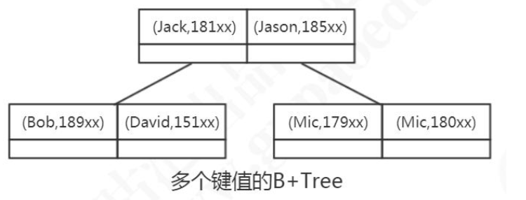
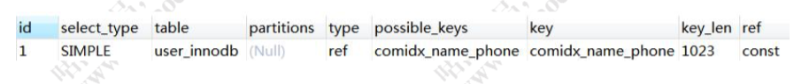

# 索引使用原则

我们容易有以一个误区，就是在经常使用的查询条件上都建立索引，索引越多越好， 那到底是不是这样呢?

- [建立索引,要使用离散度(选择度)更高的字段](#建立索引,要使用离散度(选择度)更高的字段)
- [联合索引最左匹配](#联合索引最左匹配)
- [什么时候用到联合索引](#什么时候用到联合索引)
- [最左匹配原则](#)

## 建立索引,要使用离散度(选择度)更高的字段

第一个叫做列的离散度，我们先来看一下列的离散度的公式:

```
count(distinct(column_name)) : count(*)，
```

列的全部不同值和所有数据行的比例。 数据行数相同的情况下，分子越大，列的离散度就越高。

**简单来说，如果列的重复值越多，离散度就越低，重复值越少，离散度就越高。**

了解了离散度的概念之后，我们再来思考一个问题，我们在 name 上面建立索引和 在 gender 上面建立索引有什么区别。

当我们用在 gender 上建立的索引去检索数据的时候，由于重复值太多，需要扫描的 行数就更多。例如，我们现在在 gender 列上面创建一个索引，然后看一下执行计划。

```
ALTER TABLE user_innodb DROP INDEX idx_user_gender;
ALTER TABLE user_innodb ADD INDEX idx_user_gender (gender); -- 耗时比较久 EXPLAIN SELECT * FROM `user_innodb` WHERE gender = 0;
```

```
show indexes from user_innodb;
```

而 name 的离散度更高，比如“青山”的这名字，只需要扫描一行。

```
ALTER TABLE user_innodb DROP INDEX idx_user_name; ALTER TABLE user_innodb ADD INDEX idx_user_name (name); EXPLAIN SELECT * FROM `user_innodb` WHERE name = '青山';
```

查看表上的索引，Cardinality [kɑ:dɪ'nælɪtɪ] 代表基数，代表预估的不重复的值的数量。索引的基数与表总行数越接近，列的离散度就越高。

```
show indexes from user_innodb;
```

如果在 B+Tree 里面的重复值太多，MySQL 的优化器发现走索引跟使用全表扫描差不了多少的时候，就算建了索引，也不一定会走索引。

##  联合索引最左匹配

前面我们说的都是针对单列创建的索引，但有的时候我们的多条件查询的时候，也 会建立联合索引。单列索引可以看成是特殊的联合索引。

比如我们在 user 表上面，给 name 和 phone 建立了一个联合索引。

```sql
ALTER TABLE user_innodb DROP INDEX comidx_name_phone;
ALTER TABLE user_innodb add INDEX comidx_name_phone (name,phone);
```



联合索引在 B+Tree 中是复合的数据结构，它是按照从左到右的顺序来建立搜索树的 (name 在左边，phone 在右边)。

从这张图可以看出来，name 是有序的，phone 是无序的。当 name 相等的时候， phone 才是有序的。

这个时候我们`使用 where name= '青山' and phone = '136xx '`去查询数据的时候， B+Tree 会优先比较 name 来确定下一步应该搜索的方向，往左还是往右。如果 name 相同的时候再比较 phone。

但是如果查询条件没有 name，就不知道第一步应该查哪个 节点，因为建立搜索树的时候 name 是第一个比较因子，所以用不到索引。

## 什么时候用到联合索引

 所以，我们在建立联合索引的时候，一定要把最常用的列放在最左边。
 比如下面的三条语句，能用到联合索引吗?

- 使用两个字段，可以用到联合索引:

```
EXPLAIN SELECT * FROM user_innodb WHERE name= '权亮' AND phone = '15204661800';
```


- 使用左边的 name 字段，可以用到联合索引:

```
EXPLAIN SELECT * FROM user_innodb WHERE name= '权亮'
```



- 使用右边的 phone 字段，无法使用索引，全表扫描:

```
EXPLAIN SELECT * FROM user_innodb WHERE phone = '15204661800'
```


#### 如何创建联合索引

两个查询很慢:

```
SELECT * FROM user_innodb WHERE name= ? AND phone = ?; 
SELECT * FROM user_innodb WHERE name= ?;
```

按照我们的想法，一个查询创建一个索引，所以我们针对这两条 SQL 创建了两个索 引，这种做法觉得正确吗?

```
CREATE INDEX idx_name on user_innodb(name);
CREATE INDEX idx_name_phone on user_innodb(name,phone);
```

相当于建立了两个联合索引(name),(name,phone)。

如果我们创建三个字段的索引 index(a,b,c)，相当于创建三个索引:

- index(a)
- index(a,b)
- index(a,b,c)

用 where b=? 和 where b=? and c=? 和 where a=? and c=?是不能使用到索引
的。不能不用第一个字段，不能中断。

#### 这里就是 MySQL 联合索引的最左匹配原则。

## 创建索引

1. 在用于 where 判断 order 排序和 join (on) 字段上创建索引
2. 索引的个数不要过多
3. 区分度低的字段,例如性别,不要键索引
4. 频繁更新的值,不要违主键或者索引
5. 符合索引把离散性高(区分度)高 的值放在前面
6. 创建符合索引,而不是修改但列索引
7. 过长的字段,怎么建立索引

1. 为什么不建议用无序的值(例如,身份证,UUID)作为索引,建议自增有序的索引

## 什么时候用不到索引

- 索引列上使用函数(replace\SUBSTR\CONCAT\sum count avg)、表达式、 计算(+ - * /):

```sql
explain SELECT * FROM `t2` where id+1 = 4;
```

- 字符串不加引号，出现隐式转换

```
ALTER TABLE user_innodb DROP INDEX comidx_name_phone;
ALTER TABLE user_innodb add INDEX comidx_name_phone (name,phone);
explain SELECT * FROM `user_innodb` where name = 136; explain SELECT * FROM `user_innodb` where name = '136';
```

- like 条件中前面带%

where 条件中 like abc%，like %2673%，like %888 都用不到索引吗?为什么?

```sql
explain select *from user_innodb where name like 'wang%';  //用到索引
explain select *from user_innodb where name like '%wang'; //用不到
```

过滤的开销太大，所以无法使用索引。这个时候可以用全文索引。

- 负向查询

NOT LIKE 不能:

```sql
explain select *from employees where last_name not like 'wang'
```

!= (<>)和 NOT IN 在某些情况下可以:

```
explain select *from employees where emp_no not in (1) 
explain select *from employees where emp_no <> 1
```

注意一个 SQL 语句是否使用索引，跟数据库版本、数据量、数据选择度都有关系。

## 总结

其实，用不用索引，最终都是优化器说了算。

优化器是基于什么的优化器?
基于 cost 开销(Cost Base Optimizer)，它不是基于规则(Rule-Based Optimizer)，
也不是基于语义。怎么样开销小就怎么来。

- https://docs.oracle.com/cd/B10501_01/server.920/a96533/rbo.htm#38960

- https://dev.mysql.com/doc/refman/5.7/en/cost-model.html