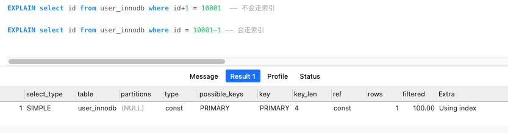

# 08-索引的创建和使用

[TOC]

因为索引对于改善查询性能的作用是巨大的，所以我们的目标是尽量使用索引。

## 索引的创建

- 在用于 where 判断 order 排序和 join 的(on)字段上创建索引
- 索引的个数不要过多。——浪费空间，更新变慢。
- 区分度低的字段，例如性别，不要建索引。 ——离散度太低，导致扫描行数过多。
- 频繁更新的值，不要作为主键或者索引。——页分裂
- 组合索引把散列性高(区分度高)的值放在前面。
- 创建复合索引，而不是修改单列索引。
- 过长的字段，怎么建立索引?
- 为什么不建议用无序的值(例如身份证、UUID )作为索引?

## 查询索引

```
show index from table_name
```


## 什么时候用不到索引?

- 索引列上使用函数`(replace\SUBSTR\CONCAT\sum count avg)`、表达式、 计算(+ - * /)

```
explain SELECT * FROM `t2` where id+1 = 4;
```



- 字符串不加引号，出现隐式转换

```
ALTER TABLE user_innodb DROP INDEX comidx_name_phone;
ALTER TABLE user_innodb add INDEX comidx_name_phone (name,phone);
```

```sql
explain SELECT * FROM `user_innodb` where name = 136;
explain SELECT * FROM `user_innodb` where name = '136';
```

- InnoDB 中，主键索引和辅助索引是有一个主次之分的

where 条件中 like abc%，like %2673%，like %888 都用不到索引吗?为什么?

```
explain select *from user_innodb where name like 'wang%'; -- 优化器会判断开销,如果太大不会走索引 range
explain select *from user_innodb where name like '%wang'; -- 不会走索引,全表扫描
```

过滤的开销太大，所以无法使用索引。这个时候可以用全文索引。

- 负向查询

NOT LIKE 不能:

````
explain select * from employees where last_name not like 'wang'
````

- != (<>)和 NOT IN 在某些情况下可以:

```
explain select *from employees where emp_no not in (1) 
explain select *from employees where emp_no <> 1
```

注意一个 SQL 语句是否使用索引，跟数据库版本、数据量、数据选择度都有关系。
**其实，用不用索引，最终都是优化器说了算。**

## 优化器是基于什么的优化器?

基于 cost 开销(Cost Base Optimizer)，它不是基于规则(Rule-Based Optimizer)，
也不是基于语义。怎么样开销小就怎么来。