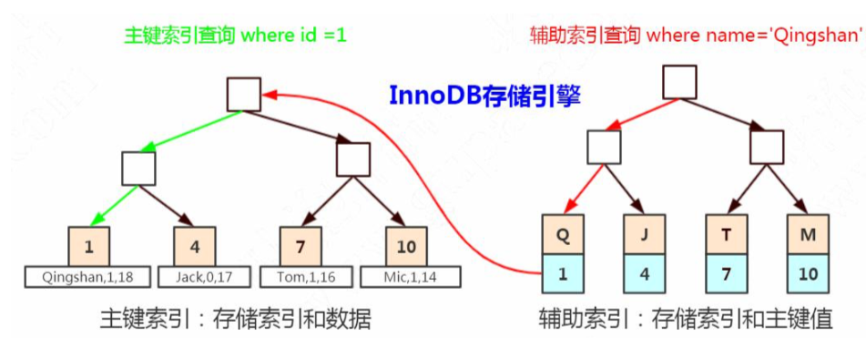

# 覆盖索引

- [什么是覆盖索引](#什么是覆盖索引)
- [什么是回表](#什么是回表)

> Explain 语句中 extra 列出现 using index

## 什么是覆盖索引

当我们要查询的列包含在 辅助索引里面的时候, 就不回表查询主键索引,而直接返回

> MySQL 只需要通过索引就可以返回查询所需要的数据,而不必在查到索引之后再去回表查询数据,减少大量的 IO操作,查询速度也相当快

### 值得注意点的是

- 如果执行就好中的 extra 列中出现 Using index 关键字,说明使用了覆盖索引
- 如果想要使用覆盖索引,一定要 select 只列出所有需要的列, 坚决不可以直接写出 select * 

## 什么是回表

> 非主键索引，我们先通过索引找到主键索引的键值，再通过主键值查出索引里面没 有的数据，它比基于主键索引的查询多扫描了一棵索引树，这个过程就叫回表。

## 实例

```
select * from user_innodb where name = '青山';
```



在辅助索引里面，不管是单列索引还是联合索引，

**如果 select 的数据列只用从索引中就能够取得，不必从数据区中读取，这时候使用的索引就叫做覆盖索引，这样就避免了回表。**

```
-- 创建联合索引
ALTER TABLE user_innodb DROP INDEX comixd_name_phone;
ALTER TABLE user_innodb add INDEX `comixd_name_phone` (`name`,`phone`);
```

```
EXPLAIN SELECT name,phone FROM user_innodb WHERE name= '青山'AND phone='13666666666'; 
EXPLAIN SELECT name FROM user_innodb WHERE name= '青山' AND phone = ' 13666666666'; 
EXPLAIN SELECT phone FROM user_innodb WHERE name= '青山' AND phone = ' 13666666666';
```

- select * ，用不到覆盖索引。
- Extra 里面值为“Using index”代表使用了覆盖索引。

```json
[
  {
    "id": 1,
    "select_type": "SIMPLE",
    "table": "user_innodb",
    "partitions": null,
    "type": "ref",
    "possible_keys": "idx_user_name",
    "key": "idx_user_name",
    "key_len": "1023",
    "ref": "const",
    "rows": 17,
    "filtered": 100,
    "Extra": "Using index"   // Extra 里面值为“Using index”代表使用了覆盖索引。
  }
]
```

