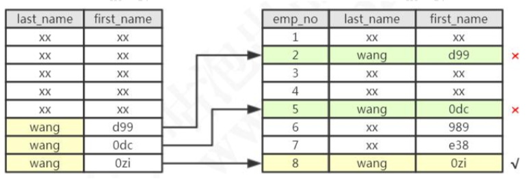
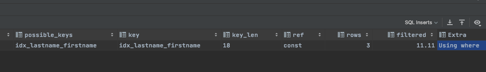
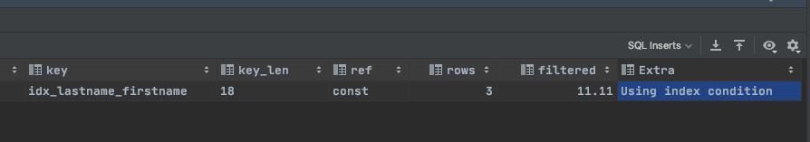

#  索引条件下推(ICP)

## 什么是索引条件下推 ICP

Index Contion PushDown (ICP) 是 MySQL 使用索引从表中检索行数据的一种优化方式,从 MySQL 5.6开始支持ICP

- 5.6 之前, 数据结构会通过遍历索引对应的为基表中的行,然后返回给 Server 层, 再去为这些数据行进行 WHERE 后条件的过滤
- 5.6 之后, 支持 ICP, 如果 WHERE 条件可以使用索引,MySQL 会把这部分过滤操作放到存储隐层层,存储引擎通过索引过滤,把满足的行从表中读取出. ICP 能减少引擎层访问基表的次数和 Server 层访问存储引擎的次数

值得注意的是

- 下推谁 , 下推的是 WHERE 条件 从 Server 层下推到存储引擎层的过程
- ICP只能应用于辅助索引,主键索引是不能用的,目的是减少 IO 操作

> explain 中的执行计划，extra 中 Using index condition

### 相关参数

查询 开关

```sql
show variables like '%optimizer_switch%'
```

```sql
index_merge=on,index_merge_union=on,index_merge_sort_union=on,index_merge_intersection=on,
engine_condition_pushdown=on // 索引条件下推开关
index_condition_pushdown=on,mrr=on,mrr_cost_based=on,block_nested_loop=on,batched_key_access=off,materialization=on,semijoin=on,loosescan=on,firstmatch=on,duplicateweedout=on,subquery_materialization_cost_based=on,use_index_extensions=on,condition_fanout_filter=on,derived_merge=on
```

可以通过命令执行启动或者关闭操作

```sql
set optimizer_switch ='index_condition_pushdown=on'
set optimizer_switch ='index_condition_pushdown=off'
```

当使用 ICP 优化是, 执行计划的 extra 列会显示 Uing Index condition 的关键字提示

## 实例

https://dev.mysql.com/doc/refman/5.7/en/index-condition-pushdown-optimization.html

再来看这么一张表，在 last_name 和 first_name 上面创建联合索引。

```
drop table employees;
CREATE TABLE `employees` (
`emp_no` int(11) NOT NULL, `birth_date` date NULL, `first_name` varchar(14) NOT NULL,
`last_name` varchar(16) NOT NULL, `gender` enum('M','F') NOT NULL, `hire_date` date NULL,
PRIMARY KEY (`emp_no`)
) ENGINE=InnoDB DEFAULT CHARSET=latin1; ​
alter table employees add index idx_lastname_firstname(last_name,first_name); ​

INSERT INTO `employees` (`emp_no`, `birth_date`, `first_name`, `last_name`,`gender`, `hire_date`) VALUES (10,NULL, '698', 'liu', 'F', NULL);


INSERT INTO `employees` (`emp_no`, `birth_date`, `first_name`, `last_name`,`gender`, `hire_date`) VALUES (1, NULL, 'd99', 'zheng', 'F', NULL);
INSERT INTO `employees` (`emp_no`, `birth_date`, `first_name`, `last_name`,`gender`, `hire_date`) VALUES (2, NULL, 'e08', 'huang', 'F', NULL);
INSERT INTO `employees` (`emp_no`, `birth_date`, `first_name`, `last_name`,`gender`, `hire_date`) VALUES (3, NULL, '59d', 'lu', 'F', NULL);
INSERT INTO `employees` (`emp_no`, `birth_date`, `first_name`, `last_name`,`gender`, `hire_date`) VALUES (4, NULL, '0dc', 'yu', 'F', NULL);
INSERT INTO `employees` (`emp_no`, `birth_date`, `first_name`, `last_name`,`gender`, `hire_date`) VALUES (5, NULL, '989', 'wang', 'F', NULL);
INSERT INTO `employees` (`emp_no`, `birth_date`, `first_name`, `last_name`,`gender`, `hire_date`) VALUES (6, NULL, 'e38', 'wang', 'F', NULL);
INSERT INTO `employees` (`emp_no`, `birth_date`, `first_name`, `last_name`,`gender`, `hire_date`) VALUES (7, NULL, '0zi', 'wang', 'F', NULL);
INSERT INTO `employees` (`emp_no`, `birth_date`, `first_name`, `last_name`,`gender`, `hire_date`) VALUES (8, NULL, 'dc9', 'xie', 'F', NULL);
INSERT INTO `employees` (`emp_no`, `birth_date`, `first_name`, `last_name`,`gender`, `hire_date`) VALUES (9, NULL, '5ba', 'zhou', 'F', NULL);
```

关闭 ICP:

```
set optimizer_switch='index_condition_pushdown=off';
```

查看参数:

```
show variables like 'optimizer_switch';
```

现在我们要查询所有姓 wang，并且名字最后一个字是 zi 的员工，比如王胖子，王 瘦子。查询的 SQL:

```
select * from employees where last_name='wang' and first_name LIKE '%zi' ;
```

这条 SQL 有两种执行方式:

- 根据联合索引查出所有姓 wang 的二级索引数据，然后回表，到主键索引上查询 全部符合条件的数据(3 条数据)。然后返回给 Server 层，在 Server 层过滤出名字以 zi 结尾的员工。
- 根据联合索引查出所有姓 wang 的二级索引数据(3 个索引)，然后从二级索引 中筛选出 first_name 以 zi 结尾的索引(1 个索引)，然后再回表，到主键索引上查询全 部符合条件的数据(1 条数据)，返回给 Server 层。



很明显，第二种方式到主键索引上查询的数据更少。

注意，索引的比较是在存储引擎进行的，数据记录的比较，是在 Server 层进行的。 而当 first_name 的条件不能用于索引过滤时，Server 层不会把 first_name 的条件传递 给存储引擎，所以读取了两条没有必要的记录。
这时候，如果满足 last_name='wang'的记录有 100000 条，就会有 99999 条没有 必要读取的记录。

执行以下 SQL，Using where:

```
explain select * from employees where last_name='wang' and first_name LIKE '%zi' ;
```



Using Where 代表从存储引擎取回的数据不全部满足条件，需要在 Server 层过滤。

先用 last_name 条件进行索引范围扫描，读取数据表记录，然后进行比较，检查是 否符合 first_name LIKE '%zi' 的条件。此时 3 条中只有 1 条符合条件。

开启 ICP:

```
set optimizer_switch='index_condition_pushdown=on';
```

```
此时的执行计划，Using index condition:
```



把 first_name LIKE '%zi'下推给存储引擎后，只会从数据表读取所需的 1 条记录。

索引条件下推(Index Condition Pushdown)，5.6 以后完善的功能。只适用于二级索引。

ICP 的目标是减少访问表的完整行的读数量从而减少 I/O 操作。

