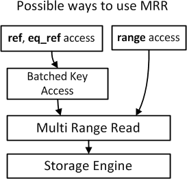

# BKA

## BKA 是什么

BKA全程 Batched Key Access, 主要用来 提高 join性能的算法,器作用是在读取被 join表的记录的时候,使用顺序 IO

## 原理

BKA 的原理非常简单,对于多表 join 语句,当 MySQL 使用索引访问第二个 join 表时,使用一个 join buffer 来收集第一个操作对象生成的相关列值

BKA 构建好相关key 之后,批量传给引擎层做索引查找,key 是通过 MRR 接口提交给引擎的,这样一来 MRR 使得查询更加高效

## 配置

MySQL 中通过 optimizer_switch 参数中的 batched_key_access 选项来控制,该选项默认是关闭的

想要开启该参数,必须先要保证是在强制使用 MRR 的基础上才可以

开启 BKA:

```
set global optimizer_switch  = 'mrr_cost_based=off'
set global optimizer_switch  = 'batched_key_access=on'
```

当 BKA 被使用时,执行计划的 extra 列会显示 Using jpoin buffer (batched key access) 提示

## MRR 与 BKA 的关系



存储引擎的上面是 MRR, 范围扫描(range access) 中 MySQL 将扫描到的数据存入 read_rnd_buffer_size 对其按照主键 rowid 进行排序然后使用排序号的数据进行数顺序回表,因为 InnoDB 的叶子节点数据按照主键 rowId 进行排列的,这样就转换随机读取为顺序读取


在 BKA 中, 则在被连接表使用 ref,eq_ref 索引扫描方式,第一个表中扫描到的兼职放到 join_buffer_size 中,然后调用 MRR 接口进行排序和顺序访问并且通过 join 条件得到数据,这样连接条件也成了顺序 IO

