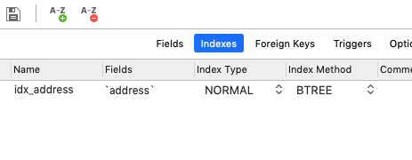

# 索引

数据库索引，是数据库管理系统(DBMS)中一个排序的数据结构，以协助快速查询、 更新数据库表中数据。


数据是以文件形式存放在磁盘上的,每一行数据都有它的磁盘地址。

如果没有索引的话,要从 500 万行数据里检索一条数据,只能遍历 500 万行数据,知道找到数据,最坏的时间复杂度为 (On)

## 索引类型



#### 索引类型

- 普通索引(Normal): 最普通的索引,没有任何限制
- 唯一(Unique): 要求建值不能重复,另外需要注意的是,主键是一种特殊的唯一索引,它还多了一个限制条件,键值不能为空.主键索引用 primay key 创建。
- 全文(FullText):针对比较大的数据，比如我们存放的是消息内容，有几 KB 的数 据的这种情况，如果要解决 like 查询效率低的问题，可以创建全文索引。只有文本类型 的字段才可以创建全文索引，比如 char、varchar、text。

```
create table m3 ( name varchar(50), fulltext index(name) );
```

全文索引的使用:

```
select * from fulltext_test where match(content) against('咕泡学院' IN NATURAL LANGUAGE MODE);
```

MyISAM 和 InnoDB 支持全文索引。

## 