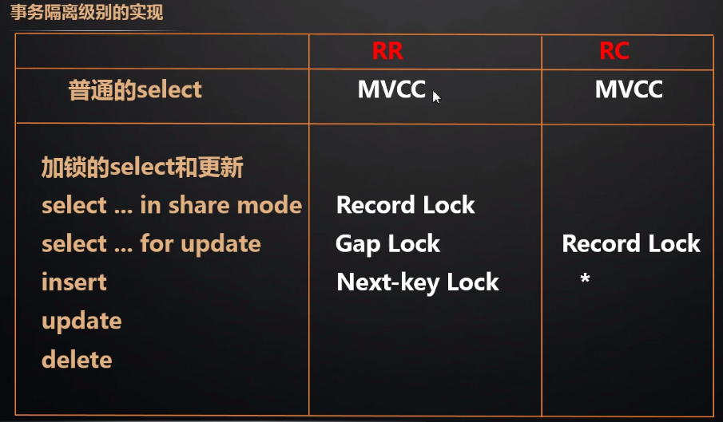

# 011-LBCC-基于锁的并发控制

[TOC]

## 什么是LBCC基于锁的并发控制

读取数据的时候，锁定要操作的数据，不允许其他的事务修改就行了。

这种方案我们叫做基于锁的并发控制 Lock Based Concurrency Control(LBCC)。

如果仅仅是基于锁来实现事务隔离，一个事务读取的时候不允许其他时候修改，那就意味着不支持并发的读写操作，而我们的大多数应用都是读多写少的，这样会极大地 影响操作数据的效率。

## InnodDB 隔离级别的实现

|      | 隔离级别                    | 读     | 写                                                           |
| ---- | --------------------------- | ------ | ------------------------------------------------------------ |
| 1    | 读未提交（read uncommitted) | 不加锁 | 不加锁                                                       |
| 2    | 读已提交（read committed)   | MVCC   | 记录锁                                                       |
| 3    | 可重复读（repeatable read)  | MVCC   | 记录锁/间隙锁/临键锁                                         |
| 4    | 串行化 (serializable)       | 共享锁 | 所有 select 隐式转换成 共享锁(in share mode)会和 update 和 delete 互斥 |

### 读未提交-read uncommitted

 隔离级别:不加锁。

### 序列化-Serializable

Serializable 所有的 select 语句都会被隐式的转化为 select ... in share mode，会 和 update、delete 互斥。
这两个很好理解，主要是 RR 和 RC 的区别?

### 可重复读-Repeatable Read

RR 隔离级别下，普通的 select 使用快照读(snapshot read)，底层使用 MVCC 来实 现。
加锁的 select(select ... in share mode / select ... for update)以及更新操作 update, delete 等语句使用当前读(current read)，底层使用记录锁、或者间隙锁、 临键锁。

### 读已提交-Read Commited

RC 隔离级别下，普通的 select 都是快照读，使用 MVCC 实现。

加锁的 select 都使用记录锁，因为没有 Gap Lock。

除了两种特殊情况

- 外键约束检查(foreign-key constraint checking)
- 重复 键检查(duplicate-key checking)时会使用间隙锁封锁区间

所以 RC 会出现幻读的问题。