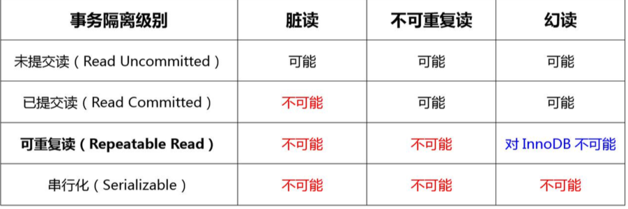
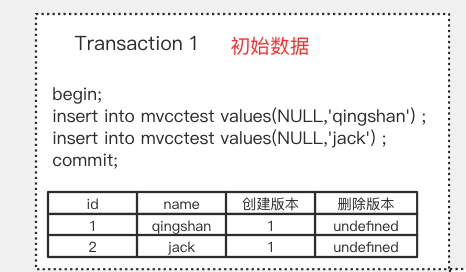
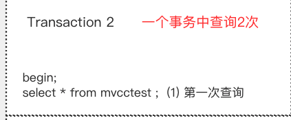
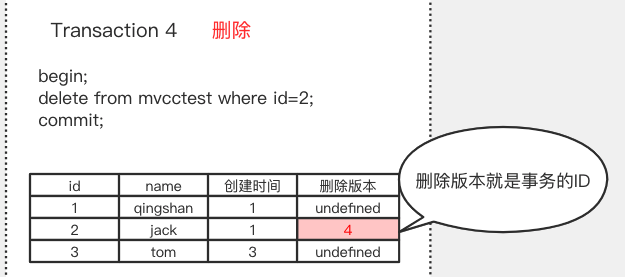
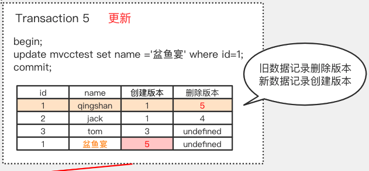
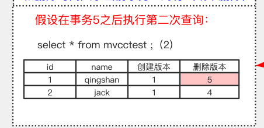

# MySQL 中的事务

- 什么是数据库事务
- MySQL InnoDB 锁的基本类型
- 行锁的原理
- 锁的算法
- 事务隔离

## 什么是事务

 [README.md](../../../08-transaction/01-database-transaction/README.md) 

## 数据库什么时候会出现事务

无论是我们在 Navicat 的这种工具里面去操作，还是在我们的 Java 代码里面通过 API 去操作，还是加上`@Transactional `的注解或者 AOP 配置，其实最终都是发送一个 指令到数据库去执行，Java 的 JDBC 只不过是把这些命令封装起来了。

我们先来看一下我们的操作环境。版本(5.7)，存储引擎(InnnoDB)，事务隔离 级别(RR)。

```
select version(); -- 版本(5.7)
show variables like '%engine%'; -- 存储引擎(InnnoDB)
show global variables like "tx_isolation"; --事务隔离 级别(RR)。
```

### 自动提交

InnoDB 里面有一个 autocommit 的参数(分成两个级别， session 级别和 global级别)。

```
show variables like 'autocommit';
```

它的默认值是 ON。autocommit 这个参数是什么意思呢?是否自动提交。如果它的 值是 true/on 的话，我们在操作数据的时候，会自动开启一个事务，和自动提交事务。

否则，如果我们把 autocommit 设置成 false/off，那么数据库的事务就需要我们手 动地去开启和手动地去结束。

#### 手动开启事务

有几种方式，一种是用 begin;一种是用 start transaction。

#### 结束事务

- commit;

- rollback，

- 客户端 的连接断开的时候，事务也会结束。

## 事务的隔离级别

 [01-read-uncommitted.md](../../../08-transaction/01-database-transaction/01-read-uncommitted.md) 

 [02-read-committed.md](../../../08-transaction/01-database-transaction/02-read-committed.md) 

 [03-repeatable-read.md](../../../08-transaction/01-database-transaction/03-repeatable-read.md) 

 [04-serializable.md](../../../08-transaction/01-database-transaction/04-serializable.md) 

## 隔离级别 MySQL 中的有点不同



InnoDB 可以解决可重复读问题

## 实现方案

-  LBCC
- MVCC

### LBCC

第一种，我既然要保证前后两次读取数据一致，那么我读取数据的时候，锁定我要 操作的数据，不允许其他的事务修改就行了。这种方案我们叫做基于锁的并发控制 Lock Based Concurrency Control(LBCC)。

如果仅仅是基于锁来实现事务隔离，一个事务读取的时候不允许其他时候修改，那 就意味着不支持并发的读写操作，而我们的大多数应用都是读多写少的，这样会极大地 影响操作数据的效率。

### MVCC

所以我们还有另一种解决方案，如果要让一个事务前后两次读取的数据保持一致， 那么我们可以在修改数据的时候给它建立一个备份或者叫快照，后面再来读取这个快照 就行了。这种方案我们叫做多版本的并发控制 **Multi Version Concurrency Control (MVCC)。**

MVCC 的核心思想是: 我可以查到在我这个事务开始之前已经存在的数据，即使它 在后面被修改或者删除了。在我这个事务之后新增的数据，我是查不到的。

问题:这个快照什么时候创建?读取数据的时候，怎么保证能读取到这个快照而不 是最新的数据?这个怎么实现呢?

**InnoDB 为每行记录都实现了3 个隐藏字段:**


- DB_TRX_ID，6 字节:插入或更新行的最后一个事务的事务 ID，事务编号是自动递 增的(我们把它理解为创建版本号，在数据新增或者修改为新数据的时候，记录当前事 务 ID)。

- DB_ROLL_PTR，7 字节:回滚指针(我们把它理解为删除版本号，数据被删除或记 录为旧数据的时候，记录当前事务 ID)。

**MVCC 的查找规则:**

- **只能查找创建时间小于等于当前事务 ID 的数据，**
- **和删除时间大于当前事务 ID 的行(或未删除)。**

https://www.processon.com/view/link/5d29999ee4b07917e2e09298 


第一个事务，初始化数据(检查初始数据)



此时的数据，创建版本是当前事务 ID，删除版本为空:

第二个事务，执行第 1 次查询，读取到两条原始数据，这个时候事务 ID 是 2:



第三个事务，插入数据:

此时的数据，多了一条 tom，它的创建版本号是当前事务编号，3:


第二个事务，执行第 2 次查询:


也就是不能查到在我的事务开始之后插入的数据，tom 的创建 ID 大于 2，所以还是 只能查到两条数据。

第四个事务，删除数据，删除了 id=2 jack 这条记录:



此时的数据，jack 的删除版本被记录为当前事务 ID，4，其他数据不变:

在第二个事务中，执行第 3 次查询:


第五个事务，执行更新操作，这个事务事务 ID 是 5:



此时的数据，更新数据的时候，旧数据的删除版本被记录为当前事务 ID 5(undo)

产生了一条新数据，创建 ID 为当前事务 ID 5:

第二个事务，执行第 4 次查询:



查找规则:只能查找创建时间小于等于当前事务 ID 的数据，和删除时间大于当前事 务 ID 的行(或未删除)。

因为更新后的数据 penyuyan 创建版本大于 2，代表是在事务之后增加的，查不出 来。

而旧数据 qingshan 的删除版本大于 2，代表是在事务之后删除的，可以查出来。

通过以上演示我们能看到，通过版本号的控制，无论其他事务是插入、修改、删除， 第一个事务查询到的数据都没有变化。

在 InnoDB 中，MVCC 是通过 Undo log 实现的。
Oracle、Postgres 等等其他数据库都有 MVCC 的实现。

需要注意，在 InnoDB 中，MVCC 和锁是协同使用的，这两种方案并不是互斥的。 

第一大类解决方案是锁，锁又是怎么实现读一致性的呢?