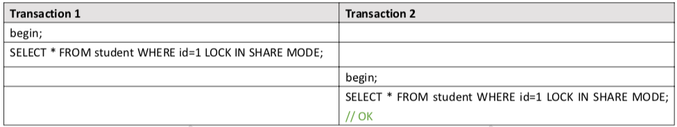
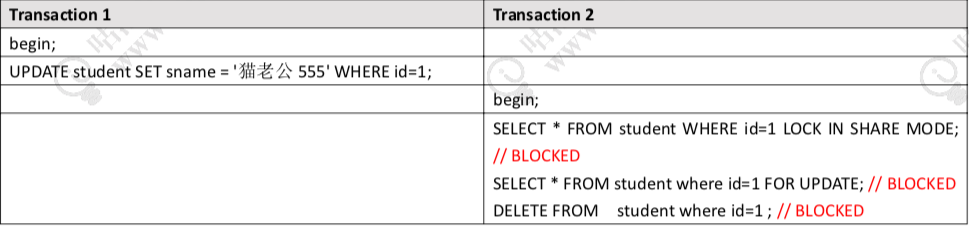
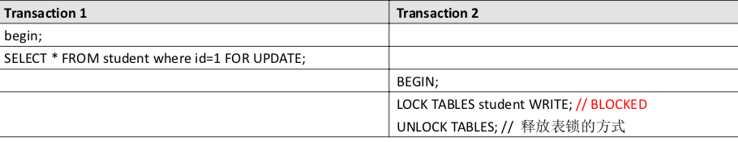

# MySQL InnoDB 锁的基本类型

https://dev.mysql.com/doc/refman/5.7/en/innodb-locking.html

官网把锁分成了 8 类。所以我们把前面的两个行级别的锁(Shared and Exclusive Locks)，和两个表级别的锁(Intention Locks)称为锁的基本模式。

后面三个 Record Locks、Gap Locks、Next-Key Locks，我们把它们叫做锁的算法， 也就是分别在什么情况下锁定什么范围。

## 锁的粒度

我们讲到 InnoDB 里面既有行级别的锁，又有表级别的锁，我们先来分析一下这两种锁定粒度的一些差异。

表锁，顾名思义，是锁住一张表;行锁就是锁住表里面的一行数据。锁定粒度，表锁肯定是大于行锁的。

#### 加锁效率

那么加锁效率，表锁应该是大于行锁还是小于行锁呢?大于。为什么?表锁只需要
直接锁住这张表就行了，而行锁，还需要在表里面去检索这一行数据，所以表锁的加锁 效率更高。

#### 冲突概览

第二个冲突的概率?表锁的冲突概率比行锁大，还是小?

大于，因为当我们锁住一张表的时候，其他任何一个事务都不能操作这张表。但是 我们锁住了表里面的一行数据的时候，其他的事务还可以来操作表里面的其他没有被锁 定的行，所以表锁的冲突概率更大。
  表锁的冲突概率更大，所以并发性能更低，这里并发性能就是小于

innoDB 里面我们知道它既支持表锁又支持行锁，另一个常用的存储引擎 MyISAM 支 持什么粒度的锁?这是第一个问题。第二个就是 InnoDB 已经支持行锁了，那么它也可 以通过把表里面的每一行都锁住来实现表锁，为什么还要提供表锁呢?

## 共享锁

第一个行级别的锁就是我们在官网看到的 Shared Locks (共享锁)，我们获取了 一行数据的读锁以后，可以用来读取数据，所以它也叫做读锁，注意不要在加上了读锁 以后去写数据，不然的话可能会出现死锁的情况。而且多个事务可以共享一把读锁。那怎么给一行数据加上读锁呢?

#### 手工加锁

我们可以用 select ...... lock in share mode; 的方式手工加上一把读锁。

释放锁有两种方式，只要事务结束，锁就会自动释放，包括提交事务和结束事务。

我们也来验证一下，看看共享锁是不是可以重复获取。



## 排它锁

第二个行级别的锁叫做 Exclusive Locks(排它锁)，它是用来操作数据的，所以又 叫做写锁。只要一个事务获取了一行数据的排它锁，其他的事务就不能再获取这一行数 据的共享锁和排它锁。

排它锁的加锁方式有两种，第一种是自动加排他锁。我们在操作数据的时候，包括 增删改，都会默认加上一个排它锁。

还有一种是手工加锁，我们用一个 FOR UPDATE 给一行数据加上一个排它锁，这个 无论是在我们的代码里面还是操作数据的工具里面，都比较常用。

释放锁有两种方式，只要事务结束，锁就会自动释放，包括提交事务和结束事务。。



## 

## 意向锁

- 意向共享锁锁
- 意向排他锁

意向锁是什么呢?我们好像从来没有听过，也从来没有使用过，其实他们是由数据 库自己维护的。也就是说，当我们给一行数据加上共享锁之前，数据库会自动在这张表上面加一个 意向共享锁。

当我们给一行数据加上排他锁之前，数据库会自动在这张表上面加一个意向排他锁。

反过来说: 如果一张表上面至少有一个意向共享锁，说明有其他的事务给其中的某些数据行加
上了共享锁。

如果一张表上面至少有一个意向排他锁，说明有其他的事务给其中的某些数据行加上了排他锁。

```
select * from t2 where id =4 for update;
```

#### 两个表级锁的意义

那么这两个表级别的锁存在的意义是什么呢?

- 第一个作用，我们有了表级别的锁，在 InnoDB 里面就可以支持更多粒度的锁。
- 第二个作用，我们想一下，如果说没有意向 锁的话，当我们准备给一张表加上表锁的时候，我们首先要做什么?是不是必须先要去 判断有没其他的事务锁定了其中了某些行?如果有的话，肯定不能加上表锁。那么这个 时候我们就要去扫描整张表才能确定能不能成功加上一个表锁，如果数据量特别大，比 如有上千万的数据的时候，加表锁的效率是不是很低?

但是我们引入了意向锁之后就不一样了。我只要判断这张表上面有没有意向锁，如 果有，就直接返回失败。如果没有，就可以加锁成功。所以 InnoDB 里面的表锁，我们 可以把它理解成一个标志。就像火车上厕所有没有人使用的灯，是用来提高加锁的效率 的。



以上就是 MySQL 里面的 4 种基本的锁的模式，或者叫做锁的类型。