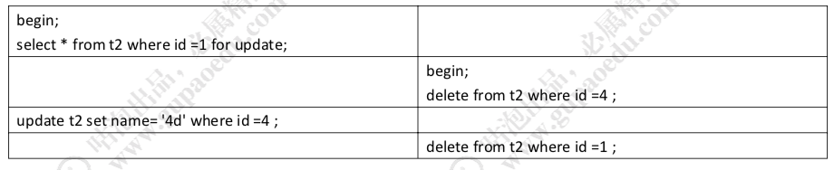
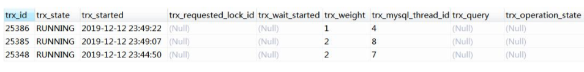
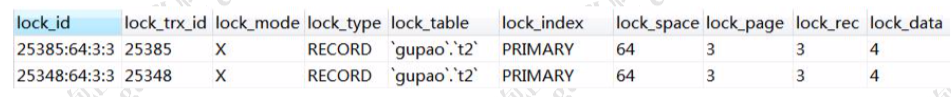

# MySQL锁等待和死锁

## 锁等待是什么

锁等待是指一个事务过程中产生的锁,其他事务需要等待上一个事务释放它的锁才能占用该资源

- 如果该事物一直不释放,就会持续等待下去, 知道超过了锁等待时间, 会报一个等待超时的错误
- MySQL 中通过 **innodb_lock_wait_timeout** 参数控制, 单位是秒

## 死锁是什么

死锁是指两个以上进程在执行过程中,因为争夺资源而造成的一种互相等待的现象

- InnoDB 存储引起可以自动检测死锁,并且自动回滚事务

锁什么时候释放? 事务结束(commit，rollback);客户端连接断开。

如果一个事务一直未释放锁，其他事务会被阻塞多久?会不会永远等待下去?如果 是，在并发访问比较高的情况下，如果大量事务因无法立即获得所需的锁而挂起，会占 用大量计算机资源，造成严重性能问题，甚至拖跨数据库。

> [Err] 1205 - Lock wait timeout exceeded; try restarting transaction

MySQL 有一个参数来控制获取锁的等待时间，默认是 50 秒。

```
show VARIABLES like 'innodb_lock_wait_timeout';
```

对于死锁，是无论等多久都不能获取到锁的，这种情况，也需要等待 50 秒钟吗?那 不是白白浪费了 50 秒钟的时间吗?

## 死锁演示



在第一个事务中，检测到了死锁，马上退出了，第二个事务获得了锁，不需要等待 50 秒:

> [Err] 1213 - Deadlock found when trying to get lock; try restarting transaction

为什么可以直接检测到呢?是因为死锁的发生需要满足一定的条件，所以在发生死 锁时，InnoDB 一般都能通过算法(wait-for graph)自动检测到。

 那么死锁需要满足什么条件?死锁的产生条件:
因为锁本身是互斥的，

- 同一时刻只能有一个事务持有这把锁，
- 其他的事 务需要在这个事务释放锁之后才能获取锁，而不可以强行剥夺，
- 当多个事务形成等 待环路的时候，即发生死锁。

如果锁一直没有释放，就有可能造成大量阻塞或者发生死锁，造成系统吞吐量下降，这时候就要查看是哪些事务持有了锁。

### 查看锁信息(日志)

```
//SHOW STATUS 命令中，包括了一些行锁的信息:
show status like 'innodb_row_lock_%';
```

- Innodb_row_lock_current_waits:当前正在等待锁定的数量; 
- Innodb_row_lock_time :从系统启动到现在锁定的总时间长度，单位 ms; 
- Innodb_row_lock_time_avg :每次等待所花平均时间;
-  Innodb_row_lock_time_max:从系统启动到现在等待最长的一次所花的时间; 
- Innodb_row_lock_waits :从系统启动到现在总共等待的次数。

SHOW 命令是一个概要信息。InnoDB 还提供了三张表来分析事务与锁的情况:

```
select * from information_schema.INNODB_TRX; -- 当前运行的所有事务 ，还有具体的语句
```



```
select * from information_schema.INNODB_LOCKS; -- 当前出现的锁
```



```

select * from information_schema.INNODB_LOCK_WAITS; -- 锁等待的对应关系
```


找出持有锁的事务之后呢?
如果一个事务长时间持有锁不释放，可以 kill 事务对应的线程 ID，也就是 INNODB_TRX 表中的 trx_mysql_thread_id，例如执行 `kill 4，kill 7，kill 8`。

当然，死锁的问题不能每次都靠 kill 线程来解决，这是治标不治本的行为。我们应该 尽量在应用端，也就是在编码的过程中避免。
  有哪些可以避免死锁的方法呢?

## 死锁的避免

1、 在程序中，操作多张表时，尽量以相同的顺序来访问(避免形成等待环路);
2、 批量操作单张表数据的时候，先对数据进行排序(避免形成等待环路);
3、 申请足够级别的锁，如果要操作数据，就申请排它锁;
4、 尽量使用索引访问数据，避免没有 where 条件的操作，避免锁表;
5、 如果可以，大事务化成小事务;
6、 使用等值查询而不是范围查询查询数据，命中记录，避免间隙锁对并发的影响。