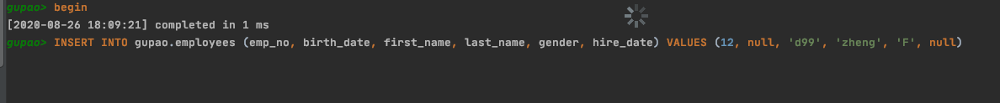

# 15-MySQ锁问题的监控

```sql
show full processlist
```

或者

```sql
show engine innodb status
```

## 三张重要的表

- INNODB_TRX
- INNODB_LOCKS
- INNODB_LOCK_WAITS

这三张表可以帮助我们监控当前事务并分析可能存在的锁问题



#### 查询INNODB_TRX表获得信息

```
select * from innodb_trx
```


```
[
  {
    "trx_id": "2133186",
    "trx_state": "LOCK WAIT",
    "trx_started": "2020-08-26 18:09:23",
    "trx_requested_lock_id": "2133186:53338:3:1",
    "trx_wait_started": "2020-08-26 18:11:12",
    "trx_weight": 2,
    "trx_mysql_thread_id": 87,
    "trx_query": "/* ApplicationName=DataGrip 2020.2 */ INSERT INTO gupao.employees (emp_no, birth_date, first_name, last_name, gender, hire_date) VALUES (12, null, 'd99', 'zheng', 'F', null)",
    "trx_operation_state": "inserting",
    "trx_tables_in_use": 1,
    "trx_tables_locked": 1,
    "trx_lock_structs": 2,
    "trx_lock_memory_bytes": 1136,
    "trx_rows_locked": 2,
    "trx_rows_modified": 0,
    "trx_concurrency_tickets": 0,
    "trx_isolation_level": "REPEATABLE READ",
    "trx_unique_checks": 1,
    "trx_foreign_key_checks": 1,
    "trx_last_foreign_key_error": null,
    "trx_adaptive_hash_latched": 0,
    "trx_adaptive_hash_timeout": 0,
    "trx_is_read_only": 0,
    "trx_autocommit_non_locking": 0
  },
  {
    "trx_id": "2133185",
    "trx_state": "RUNNING",
    "trx_started": "2020-08-26 18:09:14",
    "trx_requested_lock_id": null,
    "trx_wait_started": null,
    "trx_weight": 2,
    "trx_mysql_thread_id": 83,
    "trx_query": null,
    "trx_operation_state": null,
    "trx_tables_in_use": 0,
    "trx_tables_locked": 1,
    "trx_lock_structs": 2,
    "trx_lock_memory_bytes": 1136,
    "trx_rows_locked": 12,
    "trx_rows_modified": 0,
    "trx_concurrency_tickets": 0,
    "trx_isolation_level": "REPEATABLE READ",
    "trx_unique_checks": 1,
    "trx_foreign_key_checks": 1,
    "trx_last_foreign_key_error": null,
    "trx_adaptive_hash_latched": 0,
    "trx_adaptive_hash_timeout": 0,
    "trx_is_read_only": 0,
    "trx_autocommit_non_locking": 0
  }
]
```

- trx_id : 事务唯一 id
- trx_state :  事务状态
- trx_wait_started :  事务开始等待时间
- trx_mysql_thread_id 线程 id , 与 show full processlist 相对应

- trx_query : 事务运行sql 语句
- trx_operation_state :  事务运行的状态

#### 查看哪些事务在锁

```
select * from INNODB_LOCKS;
```

```json
[
  {
    "lock_id": "2133186:53338:3:1",
    "lock_trx_id": "2133186",
    "lock_mode": "X",
    "lock_type": "RECORD",
    "lock_table": "`gupao`.`employees`",
    "lock_index": "PRIMARY",
    "lock_space": 53338,
    "lock_page": 3,
    "lock_rec": 1,
    "lock_data": "supremum pseudo-record"
  },
  {
    "lock_id": "2133185:53338:3:1",
    "lock_trx_id": "2133185",
    "lock_mode": "X",
    "lock_type": "RECORD",
    "lock_table": "`gupao`.`employees`",
    "lock_index": "PRIMARY",
    "lock_space": 53338,
    "lock_page": 3,
    "lock_rec": 1,
    "lock_data": "supremum pseudo-record"
  }
]


```

#### 查看哪些事务在等待

```
select * from INNODB_LOCK_WAITS;
```

```json
[
  {
    "requesting_trx_id": "2133186",
    "requested_lock_id": "2133186:53338:3:1",
    "blocking_trx_id": "2133185",
    "blocking_lock_id": "2133185:53338:3:1"
  }
]
```

