# 优化器——SQL 语句分析与优化

首先我们要把慢的 SQL 语句录下来,MySQL 提供了一个 SlowQueryLog 的东西

> https://dev.mysql.com/doc/refman/5.7/en/slow-query-log.html

## 打开慢日志开关

因为开启慢查询日志是有代价的(跟 bin log、optimizer-trace 一样)，所以它默认是关闭的:

```sql
show variables like 'slow_query%';
```


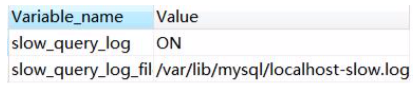

除了这个开关，还有一个参数，控制执行超过多长时间的 SQL 才记录到慢日志，默认是 10 秒。

```sql
show variables like '%slow_query%';
```

可以直接动态修改参数(重启后失效)。

```sql
set @@global.slow_query_log=1;  -- 1 开启，0 关闭，重启后失效
set @@global.long_query_time=3; -- mysql 默认的慢查询时间是 10 秒，另开一个窗口后才会查到最新值 ​
show variables like '%long_query%';
show variables like '%slow_query%';
```

或者修改配置文件 my.cnf。

 以下配置定义了慢查询日志的开关、慢查询的时间、日志文件的存放路径。

```java
slow_query_log = ON
long_query_time=2
slow_query_log_file =/var/lib/mysql/localhost-slow.log
```

#### 模拟慢查询:

```sql
select sleep(10);
```

查询 user_innodb 表的 500 万数据(检查是不是没有索引)。

```java
SELECT * FROM `user_innodb` where phone = '136';
```

## 慢日志分析

#### 日志内容

```
show global status like 'slow_queries'; -- 查看有多少慢查询 show variables like '%slow_query%'; -- 获取慢日志目录
```

```
cat /var/lib/mysql/ localhost-slow.log
```


有了慢查询日志，怎么去分析统计呢?比如 SQL 语句的出现的慢查询次数最多，平均每次执行了多久?

#### mysqldumpslow

https://dev.mysql.com/doc/refman/5.7/en/mysqldumpslow.html
MySQL 提供了 mysqldumpslow 的工具，在 MySQL 的 bin 目录下。

```sql
mysqldumpslow --help
```

例如:查询用时最多的 20 条慢 SQL:

```
mysqldumpslow -s t -t 20 -g 'select' /var/lib/mysql/localhost-slow.log
```

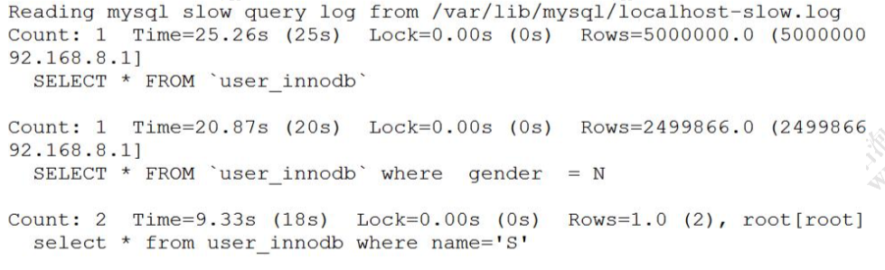

- Count 代表这个 SQL 执行了多少次;
- Time 代表执行的时间，括号里面是累计时间; Lock 表示锁定的时间，括号是累计;
- Rows 表示返回的记录数，括号是累计。

除了慢查询日志之外，还有一个 SHOW PROFILE 工具可以使用。

### SHOW PROFILE

> https://dev.mysql.com/doc/refman/5.7/en/show-profile.html

SHOW PROFILE 是谷歌高级架构师 Jeremy Cole 贡献给 MySQL 社区的，可以查看SQL 语句执行的时候使用的资源，比如 CPU、IO 的消耗情况。 在 SQL 中输入 help profile 可以得到详细的帮助信息。

#### 查看是否开启

```
select @@profiling; 
set @@profiling=1;
```

#### 查看 profile 统计

```
show profiles; --(命令最后带一个 s)
```

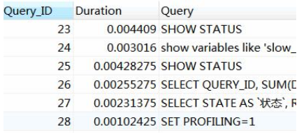

查看最后一个 SQL 的执行详细信息，从中找出耗时较多的环节(没有 s)。

```
show profile;
```

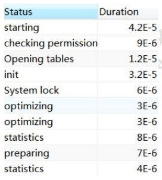

6.2E-5，小数点左移 5 位，代表 0.000062 秒。

也可以根据 ID 查看执行详细信息，在后面带上 for query + ID。

```
show profile for query 1;
```

除了慢日志和 show profile，如果要分析出当前数据库中执行的慢的 SQL，还可以 通过查看运行线程状态和服务器运行信息、存储引擎信息来分析。

### 其他系统命令

#### show processlist 运行线程

> https://dev.mysql.com/doc/refman/5.7/en/show-processlist.html

```
show processlist;
```

这是很重要的一个命令，用于显示用户运行线程。可以根据 id 号 kill 线程。也可以查表，效果一样:

```
select * from information_schema.processlist;
```

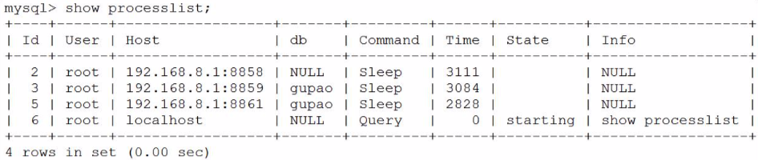

| 列      | 含义                                                         |
| ------- | ------------------------------------------------------------ |
| Id      | 线程的唯一标志,可以根据它 kill 线程                          |
| User    | 启动这个线程的用户,普通用户只能看到自己的线程                |
| Host    | 哪个 ip 端口发起连接                                         |
| db      | 操作的数据库                                                 |
| Command | 线程的命令https://dev.mysql.com/doc/refman/5.7/en/thread-commands.html |
| Time    | 操作持续时间，单位秒                                         |
| State   | 线程状态，比如查询可能有 copying to tmp table，Sorting result，Sending data https://dev.mysql.com/doc/refman/5.7/en/general-thread-states.html |
| Info    | SQL 语句的前 100 个字符，如果要查看完整的 SQL 语句，用 SHOW FULL PROCESSLIST |

#### show status 服务器运行状态

> https://dev.mysql.com/doc/refman/5.7/en/show-status.html

SHOW STATUS 用于查看 MySQL 服务器运行状态(重启后会清空)，有 session 和 global 两种作用域，格式:参数-值。
可以用 like 带通配符过滤。

```sql
SHOW GLOBAL STATUS LIKE 'com_select'; -- 查看 select 次数
```

#### show engine 存储引擎运行信息

> https://dev.mysql.com/doc/refman/5.7/en/show-engine.html

show engine 用来显示存储引擎的当前运行信息，包括事务持有的表锁、行锁信息; 事务的锁等待情况;线程信号量等待;文件 IO 请求;buffer pool 统计信息。

例如:

```
show engine innodb status;
```

如果需要将监控信息输出到错误信息 error log 中(15 秒钟一次)，可以开启输出。

```sql
show variables like 'innodb_status_output%';
-- 开启输出:
SET GLOBAL innodb_status_output=ON;
SET GLOBAL innodb_status_output_locks=ON;
```

我们现在已经知道了这么多分析服务器状态、存储引擎状态、线程运行信息的命令， 如果让你去写一个数据库监控系统，你会怎么做?
其实很多开源的慢查询日志监控工具，他们的原理其实也都是读取的系统的变量和 状态。

现在我们已经知道哪些 SQL 慢了，为什么慢呢?慢在哪里?

MySQL 提供了一个执行计划的工具(在架构中我们有讲到，优化器最终生成的就是 一个执行计划)，其他数据库，例如 Oracle 也有类似的功能。

通过 EXPLAIN 我们可以模拟优化器执行 SQL 查询语句的过程，来知道 MySQL 是 怎么处理一条 SQL 语句的。通过这种方式我们可以分析语句或者表的性能瓶颈。

**explain 可以分析` update`、`delete`、`insert `么?**

- MySQL 5.6.3 以前只能分析 SELECT; 

- MySQL 5.6.3 以后就可以分析 update、delete、 insert 了。

## EXPLAIN 执行计划

> 官方链接:https://dev.mysql.com/doc/refman/5.7/en/explain-output.html

我们先创建三张表。一张课程表，一张老师表，一张老师联系方式表(没有任何索 引)。

```
DROP TABLE IF EXISTS course; CREATE TABLE `course` (
`cid` int(3) DEFAULT NULL,
`cname` varchar(20) DEFAULT NULL, `tid` int(3) DEFAULT NULL
) ENGINE=InnoDB DEFAULT CHARSET=utf8mb4; ​
DROP TABLE IF EXISTS teacher; CREATE TABLE `teacher` (
`tid` int(3) DEFAULT NULL,
`tname` varchar(20) DEFAULT NULL, `tcid` int(3) DEFAULT NULL
) ENGINE=InnoDB DEFAULT CHARSET=utf8mb4; ​
DROP TABLE IF EXISTS teacher_contact; CREATE TABLE `teacher_contact` (
`tcid` int(3) DEFAULT NULL,
`phone` varchar(200) DEFAULT NULL
) ENGINE=InnoDB DEFAULT CHARSET=utf8mb4;
INSERT INTO `course` VALUES ('1', 'mysql', '1');
INSERT INTO `course` VALUES ('2', 'jvm', '1');
INSERT INTO `course` VALUES ('3', 'juc', '2');
INSERT INTO `course` VALUES ('4', 'spring', '3');
INSERT INTO `teacher` VALUES ('1', 'qingshan', '1');
INSERT INTO `teacher` VALUES ('2', 'jack', '2');
INSERT INTO `teacher` VALUES ('3', 'mic', '3');
INSERT INTO `teacher_contact` VALUES ('1', '13688888888'); INSERT INTO `teacher_contact` VALUES ('2', '18166669999'); INSERT INTO `teacher_contact` VALUES ('3', '17722225555');
```

先确认一下环境:

```
select version();
show variables like '%engine%';
```

例子:

```sql
-- 查询 mysql 课程的老师手机号 
EXPLAIN SELECT tc.phone FROM teacher_contact tc WHERE tcid = (
	SELECT tcid FROM teacher t WHERE t.tid=(
	SELECT c.tid FROM course c WHERE c.cname='mysql')
);
```


可以看到有这么几列:

- **id 查询序列编号**
- **select type 查询类型**
- **type 连接类型**
- **possible_key、key**
- **key_len**
- **rows**
- filtered
- ref , 使用哪个列或者常数和索引一起从表中筛选数据。
- Extra , 执行计划给出的额外的信息说明。

#### id 查询序列编号。

id 是查询序列编号。

id 值不同的时候，先查询 id 值大的(先大后小)。

```java
-- 查询 mysql 课程的老师手机号 
EXPLAIN SELECT tc.phone FROM teacher_contact tc WHERE tcid = (
	SELECT tcid FROM teacher t WHERE t.tid=(
			SELECT c.tid FROM course c WHERE c.cname='mysql'
		)
);
```

查询顺序:course c——teacher t——teacher_contact tc。

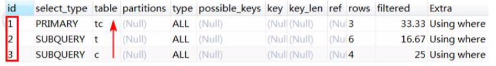

先查课程表，再查老师表，最后查老师联系方式表。子查询只能以这种方式进行，

只有拿到内层的结果之后才能进行外层的查询。

##### id 值相同

```
-- 查询课程ID为2，或者联系表ID为3的老师 
EXPLAIN SELECT
	t.tname,
	c.cname,
	tc.phone 
FROM
	teacher t,
	course c,
	teacher_contact tc 
WHERE
	t.tid = c.tid 
	AND t.tcid = tc.tcid 
	AND (
		c.cid = 2 
	OR tc.tcid = 3 
	);
```

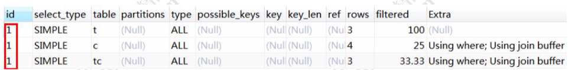

id 值相同时，表的查询顺序是从上往下顺序执行。例如这次查询的 id 都是 1，查询 的顺序是 

```
teacher t(3 条)——course c(4 条)——teacher_contact tc(3 条)。
```

teacher 表插入 3 条数据后:

```
INSERT INTO `teacher` VALUES (4, 'james', 4); INSERT INTO `teacher` VALUES (5, 'tom', 5); INSERT INTO `teacher` VALUES (6, 'seven', 6); COMMIT;
​
-- (备份)恢复语句
DELETE FROM teacher where tid in (4,5,6); COMMIT;
```

id 也都是 1，但是从上往下查询顺序变成了:

```teacher_contact tc(3 条)——teacher t(6 条)——course c(4 条)```

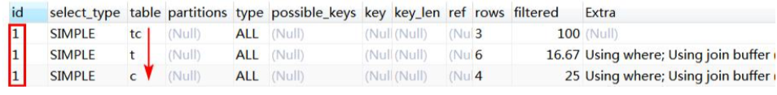

为什么数据量不同的时候顺序会发生变化呢?这个是由笛卡尔积决定的。

举例:假如有 a、b、c 三张表，分别有 2、3、4 条数据，如果做三张表的联合查询， 

- 当查询顺序是 a→b→c 的时候，它的笛卡尔积是:`2*3*4=6*4=24`。

- 如果查询顺序是 c →b→a，它的笛卡尔积是 `4*3*2=12*2=24`。

因为 MySQL 要把查询的结果，包括中间结果和最终结果都保存到内存，所以 MySQL 会优先选择中间结果数据量比较小的顺序进行查询。所以最终联表查询的顺序是 a→b→ c。这个就是为什么 teacher 表插入数据以后查询顺序会发生变化。

(小表驱动大表的思想)

#### 既有相同也有不同

**如果 ID 有相同也有不同，就是 ID 不同的先大后小，ID 相同的从上往下。**

#### select type 查询类型

这里并没有列举全部(其它: DEPENDENT UNION、DEPENDENT SUBQUERY、 MATERIALIZED、UNCACHEABLE SUBQUERY、UNCACHEABLE UNION)。

- SIMPLE , 简单查询，不包含子查询，不包含关联查询 union。
- PRIMARY 子查询 SQL 语句中的主查询，也就是最外面的那层查询。
- SUBQUERY 子查询 ,子查询中所有的内层查询都是 SUBQUERY 类型的。

```sql
-- 查询 mysql 课程的老师手机号 
EXPLAIN SELECT tc.phone FROM teacher_contact tc WHERE tcid = (
SELECT
	tcid 
FROM
	teacher t 
WHERE
	t.tid = ( SELECT c.tid FROM course c WHERE c.cname = 'mysql' ) );
```

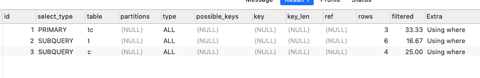

- DERIVED

  衍生查询，表示在得到最终查询结果之前会用到临时表。例如:

```
EXPLAIN SELECT cr.cname
FROM (
	SELECT * FROM course WHERE tid = 1 
UNION
	SELECT * FROM course WHERE tid = 2 
) cr;
```

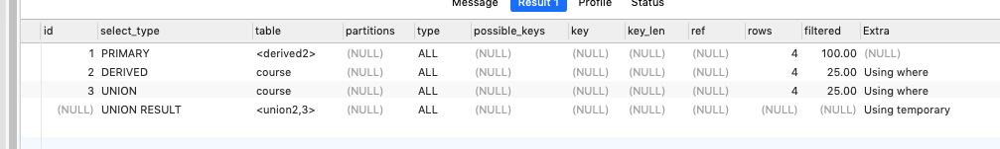

对于关联查询，先执行右边的 table(UNION)，再执行左边的 table，类型是 DERIVED。

- UNION

  用到了 UNION 查询

- UNION RESULT

  主要是显示哪些表之间存在 UNION 查询。<union2,3>代表 id=2 和 id=3 的查询 存在 UNION。同上例。

### type 连接类型

> https://dev.mysql.com/doc/refman/5.7/en/explain-output.html#explain-join-types

所有的连接类型中，上面的最好，越往下越差。

在常用的链接类型中: **system > const > eq_ref > ref > range > index > all**

这 里 并 没 有 列 举 全 部 ( 其 他 : fulltext 、 ref_or_null 、 index_merger 、
unique_subquery、index_subquery)。

 以上访问类型除了 all，都能用到索引。

- system

  system 是 const 的一种特例，只有一行满足条件。例如:只有一条数据的系统表。

- const

  主键索引或者唯一索引，只能查到一条数据的 SQL。

- eq_ref

  通常出现在多表的 join 查询，表示对于前表的每一个结果,都只能匹配到后表的一行结果。一般是唯一性索引的查询(UNIQUE 或 PRIMARY KEY)。
  
eq_ref 是除 const 之外最好的访问类型。
  
  ```
  先删除 teacher 表中多余的数据，teacher_contact 有 3 条数据，teacher 表有 3 条数据。
  DELETE FROM teacher where tid in (4,5,6); commit;
  ​
  -- 备份
  INSERT INTO `teacher` VALUES (4, 'james', 4); INSERT INTO `teacher` VALUES (5, 'tom', 5); INSERT INTO `teacher` VALUES (6, 'seven', 6); commit;
```
  
为 teacher_contact 表的 tcid(第一个字段)创建主键索引。
  
  ```
  -- ALTER TABLE teacher_contact DROP PRIMARY KEY;
  ALTER TABLE teacher_contact ADD PRIMARY KEY(tcid);
```
  
为 teacher 表的 tcid(第三个字段)创建普通索引。
  
  ```
  -- ALTER TABLE teacher DROP INDEX idx_tcid;
  ALTER TABLE teacher ADD INDEX idx_tcid (tcid);
```
  
执行以下 SQL 语句:
  
  ```
  select t.tcid from teacher t,teacher_contact tc where t.tcid = tc.tcid;
```
  
  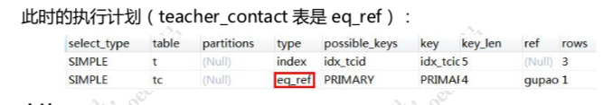

以上三种 system，const，eq_ref，都是可遇而不可求的，基本上很难优化到这个 状态。

- ref

查询用到了非唯一性索引，或者关联操作只使用了索引的最左前缀。

```
例如:使用 tcid 上的普通索引查询
explain SELECT * FROM teacher where tcid = 3;
```

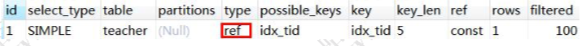


- range

索引范围扫描。

如果where后面是 `between, and, <, >, >=, <=, in这些`，type类型就为 range。 

不走索引一定是全表扫描(ALL)，所以先加上普通索引。

```
-- ALTER TABLE teacher DROP INDEX idx_tid;
ALTER TABLE teacher ADD INDEX idx_tid (tid);
```

执行范围查询(字段上有普通索引):

```
EXPLAIN SELECT * FROM teacher t WHERE t.tid <3;
-- 或
EXPLAIN SELECT * FROM teacher t WHERE tid BETWEEN 1 AND 2;
```

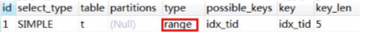


IN 查询也是 range(字段有主键索引)

```
EXPLAIN SELECT * FROM teacher_contact t WHERE tcid in (1,2,3);
```

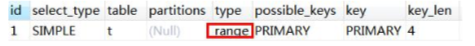

- index

Full Index Scan，查询全部索引中的数据(比不走索引要快)。

```
EXPLAIN SELECT tid FROM teacher;
```

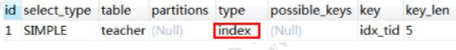

- all

Full Table Scan，如果没有索引或者没有用到索引，type 就是 ALL。代表全表扫描。

- NULL

 不用访问表或者索引就能得到结果，例如

```
EXPLAIN select 1 from dual where 1=1;
```

一般来说，需要保证查询至少达到 range 级别，最好能达到 ref。 ALL(全表扫描)和 index(查询全部索引)都是需要优化的。

### possible_key、key

可能用到的索引和实际用到的索引。如果是 NULL 就代表没有用到索引。

possible_key 可以有一个或者多个，可能用到索引不代表一定用到索引。

反过来，possible_key 为空，key 可能有值吗?

表上创建联合索引:

```
ALTER TABLE user_innodb DROP INDEX comidx_name_phone;
ALTER TABLE user_innodb add INDEX comidx_name_phone (name,phone);
```

执行计划(改成 select name 也能用到索引):

```
explain select phone from user_innodb where phone='126';
```

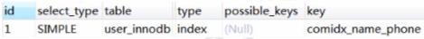


结论:是有可能的(这里是覆盖索引的情况)。

如果通过分析发现没有用到索引，就要检查 SQL 或者创建索引。

### key_len

索引的长度(使用的字节数)。跟索引字段的类型、长度有关。

### rows 

MySQL 认为扫描多少行才能返回请求的数据，是一个预估值。一般来说行数越少越好。

### filtered

这个字段表示存储引擎返回的数据在 server 层过滤后，剩下多少满足查询的记录数量的比例，它是一个百分比。

### ref

使用哪个列或者常数和索引一起从表中筛选数据。

### Extra

执行计划给出的额外的信息说明。

- using index ,  用到了覆盖索引，不需要回表。
- using where , 使用了 where 过滤，表示存储引擎返回的记录并不是所有的都满足查询条件，需要 在 server 层进行过滤(跟是否使用索引没有关系)。


```
EXPLAIN select * from user_innodb where phone ='13866667777';
```

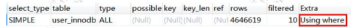

- using index condition (索引条件下推)

- using filesort 不能使用索引来排序，用到了额外的排序(跟磁盘或文件没有关系)。需要优化。 (复合索引的前提)

```
ALTER TABLE user_innodb DROP INDEX comidx_name_phone;
ALTER TABLE user_innodb add INDEX comidx_name_phone (name,phone);
EXPLAIN select * from user_innodb where name ='青山' order by id;
```

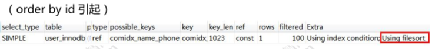

- using temporary , 用到了临时表。

  - distinct 非索引列`EXPLAIN select DISTINCT(tid) from teacher t;`
  - group by 非索引列`EXPLAIN select tname from teacher group by tname;`
  - 使用 join 的时候，group 任意列 `EXPLAIN select t.tid from teacher t join course c on t.tid = c.tid group by t.tid;`

  需要优化，例如创建复合索引。

## 总结一下:

模拟优化器执行 SQL 查询语句的过程，来知道 MySQL 是怎么处理一条 SQL 语句的。

 通过这种方式我们可以分析语句或者表的性能瓶颈。

分析出问题之后，就是对 SQL 语句的具体优化。

## SQL与索引优化

当我们的 SQL 语句比较复杂，有多个关联和子查询的时候，就要分析 SQL 语句有没 有改写的方法。
  举个简单的例子，一模一样的数据:

```
-- 大偏移量的 limit
select * from user_innodb limit 900000,10;
-- 改成先过滤 ID，再 limit
SELECT * FROM user_innodb WHERE id >= 900000 LIMIT 10;
```

对于具体的 SQL 语句的优化，MySQL 官网也提供了很多建议，这个是我们在分析 具体的 SQL 语句的时候需要注意的，也是大家在以后的工作里面要去慢慢地积累的(这 里我们就不一一地分析了)。

