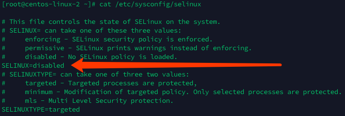

# 安装前系统检测

- SELinux和系统防火墙iptables需要关闭
- IO调度系统默认是cfq 模式,强烈建议使用deadline模式
- swap分区设置
- 文件系统的选择
- 操作系统的限制
- numa需要关闭

## SELinux和系统防火墙iptables需要关闭

要把 SELINUX 设置为 disable, 设置完成后要重启系统

```shell
cat /etc/sysconfig/selinux
```



## IO调度系统默认是cfq 模式,强烈建议使用deadline模式

查看 IO 调度文件

```shell
[root@centos-linux-2 ~]# cat /sys/block/sda/queue/scheduler 
noop [deadline] cfq 
```

修改 IO 调度器, 需要要 etc/gurb.conf 中加入 elevator=deadline,保证永久有效

## 