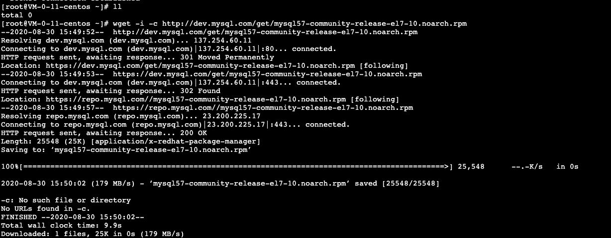
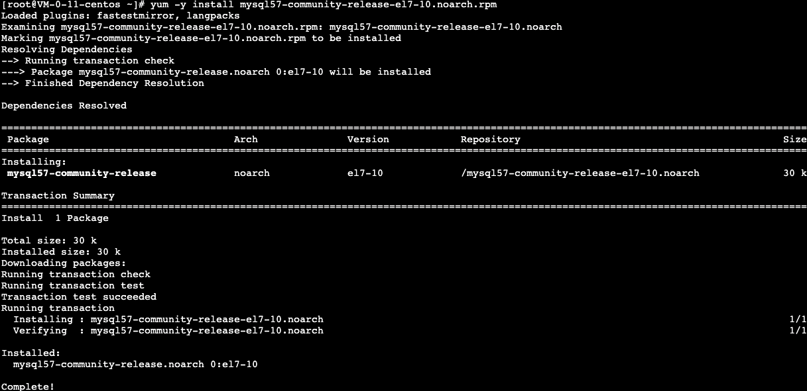
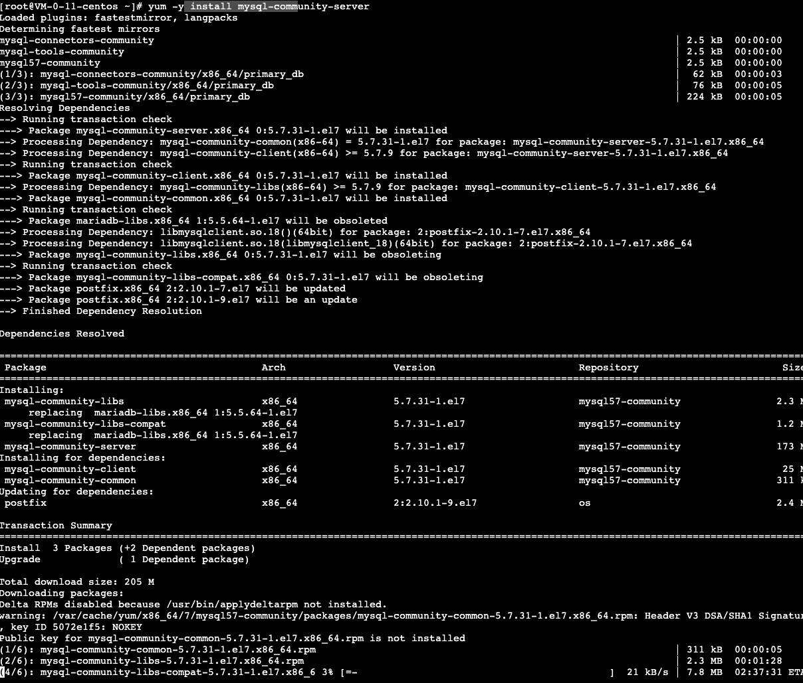

# 020-5.7版本安装

```
groupadd mysql
```

```she
useradd -g mysql mysql -s /sbin/nologin
```

```sql
mv mysql-5.7.30-linux-glibc2.12-x86_64.tar.gz /usr/local/
```

```sql
cd /usr/local/
```

```
ln -s mysql-5.7.30-linux-glibc2.12-x86_64/ mysql
```

mkdir -p /data/mysql/









在CentOS中默认安装有MariaDB（MySQL的一个分支），安装完成之后可以直接覆盖MariaDB。

