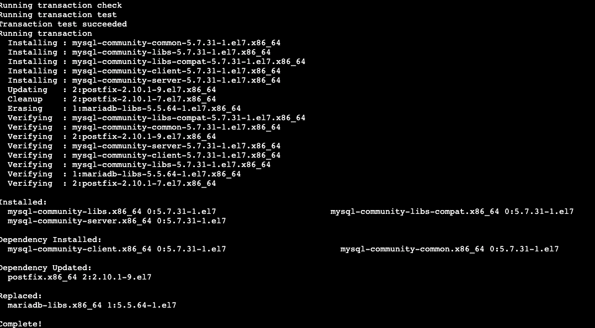
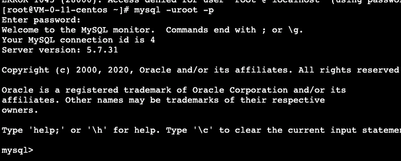

# CentOS安装MySQL-yum方式

## 环境信息

> - CentOs7
>
> - MySQL版本号：5.7.28

## 下载yum repository

```sql
wget -i -c http://dev.mysql.com/get/mysql57-community-release-el7-10.noarch.rpm
```


## 安装 rpm

```
yum -y install mysql57-community-release-el7-10.noarch.rpm
```

## 安装MySQL服务器

> 如果速度慢,参考文章 yum 替换阿里云源

```
yum -y install mysql-community-server
```



## 启动MySQL

```
systemctl start  mysqld.service
```

## 查看运行状态

```
systemctl status mysqld.service
```

## 找到MySQL-root用户的初始密码

```
grep "password" /var/log/mysqld.log
```


## 使用临时密码连接客户端

```
mysql -uroot -pPocG!ZQdi0p&
```



## (可选)修改密码安全限制，否则不能使用简单密码

#### 修改密码策略

- 临时修改

  >   mysql> set global validate_password_policy=0;
  >   mysql> set global validate_password_length=1;

- 永久修改

  > MySQL默认的配置文件 vim /etc/my.cnf

  ```
  validate_password_policy=0
  validate_password_length=1
  ```

  永久修改后重启MySQL

  >  service mysqld restart

修改策略以后就可以修改咱们的密码为简单密码啦

#### 修改密码

```
mysql> ALTER USER 'root'@'localhost' IDENTIFIED BY '123456';
```

## 授权远程访问

```
mysql> grant all privileges on *.* to 'root'@'%' identified by '123456'; 
```

如果需要远程连接，注意开放3306端口或者关闭防火墙。

## MySQL默认的数据文件目录

```sql
mysql> show variables like 'datadir';
/var/lib/mysql/
```

## MySQL默认错误日志文件

```sql
mysql> show variables like ‘log_error’;
/var/log/mysqld.log
```

至此,安装完成

