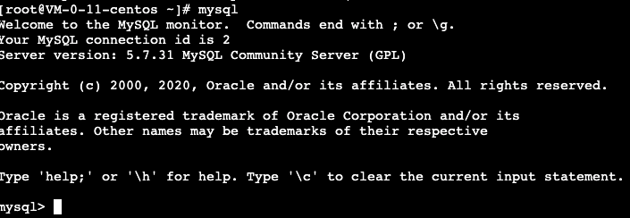
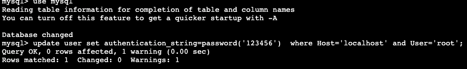

# MySQL数据库root密码丢失

## 忘记密码无法登陆

```shell
mysql -uroot -p
```

登陆不成功

```sql
[root@VM-0-11-centos ~]# mysql -uroot -p
Enter password: 
ERROR 1045 (28000): Access denied for user 'root'@'localhost' (using password: YES)
```

## 强制停库

先查看 mysql 进程号

```shell
ps -ef | grep mysql
```


kill 掉 MySQL 进程

## 添加跳过权限表参数

添加上[跳过权限表]参数可以不用输入密码进入数据库

```
vim /etc/my.cnf
```

在配置文件中加一行skip-grant-tables

```
[mysqld]
skip-grant-tables
```

重启数据库服务

```
service mysqld restart
```

然后使用mysql命令登录，使用以下密码修改密码。



```
mysql> use mysql;
mysql> update user set authentication_string=password('123456')  where Host='localhost' and User='root';
```



修改以后，在配置文件中去掉skip-grant-tables，重启数据库服务。

再使用 mysql -uroot -p123456登录