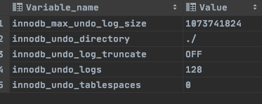

# UndoLog

undolog (撤销日志或回滚日志)

## 是什么

记录了事务发生之前的数据状态(不包括select )。

如果修改数据时出现异常，可以用 undo log 来实现回滚操作(保持原子性)。

在执行 undo 的时候，仅仅是将数据从逻辑上恢复至事务之前的状态，而不是从物理页面上操作实现的，属于逻辑格式的日志。

redo Log 和 undo Log 与事务密切相关，统称为事务日志。

undo Log 的数据默认在系统表空间 ibdata1 文件中，因为共享表空间不会自动收缩，也可以单独创建一个 undo 表空间。

```
show global variables like '%undo%';
```



1. 事务开始，从内存或磁盘取到这条数据，返回给 Server 的执行器;
2. 执行器修改这一行数据的值为 penyuyan;
3. 记录 name=qingshan 到 undo log;
4. 记录 name=penyuyan 到 redo log; 
5. 调用存储引擎接口，在内存(Buffer Pool)中修改 name=penyuyan; 
6. 事务提交。内存和磁盘之间，工作着很多后台线程。

## 相关配置

undo 表空间可以通过参数单独设置存储位置,可以从 ibdata1 中独立出来

```
Innodb_data_file_path
```

负责定义系统表空间的路径,初始化大小,自动扩展策略

 [09-binlog-redolog-undolog.md](../01-总体结构/09-binlog-redolog-undolog.md) 