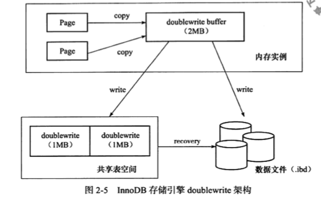
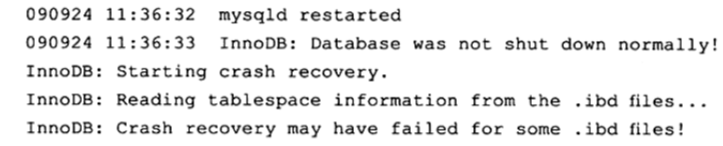
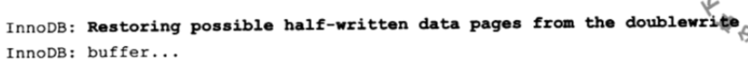

# 两次写(Double Write)

---

[TOC]

## 一言蔽之

> 如果说 ChangeBuffer 带给 InnoDB 存储引擎的是性能上的提升,那么 Double Write 两次写带给 InnoDB 存储引擎的是数据页的可靠性

## 为什么要保证数据页的可靠性

#### 部分写失败

当发生数据库宕机时,可能 InnoDB 存储引擎正在写入某个页到表中,而这个页只写了一部分, 比如 16KB 的页, 只写了前 4KB ,就发生了宕机,这种情况被成为**部分写失效(partial page write)** 

在 InnoDB 存储引擎没有使用 DoubleWrite 技术之前,曾经出现过因为部分写失败而导致数据丢失的情况

#### 为什么不能用 redolog 来恢复呢

如果发生了写失败,我们是否可以通过重做日志来进行恢复呢?这是一个办法.但是你必须知道

**重做日志中记录的是对页的物理操作,如偏移量800.写'aaaa'记录**, 如果这个页本身就已经发生了损坏,再对其进行重做是没有意义的,也就是说,

在应用(apply)重做日志之前,用户需要一个页的副本,当写入失效发生时,先通过页的副本来还原页,再进行重做,这就是doublewrite

## DoubleWrite的结构

由两部分组成

- 一部分是内存中的 double write buffer , 大小为 2MB
- 一部分是在物理磁盘上共享表空间中的,连续 128 个页, 2 个区 ,大小同样是 2MB



在对缓冲池的脏页进行刷新时,并不直接写磁盘,而是通过memcy函数将脏页先复制到内存中的doublewrite buffer , 之后通过doublewrite buffer 再分两次,每次 1MB顺序地写入共享表空间的物理磁盘上,然后马上调用fsync函数,同步磁盘,避免缓冲写带来的问题

在整个过程中,因为doublewrite 页是连续的,因此这个过程是顺序写的,开销并不是很大,在完成doublewrite页的写入后,再将doublewrite buffer中的页写入各个表空间文件中,此时写入则是离散的

## 流程

- 缓冲池准备对脏页进行刷脏, 还没有写磁盘

- 通过 memcpy 函数将脏页复制到内存中的 doublewrite buffer (大小是 2M) 

  > doublewrite 页是连续的,因此这个过程是顺序写的,开销不是很大

- 调用 fync 函数 同步脏页到磁盘

崩溃恢复

- InnoDB 引擎先从共享表空间中的 doublewrite 中找到该页的一个副本
- 将副本复制到表空间文件
- 执行 redo log

## 工作流程

双写缓冲是一个位于系统表空间中的**存储区域**

- 在堆缓冲池的脏页进行刷新时,并不直接写磁盘,而是会通过 memcpy 函数将脏页先复制到 doublewrite buffer 中

- 之后通过 doublewrite buffer 再分两次,每次 1MB 顺序地写入共享空间的物理磁盘上
- 调用 fsync 函数,同步磁盘,避免缓冲写带来的问题(这个过程是顺序写的,开销并不是很大)

完成doublewrite 页的写入后,再将 doublewrite buffer 中的页写入各个表空间文件中, 此时写入则是离散的

## 配置

双写缓冲在默认场景下都是有效的,可以通过设置 **innodb_doublewrite** 为 0 来关闭双写缓冲

## 观察两次写的运行情况

```sql
mysql>SHOW GLOBAL STATUS like 'innodb_dblwr%' \G;
```

| Variable\_name                | Value  |
| :---------------------------- | :----- |
| Innodb\_dblwr\_pages\_written | 442327 |
| Innodb\_dblwr\_writes         | 86718  |

可以看出 doublewrite 一共写了 442327 个页, 但是实际写入次数为 86718 , 基本符合 64: 1

如果发现系统在高峰时, 比例远小于64: 1 ,那么说明系统写入压力并不是很高

## 重写

如果才做系统在将页写入磁盘的过程中发生了崩溃,在恢复过程中 , InnoDB存储引擎可以从共享表空间中的 doublewrite 中找到该页的一个副本,将其复制到表空间文件,再应用重做日志,下面显示了一个由doublewrite进行恢复的情况





## 禁用

参数 skip_innodb_doublewrite 可以禁止使用doublewrite 功能,但是可能会发生前面提及的部分写失效问题

如果用户有多个从服务器,需要提供较快的性能(如在slaves erver上做的是RAID0) , 也许启用这个参数是一个办法

不过对于需要提供数据高可靠性的主服务器, 任何时候用户都应该开启doublewrite 功能

