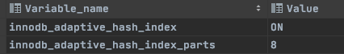

# 自适应哈希

哈希是一种非常快的查找方法,一般情况下这种查找的事件复杂度为 O(1) ,

B+树的查找次数,取决于 B+树的高度, 在生产环境中, B+树的高度一般为 3-4 层,所以需要 3-4 次查询

## 目录

- [什么是自适应hash](#什么是自适应hash)
- [什么条件下会启动](#什么条件下会启动)
- [如何开启](#如何开启)
- [开启后效果](#开启后效果)

## 什么是自适应hash

InnoDB 存储引擎会监控对表上各索引页的查询. 如果观察到建立哈希索引可以带来速度提升,则建立 hash 索引, 称之为 **自适应哈希索引 (Adaptive Hash Index),AHI**

自适应哈希索引是通过 B+树页构造而来,因此建立的速度也很快,而且不需要对整张表构建 Hash 索引, InnoDB 存储引擎会自动根据访问的频率和模式来自动地为某些热点页建立哈希索引

## 什么条件下会启动

AHI 有一个要求, 对这个页的连续访问模式必须是一样的,例如对(a,b)这样的联合索引页,其访问可以是以下情况

- WHERE a == xxx
- WHERE a == xxx and b =xxx

访问模式一样指的是查询条件一样,若交替进行上述两种查询,那么 InnoDB 存储引擎不会对该页进构造 AHI, 此外,AHI 还有如下要求

- 以该模式访问 了 100 次
- 页通过该模式访问了 N 次, N 是页中数据 * 1/16

## 如何开启

可以通过配置 innodb_adaptive_hash_index 参数来控制,默认情况下是开启的

> ```sql
> show global variables like '%innodb_adaptive_hash_index%';
> ```



MySQL 5.7 开始,自适应哈希索引搜索系统是分区的,每个索引都会绑定到一个特殊的分区上,而且各个分区都有自己的锁存器来保护

分区可以通过`innodb_adaptive_hash_index_paths` 参数来控制, 该参数的默认值为 8 个,最大可以设置为 512 个

- 通过设置分区值,可以减低争用,提高并发性

可以使用 show engine innodb status 命令所输出的 SEMAPHORES 部分来监控自适应哈希索引的使用以及其竞争情况,如果你看到许多线程正在等待在 btrOsea.c 中创建的 RW-latch , 则它可能被用于精致自适应哈希索引

```
 show engine innodb status
```

## 开启后效果

开启后, 读取和写入速度可以提高 2 倍,辅助索引的连接操作性能可以提高 5 倍

毫无疑问, AHI 是非常好的优化模式,其设计思想是数据库自优化(self-trunning) 即无需 DBA 对数据库进行人为调整