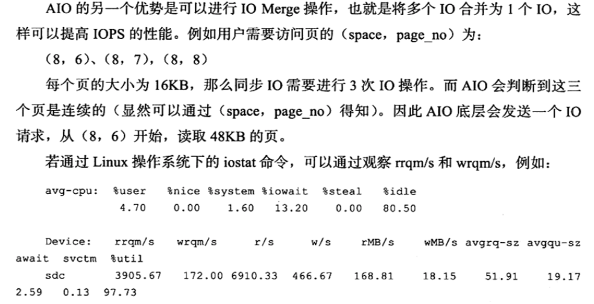

# 异步 IO

[toc]

## 什么是AIO

为了提高磁盘操作性能,当前的数据库系统都采用异步IO(Asynchronous IO) AIO 的方式来处理磁盘操作, InnoDB 也是一样

## 什么是SIO

AIO 相对的是 Sync IO ,即同步 IO, 需要等待此次操作结束才能继续接下来的操作

## 为什么要有AIO

#### 减少等待时间

- 如果一个用户发出的是一条索引扫描的查询,那么这条 SQL 查询语句可能需要扫描多个索引页,也就是需要多次 IO,
- 在扫描一个页并等待完成后再扫描另一个页是没有必要的
- 用户可以在发出一个 IO 请求后立即再发出另一个 IO 请求,当 IO 请求发送完毕后,等待所有的 IO 操作完成,这就是 AIO

#### IOMerge提高IOPS

- AIO的另一个优势就是可以进行 IO Merge 操作

