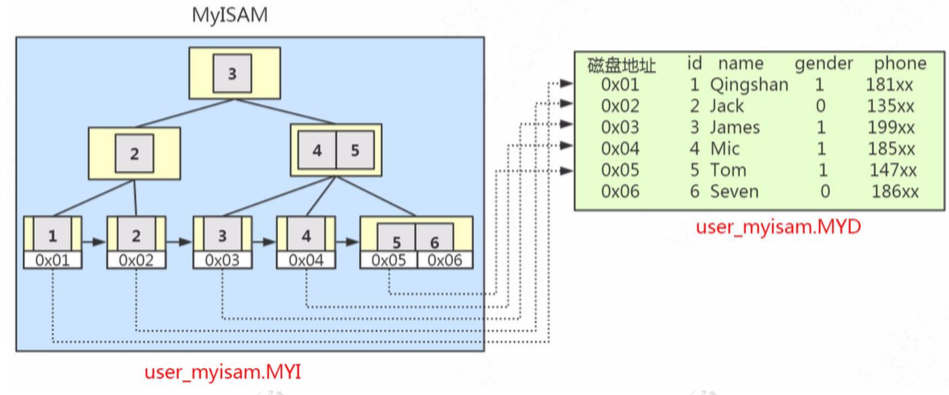

# MyISAM(3个文件)

> 一个显著的特点是其只缓存索引文件,数据文件的缓存交由操作系统本身来完成

应用范围比较小。表级锁定限制了读/写的性能，因此在 Web 和数据仓库配置中， 它通常用于只读或以读为主的工作。

特点:

- **支持表级别的锁**(插入和更新会锁表)。
- **不支持事务**
- 支持全文索引
- 拥有较高的插入 **(insert)** 和查询 **(select)** 速度
- 存储了表的行数 (count 速度更快)

(怎么快速向数据库插入100 万条数据?我们有一种先用 **MyISAM** 插入数据，然后修改存储引擎为 InnoDB 的操作)

-  适合:**只读之类的数据分析的项目。**

在缓冲池中只缓存(索引文件) **不缓冲数据文件**,这点和大多数的数据库不同

#### 三个文件

- frm 文件存放表结构
- **.MYD 文件**，D 代表 Data，是 MyISAM 的数据文件，存放数据记录，比如我 们的 user_myisam 表的所有的表数据。
- **.MYI 文件**，I 代表 Index，是 MyISAM 的索引文件，存放索引，比如我们在 id 字段上面创建了一个主键索引，那么主键索引就是在这个索引文件里面。

## 主键索引的存储方式

也就是说，在 MyISAM 里面，索引和数据是两个独立的文件。

那我们怎么根据索引找到数据呢?

MyISAM 的 B+Tree 里面，叶子节点存储的是数据文件对应的磁盘地址。所以从索引文件.MYI 中找到键值后，会到数据文件.MYD 中获取相应的数据记录。

## 辅助索引的存储方式

在 MyISAM 里面，辅助索引也在这个.MYI 文件里面。 辅助索引跟主键索引存储和检索数据的方式是没有任何区别的，一样是在索引文件
里面找到磁盘地址，然后到数据文件里面获取数据。

