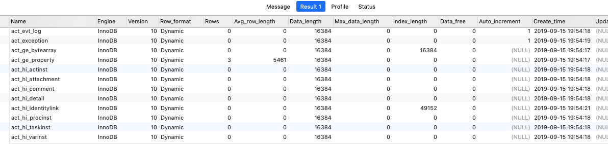

# 存储引擎总览

- [存储引擎在总体架构的位置](#存储引擎在总体架构的位置)
- [存储引擎在硬盘上的体现](#存储引擎在硬盘上的体现)
- [数据库支持的存储引擎](#数据库支持的存储引擎)
- [如何选择存储引擎](#如何选择存储引擎)
- [各个存储引擎的特点](#各个存储引擎的特点)

## 存储引擎在总体架构的位置


## 常用的存储引擎

| 存储引擎名称                   | 特点                                                         | 应用场景                                            |
| ------------------------------ | ------------------------------------------------------------ | --------------------------------------------------- |
| [InnoDB](010-InnoDB/README.md) | 支持事务;行锁;支持 MVCC多版本并发控制;并发性高               | 应用于 OLTP (联机事务处理) 业务系统                 |
| [MyISAM](#MyISAM(3个文件))     | 不支持事务; 表锁; 8.0之后废弃了,并发低,资源利用率也低        | 应用于 OLAP 系统,生产应该尽量少使用 MySIAM 存储引擎 |
| [Memory](030-Memory/README.md) | 表中的数据都在内存存放,不落地,支持 Hash 和 Btree 索引,数据读取块,安全性不高 | 对于数据安全性要求不高的环境                        |
| TokuDB                         | 支持事务,支持压缩,告诉写入功能, 比 InoDB 块 9 倍, 支持在线 Onlne DDL,不产生索引碎片 | 应用于海量数据的存储场景                            |
| MariaDb Cloumnstore            | 列式存储一起,高压缩功能                                      | 数据仓库,OLAP 业务系统                              |
| Blackhole                      | 不支持数据存储,数据写入只写 binlog                           | blackhole 常用来做 binlog 转储或者测试              |

## 存储引擎基本介绍

在 MySQL 里面，支持多种存储引擎，他们是可以替换的，所以叫做插件式的存储引擎。为什么要搞这么多存储引擎呢?一种还不够用吗?

#### 存储引擎的好处

每个存储引擎都有其特点,能够根据具体的应用建立不同的存储引擎表

#### 查看存储引擎

```
show table status from 'notes'(库名)
show table status like 'table'(表名)
```



查看某个表的存储引擎


| 属性名          | 解释                                                         |
| --------------- | ------------------------------------------------------------ |
| Row_format      | 行格式。对于MyISAM引擎，这可能是Dynamic，Fixed或Compressed。动态行的行长度可变，例如Varchar或Blob类型字段。固定行是指行长度不变，例如Char和Integer类型字段 |
| Rows            | 表中的行数。对于MyISAM和其他存储引擎，这个值是精确的，对于innoDB存储引擎，这个值通常是估算的 |
| Avg_row_length  | 平均每行包括的字节数                                         |
| Data_length     | 整个表的数据量(以字节为单位)                                 |
| Max_data_length | 表可以容纳的最大数据量，该值和存储引擎相关                   |
| Index_length    | 索引占用磁盘的空间大小(以字节为单位)                         |
| Data_free       | 对于MyISAM引擎，表示已经分配，但目前没有使用的空间。这部分空间包含之前被删除的行，以及后续可以被insert利用到的空间 |
| Auto_increment  | 下一个Auto_increment的值                                     |
| Create_time     | 表的创建时间                                                 |
| Update_time     | 表的最近更新时间                                             |
| Check_time      | 使用 check table 或myisamchk工具最后一次检查表的时间         |
| Collation       | 表的默认字符集和字符排序规则                                 |
| Checksum        | 如果启用，保存的是整个表的实时校验和                         |
| Create_options  | 创建表时指定的其他选项                                       |
| Comment         | 包含了其他额外信息，对于MyISAM引擎，保存的是表在创建时带的注释。如果表使用的是innodb引擎 ，保存的是InnoDB表空间的剩余空间。如果是一个视图，注释里面包含了VIEW字样。 |

在 MySQL 里面，我们创建的每一张表都可以指定它的存储引擎，而不是一个数据库只能使用一个存储引擎。存储引擎的使用是以表为单位的。而且，创建表之后还可以修 改存储引擎。

## 存储引擎在硬盘上的体现

```sql
show variables like 'datadir';
```


## 数据库支持的存储引擎

#### 用这个命令查看数据库对存储引擎的支持情况:

```java
show engines;
```

其中有存储引擎的描述和对事务、XA 协议和 Savepoints 的支持。

- XA 协议用来实现**分布式事务**(分为本地资源管理器，事务管理器)。 
- **Savepoints 用来实现子事务(嵌套事务)**。创建了一个 Savepoints 之后，事务就可以回滚到这个点，不会影响到创建 Savepoints 之前的操作。


## 如何选择存储引擎

这是 MySQL 里面常见的一些存储引擎，我们看到了，不同的存储引擎提供的特性都 不一样，它们有不同的**存储机制**、**索引方式**、**锁定水平**等功能。
我们在不同的业务场景中对数据操作的要求不同，就可以选择不同的存储引擎来满 足我们的需求，这个就是`MySQL `支持这么多存储引擎的原因。

- 如果对数据一致性要求比较高，需要事务支持，可以选择 InnoDB。
- 如果数据查询多更新少，对查询性能要求比较高，可以选择 MyISAM。 
- 如果需要一个用于查询的临时表，可以选择 Memory。

## 存储引擎

-  [InnoDB](010-InnoDB/README.md) 
-  [MyISAM](020-MyISAM/README.md) 
-  [Memory](030-Memory/README.md) 
-  [CSV](040-CSV/README.md) 
-  [Archive](050-Archive/README.md) 

## 各个存储引擎的特点

| Feature                                   | InnoDB       | MyISAM       | Memory           | Archive      | NDB          |
| ----------------------------------------- | ------------ | ------------ | ---------------- | ------------ | ------------ |
| **B-tree indexes**                        | Yes          | Yes          | Yes              | No           | No           |
| **备份/恢复时间点** (note 1)              | Yes          | Yes          | Yes              | Yes          | Yes          |
| **集群数据库支持**                        | No           | No           | No               | No           | Yes          |
| **聚集索引**                              | Yes          | No           | No               | No           | No           |
| **压缩数据**                              | Yes          | Yes (note 2) | No               | Yes          | No           |
| **数据缓存**                              | Yes          | No           | N/A              | No           | Yes          |
| **加密的数据**                            | Yes (note 4) | Yes (note 3) | Yes (note 3)     | Yes (note 3) | Yes (note 3) |
| **Foreign key support**                   | Yes          | No           | No               | No           | Yes (note 5) |
| **Full-text search indexes**              | Yes (note 6) | Yes          | No               | No           | No           |
| **地理空间数据类型支持**                  | Yes          | Yes          | No               | Yes          | Yes          |
| **地理空间索引支持**                      | Yes (note 7) | Yes          | No               | No           | No           |
| **Hash indexes**                          | No (note 8)  | No           | Yes              | No           | Yes          |
| **Index caches**                          | Yes          | Yes          | N/A              | No           | Yes          |
| **锁粒度Locking granularity**             | Row          | Table        | Table            | Row          | Row          |
| **MVCC**                                  | Yes          | No           | No               | No           | No           |
| **Replication support** (note 1)          | Yes          | Yes          | Limited (note 9) | Yes          | Yes          |
| **Storage limits**                        | 64TB         | 256TB        | RAM              | None         | 384EB        |
| **T-tree indexes**                        | No           | No           | No               | No           | Yes          |
| **Transactions**                          | Yes          | No           | No               | No           | Yes          |
| **Update statistics for data dictionary** | Yes          | Yes          | Yes              | Yes          | Yes          |

**Notes:**

1. 在服务器中实现，而不是在存储引擎中实现。
2. Compressed MyISAM tables are supported only when using the compressed row format. Tables using the compressed row format with MyISAM are read only.
3. Implemented in the server via encryption functions.
4. Implemented in the server via encryption functions; In MySQL 5.7 and later, data-at-rest tablespace encryption is supported.
5. Support for foreign keys is available in MySQL Cluster NDB 7.3 and later.
6. InnoDB support for FULLTEXT indexes is available in MySQL 5.6 and later.
7. InnoDB support for geospatial indexing is available in MySQL 5.7 and later.
8. InnoDB内部利用哈希索引来实现自适应哈希索引特性。
9. See the discussion later in this section.