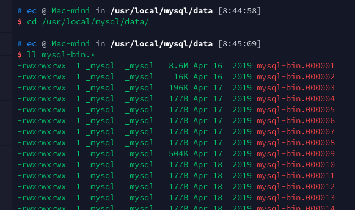
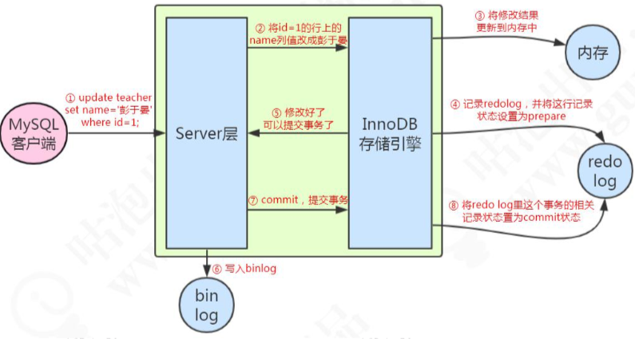

# MySQL二进制文件-Binlog

## 目录

- [BinLog是什么](#BinLog是什么)
- [BinLog什么时候写入的](#BinLog什么时候写入的)
- BinLog格式
- [使用实例](#使用实例)

## BinLog是什么

插入前存储到硬盘的逻辑日志 , 以事件的形式记录了所有的 DDL 和 DML 语句 (因为它记录的是操作而不是数据值，属于逻辑日志)，可以用来做主从复制和数据恢复。binlog 不包含 select 和 show 这样的语句, 如果需要记录, 需要开启全量日志功能

#### 有什么用

- 恢复 (recovery) : 某些数据的恢复需要二进制日志, 例如, 在一个数据库全备文件恢复后,用户可以通过而二进制日志进行 point-in-time (基于时间点和基于位置) 的恢复
- 复制 (replication) : 其原理与恢复类似 , 通过复制和执行二进制日志使一台远程的 MySQL 数据库(slave) 实时同步
- 审计 (audit) : 用户可以通过二进制日志中的信息来进行审计,判断是否对数据库进行诸如攻击

## BinLog什么时候写入的

事务提交以后写入BinLog

刷新条件:

sync_binlog 参数来决定的

- sync_binlog = 1 时 , 更加安全

  事务提交后,MySQL让文件系统自行决定什么时候同步,如果 cache 满了才会同步到磁盘

> 当 sync_binlog = 1 , innodb_flush_log_at_trx_commit = 1 , 是双写模式,确保数据库更安全

- sync_binlog = n 时 ,更关注性能

  每进行 n 次事务提交,MySQL 会执行一次 fync 之类的磁盘同步命令强制写入磁盘

## 使用实例

- [开启binlog](#开启binlog)

- [查看存储位置](#查看存储位置)

- [查看当前binlog以及状态](#查看当前binlog以及状态)
- [查看所有binlog和其大小](#查看所有binlog和其大小)

#### 开启binlog

使用配置参数 

```
log-bin=[filename] 
```

可以启动二进制日志,如果没有命名 filename,则以主机名来为二进制日志的文件名,二进制日志默认存储在数据目录下

#### 查看存储位置

```sql
show variables like '%log_bin%'
```

```sql
[
  {
    "Variable_name": "log_bin",  
    "Value": "ON"  //开启了二进制日志
  },
  {
    "Variable_name": "log_bin_basename",
    "Value": "/usr/local/mysql/data/mysql-bin"
  },
  {
    "Variable_name": "log_bin_index",
    "Value": "/usr/local/mysql/data/mysql-bin.index"
  },
  {
    "Variable_name": "log_bin_trust_function_creators",
    "Value": "OFF"
  },
  {
    "Variable_name": "log_bin_use_v1_row_events",
    "Value": "OFF"
  },
  {
    "Variable_name": "sql_log_bin",
    "Value": "ON"
  }
]
```



#### 查看所有binlog和其大小

```sql
show binary logs
```

```json
[
  {
    "Log_name": "mysql-bin.000001",
    "File_size": 9050811
  },
  {
    "Log_name": "mysql-bin.000002",
    "File_size": 16269
  },
...
```

#### 查看当前binlog以及状态

```
show master status
```

```json
[
  {
    "File": "mysql-bin.000591",
    "Position": 197183925,
    "Binlog_Do_DB": "",
    "Binlog_Ignore_DB": "",
    "Executed_Gtid_Set": ""
  }
]
```

- 当前文件是 mysql-bin.000591
- 偏移量是 197183925
- 数据目录文件下的 mysql-bin.index 文件是二进制文件的索引文件,用来记录产生的二进制日志序号

## 一条更新语句

配置方式和主从复制的实现原理在 Mycat 第二节课中有讲述。 有了这两个日志之后，我们来看一下一条更新语句是怎么执行的:



例如一条语句 : update teacher set name='盆鱼宴' where id=1; 

1. 先查询到这条数据，如果有缓存，也会用到缓存。
2. 把 name 改成盆鱼宴，然后调用引擎的 API 接口，写入这一行数据到内存，同时记录redo log。这时 redo log 进入 prepare 状态，然后告诉执行器，执行完成了，可 以随时提交。
3. 执行器收到通知后记录 binlog，然后调用存储引擎接口，设置 redo log 为 commit 状态。
4. 更新完成。

## 流程

1. 先记录到内存，再写日志文件。
2. 记录 redo log 分为两个阶段。 
3. 存储引擎和 Server 记录不同的日志。 
4. 先记录 redo，再记录 binlog。

## 区别

 [09-binlog-redolog-undolog.md](../01-总体结构/09-binlog-redolog-undolog.md) 

## 相关参数

| 参数                                    | 默认  | 含义                                                         |
| --------------------------------------- | ----- | ------------------------------------------------------------ |
| [max_binlog_size](#max_binlog_size)     | 1G    | -                                                            |
| [binlog_cache_size](#binlog_cache_size) | 32KB  | -                                                            |
| [binlog_format](#binlog_format)         | ROW   | -                                                            |
| sync_binlog                             |       | 影响 binlog 的刷新                                           |
| expire_logs_days                        | 0     | 失效时间,单位是天                                            |
| binlog_do_db<br />binlog_ignore_db      |       | 表示写入或者忽略写入哪些库的日志                             |
| log_slave_updates                       | 1     | 该参数在搭建 m -> s1 -> s2  这样的主从架构时,需要 s1 上配置参数,才能实现s1 到 s2 的同步 |
| binlog_checksum                         | crc32 | 该参数目的就是写入 binlog 进行校验,有两个值,一个是 none 一个是 crc32 , |
| log_bin_use_v1_row_events               | OFF   | 该参数代表了 binlog 的版本信息,从 MySQL5.6.6 开始默认使用 Version 2 binary log ,显示为 OFF |
| binlog_row_image                        | FULL  | 该参数有 full, minimal,noblob 三个值,full 代表全部记录,minimal 代表值记录要修改列的记录, noblob 记录了除了 blob 和 text 之外的所有字段, |

#### max_binlog_size

> 默认值为 1G

该参数指定了单个 binlog 的最大值,如果超过了该值就会自动生成新的 binlog 文件 (重启 MySQL实例也会生成新的 binlog)

建议

> 生产情况下, binlog 的生成时间最小间隔应该保持在 2-5 分钟,所以该参数不要太大, 可以调整为 256MB

```
show variables like '%max_binlog_size%'
```

```json
[
  {
    "Variable_name": "max_binlog_size",
    "Value": "1073741824"  //1G,这里单位是字节
  }
]
```

#### binlog_cache_size

所有未提交的事务都会记录到一个缓冲中,等待事务提交时,直接将缓冲中的二进制日志写入到 binlog, 缓冲的大小由 binlog_cache_size 决定,

- 它的默认值是 32KB
- binlog_cache_size 基于会话,也就是当一个线程要开始一个事务时,MySQL 会自动分配一个该值大小的缓存

> 设置这个值要当心,如果设置太小就是使用磁盘上的临时文件记录
>
> 可以通过 show global status 命令 查看 binlog_cache_use 和 binlog_cache_disk_use 的使用情况来判断当前的 binlog_cache_size 是否合适

#### binlog_format

binlog_format 代表二进制文件的格式

- statement : 基于操作的 SQL 语句记录到 binlog 中,简称 SBR , 不建议在生产使用
  - 优点: 历史悠久,技术成熟,不需要记录每一条 SQL语句和每一行的数据变化,减少日志量
  - 缺点: 主从可可能导致 数据不一致
- row :  基于行变化,会记录行变更前的样子以及变更后的样子,简称 RBR ,生产环境推荐
  - 优点: 仅仅记录那条数据被修改了,不记录具体的 sql 语句, 5.6之后可以通过 binlog_rows_query_log_events参数,通过设置该参数,可我们可以看到完整的 SQL
  - 缺点:会产生大量的日志
- mixed : 混合使用 statement  和 row ,属于 5.1 版本的过度类型,不建议使用

```
show variables like '%binlog_format%'
set global binlog_format='ROW'
```

#### 如何查看二进制文件

二进制文件通过 cat, head 或者 tail 是无法查看的,所以需要通过 mysqlbinlog 命令查看二进制日志,转换格式化可以输出到 bin.log 文件中

```
show master status
```

```
/usr/local/mysql/bin/mysqlbinlog --no-defaults -v -v --base64-output=decode-rows /usr/local/mysql/data/mysql-bin.000592 > my_bin_log.log
```

- -v  代表可以看到具体的执行信息
- --base64-output 代表把二进制文件转换格式
  - decode-rows 