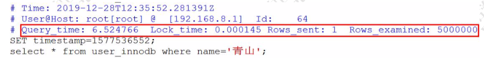

# 04-MySQL慢查询日志

> https://dev.mysql.com/doc/refman/5.7/en/slow-query-log.html

## 目录

- [什么是慢查询日志](#什么是慢查询日志)
- [慢查询日志相关参数](#慢查询日志相关参数)
- [如何查看慢日志](#如何查看慢日志)
- [实例:模拟慢查询](#实例:模拟慢查询)
- [查看慢查询日志](#查看慢查询日志)
  - [mysqldumpslow](#mysqldumpslow) : mysql 自带工具
  - percona-toolkit : 瑞士军刀第三方 

- 使用 show-profile 查看

## 什么是慢查询日志

慢查询日志可以把超过参数` long_query_time` 时间的 不小于 `min_examined_row_limit` 的所有 SQL 记录进来, (注意, 获得表锁定的时间不算作执行时间),帮助 DBA 优化有问题的 SQL 语句

- `long_query_time` 默认是 10s, 最小为0, 精度可以到微秒
- 从 MySQL 5.1 开始, 该参数就以微秒为单位记录 SQL 语句的运行时间,之前仅仅以秒为计数单位
- 因为开启慢查询日志是有代价的(跟 bin log、optimizer-trace 一样)，所以它默认是关闭的

有两种常见的语句不会被记录到慢查询语句:

- 管理语句: ALTER TABLE, REPAIR TABLE , CHECK TABLE , CREATE TABLE, DROP INDEX, OPTIMIZE TABLE 和 REPAIR TABLE  (可以使用-- `log-slow-admin-statements`)(`log_slow_admin_statements`)
- 不使用索引进行查询的语句(`log_queries_not_using_indexes`)

## 慢查询日志相关参数

```sql
SHOW VARIABLES LIKE '%slow%'
```

查询结果

| Variable\_name               | Value                                   | 含义             |
| :--------------------------- | :-------------------------------------- | ---------------- |
| log\_slow\_admin\_statements | OFF                                     |                  |
| log\_slow\_slave\_statements | OFF                                     |                  |
| slow\_launch\_time           | 2                                       |                  |
| slow\_query\_log             | OFF                                     | 是否打开慢日志   |
| slow\_query\_log\_file       | /usr/local/mysql/data/Mac-mini-slow.log | 日志文件存储位置 |

可以直接动态修改参数(重启后失效)。

```sql
set @@global.slow_query_log=1;  -- 1 开启，0 关闭，重启后失效
set @@global.long_query_time=3; -- mysql 默认的慢查询时间是 10 秒，另开一个窗口后才会查到最新值 ​
show variables like '%long_query%';
show variables like '%slow_query%';
```

或者修改配置文件 my.cnf。

以下配置定义了慢查询日志的开关、慢查询的时间、日志文件的存放路径。

```
slow_query_log = ON
long_query_time=2
slow_query_log_file =/var/lib/mysql/localhost-slow.log
```

首先我们要把慢的 SQL 语句录下来,MySQL 提供了一个 SlowQueryLog 的东西

## 实例:模拟慢查询

```sql
select sleep(10);
```

查询 user_innodb 表的 500 万数据(检查是不是没有索引)。

```java
SELECT * FROM `user_innodb` where phone = '136';
```

## 慢日志分析

#### 日志内容

```sql
show global status like 'slow_queries'; -- 查看有多少慢查询 show variables like '%slow_query%'; -- 获取慢日志目录
```

```sql
cat /var/lib/mysql/ localhost-slow.log
```



有了慢查询日志，怎么去分析统计呢?比如 SQL 语句的出现的慢查询次数最多，平均每次执行了多久?

## 查看慢查询日志

### mysqldumpslow

https://dev.mysql.com/doc/refman/5.7/en/mysqldumpslow.html
MySQL 提供了 mysqldumpslow 的工具，在 MySQL 的 bin 目录下。

```sql
mysqldumpslow --help
```

例如:查询用时最多的 20 条慢 SQL:

```
mysqldumpslow -s t -t 20 -g 'select' /var/lib/mysql/localhost-slow.log
```


- Count 代表这个 SQL 执行了多少次;
- Time 代表执行的时间，括号里面是累计时间; Lock 表示锁定的时间，括号是累计;
- Rows 表示返回的记录数，括号是累计。

除了慢查询日志之外，还有一个 SHOW PROFILE 工具可以使用。

