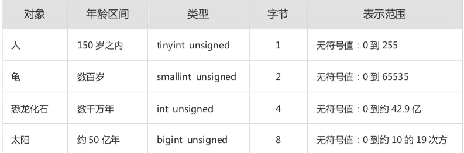

# 建表规约

#### 【强制】表达是否概念字段,必须使用is_xxx方式命名,数据类型是unsigned tinyint (1 表示是,0表示否)

说明: 任何字段如果为非负数,必须是unsigned

注意:  pojo类中的任何布尔类型的变量,都不要加is前缀,所以,resultMap设置从isXXX 到 Xxx 的映射关系,数据库表示是否的值,使用tinint类型,坚持 is_xxxx 的的命名方式是为了明确起名含义与取值范围

- 正例: 表达删除逻辑的字段名 is_deleted 1表示删除, 0 表示未删除

#### 【强制】表名、字段名必须使用小写字母或数字，禁止出现数字开头，禁止两个下划线中间只出现数字。数据库字段名的修改代价很大，因为无法进行预发布，所以字段名称需要慎重考虑。

> MySQL  在windows下不区分大小写,但是在linux下默认是区分的,因此数据库名,表名,字段名都不允许出现大写字母

- 正例: aliyun_admin，rdc_config，level3_name
- 反例: AliyunAdmin，rdcConfig，level_3_name

#### 【强制】表名不使用复数名词。

> 说明 : 表名应该仅仅表示表里面的实体内容，不应该表示实体数量，对应于 DO 类名也是单数形式，符合表达习惯。

#### 【强制】禁用保留字，如desc、range、match、delayed等，请参考MySQL官方保留字。

#### 【强制】主键索引名为pk_字段名;唯一索引名为uk_字段名;普通索引名则为idx_字段名。

> 说明 : pk_ 即 primary key;uk_ 即 unique key;idx_ 即 index 的简称。

#### 【强制】小数类型为decimal，禁止使用float和double。

> 说明:在存储的时候，float 和 double 都存在精度损失的问题，很可能在比较值的时候，得到不正确的结果。如果存储的数据范围超过 decimal 的范围，建议将数据拆成整数和小数并分开存储。

#### 【强制】如果存储的字符串长度几乎相等，使用char定长字符串类型。

#### 【强制】varchar是可变长字符串，不预先分配存储空间，长度不要超过5000，如果存储长 度大于此值，定义字段类型为 text，独立出来一张表，用主键来对应，避免影响其它字段索 引效率。

#### 【推荐】单表行数超过 500 万行或者单表容量超过 2GB，才推荐进行分库分表。 说明:如果预计三年后的数据量根本达不到这个级别，请不要在创建表时就分库分表。

#### 【推荐】字段允许适当冗余，以提高查询性能，但必须考虑数据一致。冗余字段应遵循: 

- 不是频繁修改的字段。
- 不是 varchar 超长字段，更不能是 text 字段。
- 不是唯一索引的字段。 正例:商品类目名称使用频率高，字段长度短，名称基本一不变，可在相关联的表中冗余存储类目名 称，避免关联查询。

>  【参考】合适的字符存储长度，不但节约数据库表空间、节约索引存储，更重要的是提升检 索速度。
>   正例:如下表，其中无符号值可以避免误存负数，且扩大了表示范围。

