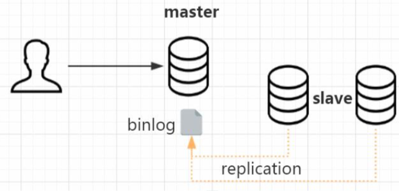
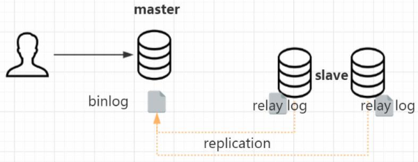

# 主从复制

如果单台数据库服务满足不了访问需求，那我们可以做数据库的集群方案。

集群的话必然会面临一个问题，就是不同的节点之间数据一致性的问题。如果同时 读写多台数据库节点，怎么让所有的节点数据保持一致?

这个时候我们需要用到复制技术(replication)，被复制的节点称为 master，复制的节点称为 slave。slave 本身也可以作为其他节点的数据来源，这个叫做级联复制。


主从复制是怎么实现的呢?更新语句会记录 binlog，它是一种逻辑日志。

有了这个 binlog，从服务器会获取主服务器的 binlog 文件，然后解析里面的 SQL 语句，在从服务器上面执行一遍，保持主从的数据一致。

这里面涉及到三个线程，连接到 master 获取 binlog，并且解析 binlog 写入中继日 志，这个线程叫做 I/O 线程。

Master 节点上有一个 log dump 线程，是用来发送 binlog 给 slave 的。

从库的 SQL 线程，是用来读取 relay log，把数据写入到数据库的。


做了主从复制的方案之后，我们只把数据写入 master 节点，而读的请求可以分担到 slave 节点。我们把这种方案叫做读写分离。


读写分离可以一定程度低减轻数据库服务器的访问压力，但是需要特别注意主从数 据一致性的问题。如果我们在 master 写入了，马上到 slave 查询，而这个时候 slave 的 数据还没有同步过来，怎么办?
 所以，基于主从复制的原理，我们需要弄明白，主从复制到底慢在哪里?

### 单线程

早期的 MySQL 中，slave 的 SQL 线程是单线程。master 可以支持 SQL 语句的并行执行，配置了多少的最大连接数就是最多同时多少个 SQL 并行执行。

而 slave 的 SQL 却只能单线程排队执行，在主库并发量很大的情况下，同步数据肯定会出现延迟。

为什么从库上的 SQL Thread 不能并行执行呢?举个例子，主库执行了多条 SQL 语句，首先用户发表了一条评论，然后修改了内容，最后把这条评论删除了。

这三条语句 在从库上的执行顺序肯定是不能颠倒的。

```sql
insert into user_comments (10000009,'nice');
update user_comments set content ='very good' where id =10000009; 
delete from user_comments where id =10000009;
```

怎么解决这个问题呢?怎么减少主从复制的延迟?

### 异步与全同步

首先我们需要知道，在主从复制的过程中，MySQL 默认是异步复制的。也就是说:

- 对于主节点来说，写入binlog，事务结束，就返回给客户端了。
- 对于 slave 来说，接收 到 binlog，就完事儿了。
- master 不关心 slave 的数据有没有写入成功。



如果要减少延迟，是不是可以等待全部从库的事务执行完毕，才返回给客户端呢? 这样的方式叫做全同步复制。从库写完数据，主库才返会给客户端。

这种方式虽然可以保证在读之前，数据已经同步成功了，但是带来的副作用大家应该能想到，事务执行的时间会变长，它会导致 master 节点性能下降。

有没有更好的办法呢? 既减少 slave 写入的延迟，又不会明显增加 master 返回给客户端的时间?

### 半同步复制

介于异步复制和全同步复制之间，还有一种半同步复制的方式。

- 主库在执行完客户端提交的事务后不是立刻返回给客户端，而是等待至少一个从库.接收到 binlog 并写到 relay log 中才返回给客户端。
- master 不会等待很长的时间，但是返回给客户端的时候，数据就即将写入成功了，因为同步只剩最后一步了:就是读取 relay log，写入从库。



如果我们要在数据库里面用半同步复制，必须安装一个插件，这个是谷歌的一位工 程师贡献的。这个插件在 mysql 的插件目录下已经有提供:

```shell
cd /usr/lib64/mysql/plugin/
```

主库和从库是不同的插件，安装之后需要启用:

```sql
-- 主库执行
INSTALL PLUGIN rpl_semi_sync_master SONAME 'semisync_master.so';
set global rpl_semi_sync_master_enabled=1; 
show variables like '%semi_sync%';
-- 从库执行
INSTALL PLUGIN rpl_semi_sync_slave SONAME 'semisync_slave.so'; set global rpl_semi_sync_slave_enabled=1;
show global variables like '%semi%';
```

相对于异步复制，半同步复制提高了数据的安全性，同时它也造成了一定程度的延迟，它需要等待一个 slave 写入中继日志，这里多了一个网络交互的过程，所以，半同步 复制最好在低延时的网络中使用。

这个是从主库和从库连接的角度，来保证 slave 数据的写入。

另一个思路，如果要减少主从同步的延迟，减少 SQL 执行造成的等待的时间，那有 没有办法在从库上，让多个 SQL 语句可以并行执行，而不是排队执行呢?

### 多库并行复制

怎么实现并行复制呢?设想一下，如果 3 条语句是在三个数据库执行，操作各自的 数据库，是不是肯定不会产生并发的问题呢?执行的顺序也没有要求。当然是，所以如果是操作三个数据库，这三个数据库的从库的 SQL 线程可以并发执行。这是 MySQL 5.6 版本里面支持的多库并行复制。


但是在大部分的情况下，我们都是单库多表的情况，在一个数据库里面怎么实现并行复制呢? 或者说，我们知道，数据库本身就是支持多个事务同时操作的;

为什么这些 事务在主库上面可以并行执行，却不会出现问题呢?

因为他们本身就是互相不干扰的，比如这些事务是操作不同的表，或者操作不同的行，不存在资源的竞争和数据的干扰。那在主库上并行执行的事务，在从库上肯定也是可以并行执行，是不是?

比如在 master 上有三个事务同时分别操作三张表，这三个事务是不是在 slave 上面也可以并行执行呢?

###  异步复制之 GTID 复制

所以，我们可以把那些在主库上并行执行的事务，分为一个组，并且给他们编号， 这一个组的事务在从库上面也可以并行执行。这个编号，我们把它叫做 `GTID(Global Transaction Identifiers)`，这种主从复制的方式，我们把它叫做基于 GTID 的复制。


如果我们要使用 GTID 复制，我们可以通过修改配置参数打开它，默认是关闭的:

```sql
show global variables like 'gtid_mode';
```

无论是优化 master 和 slave 的连接方式，还是让从库可以并行执行 SQL，都是从数据库的层面去解决主从复制延迟的问题。

除了数据库本身的层面之外，在应用层面，我们也有一些减少主从同步延迟的方法。

我们在做了主从复制之后，如果单个 master 节点或者单张表存储的数据过大的时 候，比如一张表有上亿的数据，单表的查询性能还是会下降，我们要进一步对单台数据 库节点的数据分型拆分，这个就是分库分表。