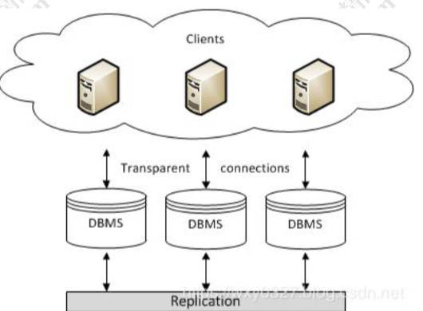
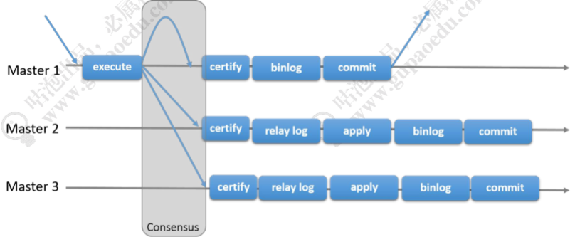

# 高可用

传统的 `HAProxy + keepalived` 的方案，基于主从复制。

#### NDB Cluster

https://dev.mysql.com/doc/mysql-cluster-excerpt/5.7/en/mysql-cluster-overview.html
基于 NDB 集群存储引擎的 MySQL Cluster。

####  Galera

https://galeracluster.com/
  一种多主同步复制的集群方案。

###  MHA/MMM

>  https://tech.meituan.com/2017/06/29/database-availability-architecture.html

MMM(Master-Master replication manager for MySQL)，一种多主的高可用 架构，是一个日本人开发的，像美团这样的公司早期也有大量使用 MMM。

MHA(MySQL Master High Available)。

MMM 和 MHA 都是对外提供一个虚拟 IP，并且监控主节点和从节点，当主节点发 生故障的时候，需要把一个从节点提升为主节点，并且把从节点里面比主节点缺少的数 据补上，把 VIP 指向新的主节点。

###  MGR

> https://dev.mysql.com/doc/refman/5.7/en/group-replication.html

> https://dev.mysql.com/doc/refman/5.7/en/mysql-cluster.html 

MySQL 5.7.17 版本推出的 InnoDB Cluster，也叫 MySQL Group Replicatioin (MGR)，这个套件里面包括了 mysql shell 和 mysql-route。

高可用 HA 方案需要解决的问题都是当一个 master 节点宕机的时候，如何提升一个 数据最新的 slave 成为 master。如果同时运行多个 master，又必须要解决 master 之间 数据复制，以及对于客户端来说连接路由的问题。

  不同的方案，实施难度不一样，运维管理的成本也不一样。

