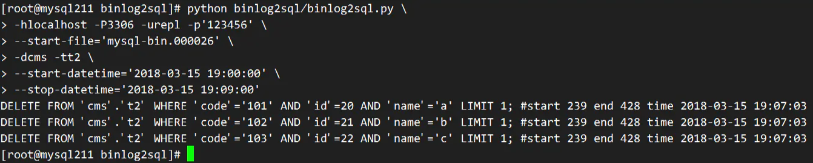
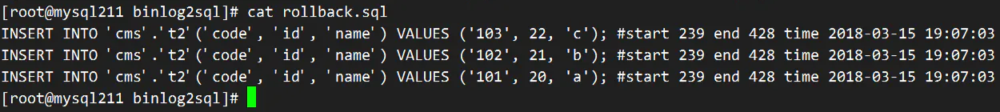

# binlog2sql 闪回

> https://www.jianshu.com/p/6432188bc3d9

mysqlbinlog 可以进行基于位置或者时间点的数据恢复操作

## 下载地址

```shell
git clone https://github.com/danfengcao/binlog2sql.git && cd binlog2sql
pip install -r requirements.txt -i https://pypi.tuna.tsinghua.edu.cn/simple
```

binlog2sql参数

```shell
python binlog2sql/binlog2sql.py --help
选项
mysql连接配置
-h host; -P port; -u user; -p password
解析模式
--stop-never 持续解析binlog。可选。，默认False，同步至执行命令时最新的binlog位置。
-K, --no-primary-key 对INSERT语句去除主键。可选。默认False
-B, --flashback 生成回滚SQL，可解析大文件，不受内存限制。可选。默认False。与stop-never或no-primary-key不能同时添加。
--back-interval -B模式下，每打印一千行回滚SQL，加一句SLEEP多少秒，如不想加SLEEP，请设为0。可选。默认1.0。
解析范围控制
--start-file 起始解析文件，只需文件名，无需全路径 。必须。
--start-position/--start-pos 起始解析位置。可选。默认为start-file的起始位置。
--stop-file/--end-file 终止解析文件。可选。默认为start-file同一个文件。若解析模式为stop-never，此选项失效。
--stop-position/--end-pos 终止解析位置。可选。默认为stop-file的最末位置；若解析模式为stop-never，此选项失效。
--start-datetime 起始解析时间，格式'%Y-%m-%d %H:%M:%S'。可选。默认不过滤。
--stop-datetime 终止解析时间，格式'%Y-%m-%d %H:%M:%S'。可选。默认不过滤。
对象过滤
-d, --databases 只解析目标db的sql，多个库用空格隔开，如-d db1 db2。可选。默认为空。
-t, --tables 只解析目标table的sql，多张表用空格隔开，如-t tbl1 tbl2。可选。默认为空。
--only-dml 只解析dml，忽略ddl。可选。默认TRUE。
--sql-type 只解析指定类型，支持INSERT, UPDATE, DELETE。多个类型用空格隔开，如--sql-type INSERT DELETE。可选。默认为增删改都解析。用了此参数但没填任何类型，则三者都不解析。
```

## 二、应用案例

### 2.1 误删整张表数据，需要紧急回滚

```shell
# 数据库
mysql> show create database cms\G
*************************** 1. row ***************************
       Database: cms
Create Database: CREATE DATABASE `cms` /*!40100 DEFAULT CHARACTER SET utf8 */
1 row in set (0.00 sec)

# 表结构
mysql> show create table t2\G
*************************** 1. row ***************************
       Table: t2
Create Table: CREATE TABLE `t2` (
  `id` int(11) NOT NULL AUTO_INCREMENT,
  `name` varchar(20) DEFAULT NULL,
  `code` varchar(50) DEFAULT NULL,
  PRIMARY KEY (`id`),
  KEY `idx_code` (`code`),
  KEY `idx_name` (`name`)
) ENGINE=InnoDB AUTO_INCREMENT=20 DEFAULT CHARSET=utf8mb4
1 row in set (0.00 sec)

# 插入测试数据
insert into t2 (name, code) values ('a', '101'), ('b', '102'), ('c', '103');

# 数据
mysql> select * from t2;
+----+------+------+
| id | name | code |
+----+------+------+
| 20 | a    | 101  |
| 21 | b    | 102  |
| 22 | c    | 103  |
+----+------+------+
3 rows in set (0.00 sec)

# 刷新日志，实际不需要，这里只是为了让重新生成一个日志
flush logs;

# 删除表数据
mysql> delete from t2;
Query OK, 5 rows affected (0.00 sec)

mysql> select * from t2;
Empty set (0.00 sec)
```

查看binlog文件

```shell
# show binary logs;
mysql> show master status\G
*************************** 1. row ***************************
             File: mysql-bin.000026
         Position: 459
     Binlog_Do_DB: 
 Binlog_Ignore_DB: 
Executed_Gtid_Set: db6406b5-1b06-11e8-8dc3-525400ad3b43:1-47
1 row in set (0.00 sec)
```

根据操作时间定位误操作SQL的binlog位置

查看回滚sql




```shell
# cd ~/binlog2sql
python binlog2sql/binlog2sql.py \
-hlocalhost -P3306 -urepl -p'123456' \
--start-file='mysql-bin.000026' \
-dcms -tt2 \
--start-datetime='2018-03-15 19:00:00' \
--stop-datetime='2018-03-15 19:09:00'
```

从结果找至误操作的位置为239-428之间，生成回滚sql


```shell
python binlog2sql/binlog2sql.py \
-hlocalhost -P3306 -urepl -p'123456' \
--start-file='mysql-bin.000026' \
-dcms -tt2 \
--start-position=239 \
--stop-position=428 \
-B > rollback.sql
```

查看回滚sql



确认回滚sql正确，执行回滚sql


```shell
mysql < rollback.sql
```

## 三、总结

### 3.1 限制（对比mysqlbinlog）

- mysql server必须开启，离线模式下不能解析
- 参数 *binlog_row_image* 必须为FULL，暂不支持MINIMAL
- 解析速度不如mysqlbinlog

### 3.2 优点（对比mysqlbinlog）

- 纯Python开发，安装与使用都很简单
- 自带flashback、no-primary-key解析模式，无需再装补丁
- flashback模式下，更适合[闪回实战](https://link.jianshu.com?t=https%3A%2F%2Fgithub.com%2Fdanfengcao%2Fbinlog2sql%2Fblob%2Fmaster%2Fexample%2Fmysql-flashback-priciple-and-practice.md)
- 解析为标准SQL，方便理解、筛选
- 代码容易改造，可以支持更多个性化解析


