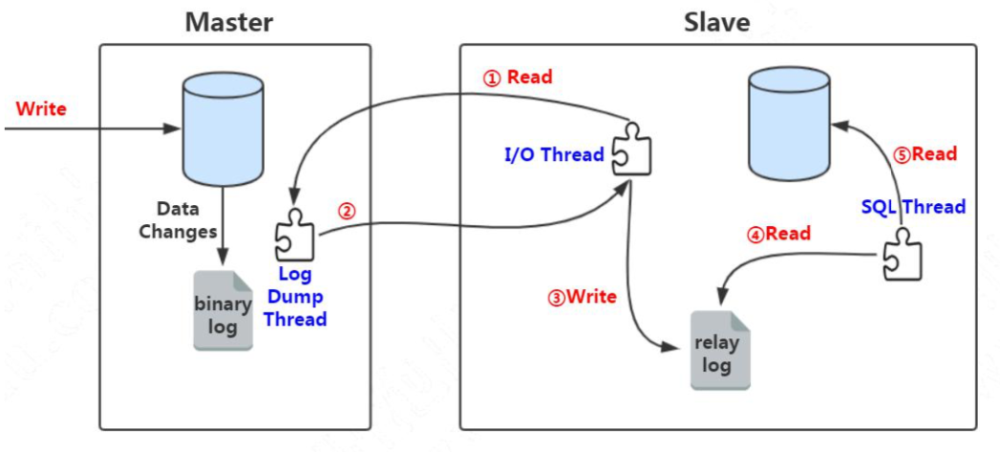

# 主从复制的原理

## 目录

- [工作线程dump-thread](#工作线程dump-thread)
- [工作流程](#工作流程)
- [主从复制到底慢在哪里](#主从复制到底慢在哪里)

## 工作线程dump-thread

- 主服务器其有一个工作线程 I/O dump thread 
- 从服务器有两个工作线程
  - I/O thread 
  - SQL thread

## 工作流程

- 主库把外界接受的 SQL 请求记录到自己的 binlog 中
- 从库的 I/O thread 去请求主库的 binlog 日志,并将得到的 binlog 日志写到自己的 relaylog(中继日志) 中
- 从库上重做应用中继日志中的 SQL 语句,主库通过 I/Odump thread 给从库 IO thread 传递日志

## 主从复制到底慢在哪里

#### 异步复制

异步复制是 MySQL 默认的复制方式,原理很简单,就是在主库写入 binlog 日志后,即可成功返回客户端,无需等待 binlog日志传递给从库的过程,

**一旦发生宕机,则有可能出现丢失数据的情况**

#### 半同步复制

异步复制的核心问题在于

> 当主库把 event写入到 binlog 之后,并不知道从库是否已经接收并应用了,那么如果主库崩溃,很有可能主库已经提交的事务,没有传递给任何一台从库

5.5 之后引入半同步, 主从服务器必须同时安装半同步复制插件才能开启这个复制功能

其核心是确保主库传递过来的 binlog 写入到自己的 relay log 里面,才会通知主库上面的等待线程

## 建议使用

- [GTID-ROWS复制模式.md](020-GTID-ROWS复制模式.md) 

