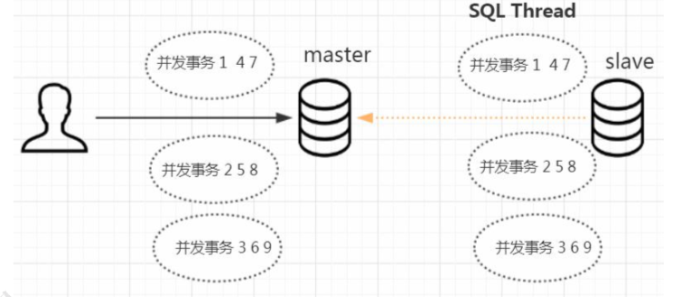

# GTID-ROWS复制模式(推荐)

## 目录

## 什么是GTID

GTID ,全局事务 ID , Global Transaction ID , 是一个已经提交的事务的编号,并且是一个全局唯一的编号, MySQL 5.6之后再主从复制类型上添加了 GTID 复制

> 我们可以把那些在主库上并行执行的事务，分为一个组，并且给他们编号， 这一个组的事务在从库上面也可以并行执行。这个编号，我们把它叫做 GTID(Global Transaction Identifiers)，这种主从复制的方式，我们把它叫做基于 GTID 的复制。

## GTID组成

GTID 是由 server_uuid 和 事务 ID 组成的 ,即 GTID = server_uuid:transaction_id

- server_uuid 数据库启动的时候自动生成,你每台机器都不一样
- transaction_id 是事务提交时根据系统顺序分配的一个不会重复的序列号

## GTID存在的价值

- GTID 使用 master_auto_position = 1 代替了基于 binlog 和 position 号的主从复制搭建方式,更加方便主从复制搭建
- GTID 可以知道事务在最开始是爱哪个实例上提交的
- GTID 方便实现主从之间的 failover ,再也不用不断去找 postion 和 binlog 了

## GTID缺点

GTID复制是针对事务来说的,一个事务只对应一个GTID , 好多限制就在于此

- 不能使用 create table table_name select * from tablename
- 在一个事务中既包含事务表的操作又包含非事务表的操作
- 不支持 CREATE TEMOIRART TABLE or  DROP TEMPORART TABLE 语句操作
- 使用 GTID 复制从库跳过错误时,不支持执行 sql_slave_skip_conter 参数的语法

