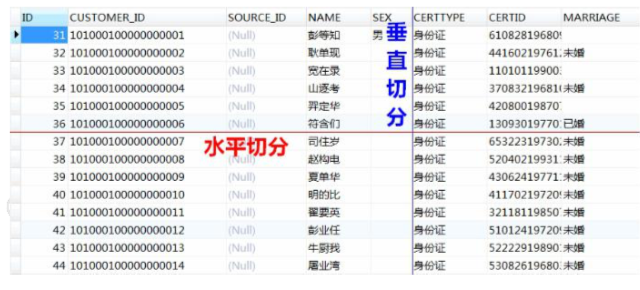
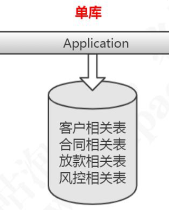
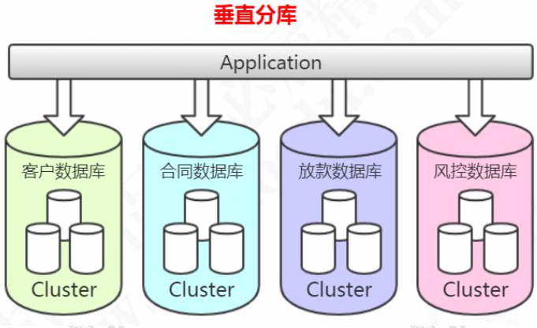
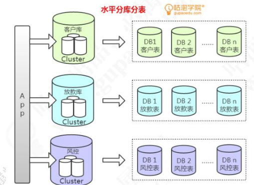
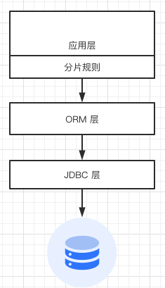
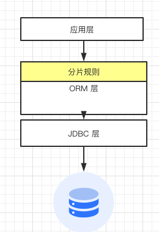
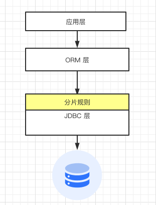

# 什么是分库分表

[TOC]

## 分库分表

为了分散数据库压力,我们会采用分库分表的方案,将一个表结构分为多个表, 或者将一个表的数据分片后放入多个表.

这些表结构可以放在一个库里,也可以放在不同的数据库实例上

#### 主要体现在两个方面

- [垂直拆分](#垂直拆分)
- [水平拆分](#水平拆分)



## 什么情况下需要分库分表

- 表数据达到千万级别, 就要考虑分库分表

  > MySQL 5000w 数据基本到了极限 , 分解单表的大数据量对索引查询带来的压力,并方便对索引和表结构的变更

- 如果数据量的吞吐量达到瓶颈,就需要增加数据库实例,利用多个数据库实例来分解大量数据库请求带来的系统压力
- 如果希望在扩容对应用层的配置改变最少,就需要在每个数据库实例中预留足够多的数据库数量

## 单库



## 垂直拆分

根据业务的纬度,将原本的一个库(表)拆分为多个库(表). 每个库(表)与原有的结构不同

#### 优点

- 拆分后逻辑清晰,拆分后规则明确
- 便于实现动静分离,冷热分离的数据设计
  - 冷数据: 有些字段变化频率低,查询次数多 , 叫做冷数据,可以使用MyiSAM存放
  - 热数据: 更新比较频繁,建议使用InnoDB引擎

#### 缺点

- 部分业务表无法关联,只能通过接口方式解决,提高了系统的复杂度

- 事务处理复杂



## 水平拆分

根据分片算法(sharding) 将一个库或者表拆分为多个库,每个库依旧保留原有的结构

水平分库分表的做法，把单张表的数据按照一定的规则分布到多个数据库。

#### 优点

- 单库单表都能保持一定的量级 ,有助于提高性能

#### 缺点

- 很难 join 操作, 跨库 join性能差



## 三种分而治之的解决方案

- [客户端分片](##客户端分片)

  - [应用层直接实现](#应用层直接实现)
  - [定制JDBC协议实现](#定制JDBC协议实现)
  - [定制ORM框架实现](#定制ORM框架实现)

- [代理分片](#代理分片)

  > 代理分片是在应用和数据库层增加一个代理层,把分片路由的规则配置在代理层,代理层对外提供与JDBC 兼容的接口给应用层,应用层的开发人员不用关心分片规则,只需要关系业务逻辑的实现
  >
  > 典型的就是Cobar 和 [Mycat](020-Mycat.md) 

- [支持事务的分布式数据库](#支持事务的分布式数据库)

  > 现在有甚多数据库都支持可伸缩的体系架构,例如TiDB, OceanBase 等等,提供一定的分布式事务支持

### 客户端分片

- DAO : AbstractRoutingDataSource 
- ORM : MyBatis 插件 
- JDBC : Sharding-JDBC 
- Proxy : Mycat、Sharding-Proxy 
- Server : 特定数据库或者版本

#### 应用层直接实现

客户端分片就是在应用层直接进行分片逻辑,分片规则需要在同一个应用的多个节点之间同步,每个应用层都侵入一个操作切片的逻辑实现, 一般是以 jar 包形式实现

核心:

> 从应用层直接决定每次操作应该使用哪个服务器实例



虽然侵入了业务,但是实现起来比较简单,适合快速上线,而且分片逻辑是自己开发的,如果生产商除了什么问题,都可以比较容易解决

但是这种实现方式会让数据库保持的连接比较多,要看应用服务器池的节点数量

#### 代表项目

https://github.com/henrypfhu/dbsplit

### 定制ORM框架实现

由于关系型数据库与面向对象语言之间的差异,ORM框架得到了广泛的发展和应用,因此我们可以提供定制ORM 框架实现分库分表方案



比较简单的做法就是通过MyBatis配置的文件的SQL增加表索引的参数来实现分片

```xml
<select id = "getUser" parameterType = "java.util.Map" resultType = "User">
	SELECT user_id,user_name
  FROM USER_#{index}
  WHERE user_id = #{userId}
</select>
```

### 定制JDBC协议实现

代表项目 [shardingjdbc](http://shardingsphere.apache.org/index_zh.html)



在应用层直接实现或多或者少使用切片逻辑侵入了应用的业务实现,而且对开发人员的能力要求比较高,开发人员既要实现业务逻辑,也需要实现框架需求

> 我们可以通过定制 JDBC 协议的方式实现,也就是针对业务逻辑提供与JDBC一样的接口,让业务开发人员不必要关心分库分表的实现

