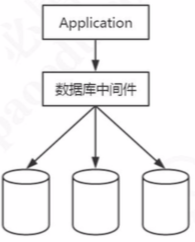

# Mycat

| 相关网站                                                     |
| ------------------------------------------------------------ |
| [Mycat 概要介绍](https://github.com/MyCATApache/Mycat-Server) |
| [入门指南](https://github.com/MyCATApache/Mycat-doc/tree/master/%E5%85%A5%E9%97%A8%E6%8C%87%E5%8D%97) |
| [官网](http://www.mycat.io)                                  |

## 目录

- [什么是Mycat](#什么是Mycat)
- [Mycat分片规则](#Mycat分片规则)
- [Mycat配置详解](#Mycat配置详解)

## 什么是Mycat

Mycat是一个开源的分布式数据库系统, 也是一款强大的数据库中间件

实现了

> 运行在应用和数据库之间，可以当做一个 MySQL 服务器使用，实现对 MySQL 数据库的分库分表，也可以通过 JDBC 支持其他的数据库。

- Mycat协议
- JDBC协议

#### 关键特性

- 可以当做一个 MySQL 数据库来使用
- 支持 MySQL 之外的数据库，通过 JDBC 实现 3、解决了我们提到的所有问题，多表 join、分布式事务、全局序列号、翻页排序
- 支持 ZK 配置，带监控 mycat-web 5、2.0 正在开发中

| 概念       | 含义                                                         |
| ---------- | ------------------------------------------------------------ |
| 主机       | 物理主机，一台服务器，一个数据库服务，一个 3306 端口         |
| 物理数据库 | 真实的数据库，例如 146、150、151 的 gpcat 数据库             |
| 物理表     | 真实的表，例如 146、150、151 的 gpcat 数据库的 order_info 表 |
| 分片       | 将原来单个数据库的数据切分后分散存储在不同的数据库节点       |
| 分片节点   | 分片以后数据存储的节点                                       |
| 分片键     | 分片依据的字段，例如 order_info 表以 id 为依据分片,id 就是分片键，通常是主键 |
| 分片算法   | 分片的规则，例如随机、取模、范围、哈希、枚举以及各种组合算法 |
| 逻辑表     | 相对于物理表，是分片表聚合后的结果，对于客户端来说跟真实的表没有区别 |
| 逻辑数据库 | 相对于物理数据库，是数据节点聚合后的结果，例如 catmall       |

## Mycat配置详解

主要的配置文件 server.xml、schema.xml、rule.xml 和具体的分片配置文件。 坑非常多，配置错误会导致无法启动，这个时候要看日志

