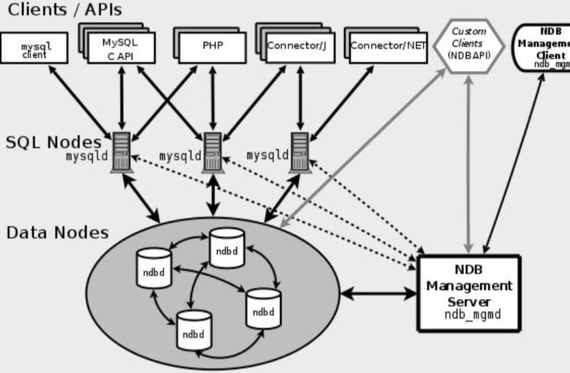

# 高可用方案

- 基于主从复制的方案
  - [MHA](#MHA)
  - [keepalived双主架构](#keepalived双主架构)
- 基于 Galera 协议的 Percona XtraDB cluster (PXC) 实现真正意义上的同步复制
- 基于中间件

## 基于主从复制的方案

#### MHA简介

https://tech.meituan.com/2017/06/29/database-availability-architecture.html

> MMM 和 MHA 都是对外提供一个虚拟 IP，并且监控主节点和从节点，当主节点发 生故障的时候，需要把一个从节点提升为主节点，并且把从节点里面比主节点缺少的数 据补上，把 VIP 指向新的主节点。

MHA ,即 NasterHigh Availiablity Manager and  Tools for MySQL , 

是以为日本 MySQL 专家采用 Perl 语言编写的一个脚本管理工具, 该工具仅适用于 MySQL 主从复制环境

目的是维持 master 主库的高可用性.MHA 是自动的 master 故障转移和 slave 提升软件

#### MHA原理

 MHA 的目的是在于维持 MySQL 主从复制中的 master 库的高可用性, 其最大的特点就是可以修复多个 slave 之间的差异日志,最使所有的 slave 保持数据一致, 然后从中选择一个 slave 并指向它,

- 当master 节点故障时,可以通过对比 slave 之间的 I/O thread 读取主库 binlog 的 position 号, 换区最接近的 salve 作为备选主库
- 其他的从库可以通过与备选主库对比生成的中继日志,在备选主库上应用从原来 master 保存的 binlog, 同时将备选主库提升为 master
- 最后再其他 salve 上应用相应的差异中继日志并从新的 master 开始复制

#### MHA 优缺点

- 优点
  - 故障切换时, 可以自行判断哪个从库与主库的数据最接近,然后切换到上面,减少数据的丢失,保证数据的一致性
  - 支持 binlog server ,可以提高 binlog 的传送效率,进一步减少数据丢失的风险
  - 结合 MySQL 5/7 的曾倩半同步功能,确保故障切换时数据不丢失
- 缺点
  - 自动切换脚本太简单,而且比较老化, 建议后期主键完善
  - 搭建 MHA 架构, 需要开启 Linux 系统互信协议,所以对于系统安全性来说是个不小的考验

## keepalived双主架构

双 master 配合 Keepalived 这种 MySQL 高可用架构设计也是基于主从复制的原理

利用 Keepalived 自带的服务监控功能和自定义脚本来实现 MySQL 故障自动切换

#### Keepalived简介

Keepalived 基于 VRRP 协议, VRRP 全程是虚拟冗余路由协议, 协议的目的就是为了解决静态路由器单点故障引起网络失效的问题而设计的

Keepalived 利用 VRRP 协议可以实现 MySQL 高可用集群方案,避免单点故障,

-  两台互为准备的 MySQL 服务器运行 Keepalived
- master 会像 backip 节点发送广播信号,当 backup 节点接受不到 master 发送的 VRRP 包时,会认为 master 宕机
- 根据 MRRP 的优先级选举出一个 backup充当 master , 则这个 master 就会持有 vip (vip 是对外应用连接的 ip 地址), 从而保证了线上现有业务的正常运行

## NDB Cluster

https://dev.mysql.com/doc/mysql-cluster-excerpt/5.7/en/mysql-cluster-overview.html

基于 NDB 集群存储引擎的 MySQL Cluster。

## Galera

https://galeracluster.com/
  一种多主同步复制的集群方案。

## MGR

https://dev.mysql.com/doc/refman/5.7/en/group-replication.html
https://dev.mysql.com/doc/refman/5.7/en/mysql-cluster.html
MySQL 5.7.17 版本推出的 InnoDB Cluster，也叫 MySQL Group Replicatioin (MGR)，这个套件里面包括了 mysql shell 和 mysql-route。`