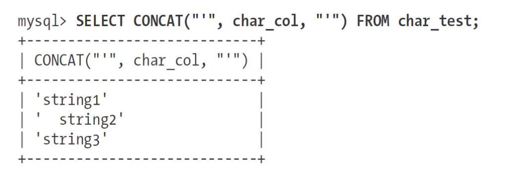
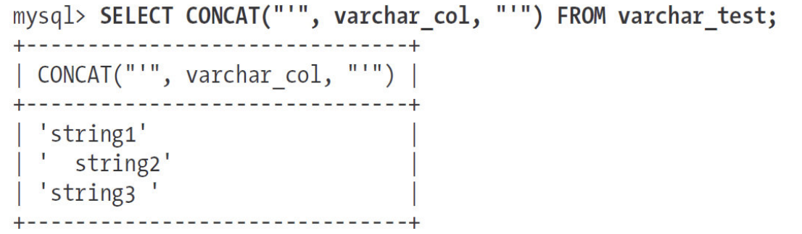

# 040-字符串类型

[TOC]

#### VARCHAR和CHAR类型

VARCHAR和CHAR是两种最主要的字符串类型。不幸的是，很难精确地解释这些值是怎么存储在磁盘和内存中的，因为这跟存储引擎的具体实现有关。

下面的描述假设使用的存储引擎是InnoDB和/或者MyISAM。如果使用的不是这两种存储引擎，请参考所使用的存储引擎的文档。

先看看VARCHAR和CHAR值通常在磁盘上怎么存储。请注意，存储引擎存储CHAR或者VARCHAR值的方式在内存中和在磁盘上可能不一样，所以MySQL服务器从存储引擎读出的值可能需要转换为另一种存储格式。下面是关于两种类型的一些比较。

#### VARCHAR

#####  Varchar 节省空间

VARCHAR类型用于存储可变长字符串，是最常见的字符串数据类型。它比定长类型更节省空间，因为它仅使用必要的空间（例如，越短的字符串使用越少的空间）。有一种情况例外，如果MySQL表使用ROW_FORMAT=FIXED创建的话，每一行都会使用定长存储，这会很浪费空间。

VARCHAR需要使用1或2个额外字节记录字符串的长度：如果列的最大长度小于或等于255字节，则只使用1个字节表示，否则使用2个字节。假设采用latin1字符集，一个VARCHAR（10）的列需要11个字节的存储空间。VARCHAR（1000）的列则需要1002个字节，因为需要2个字节存储长度信息。

#### varchar 更新变长后的额外操作

VARCHAR节省了存储空间，所以对性能也有帮助。但是，由于行是变长的，在UPDATE时可能使行变得比原来更长，这就导致需要做额外的工作。如果一个行占用的空间增长，并且在页内没有更多的空间可以存储，在这种情况下，不同的存储引擎的处理方式是不一样的。例如，MyISAM会将行拆成不同的片段存储，InnoDB则需要分裂页来使行可以放进页内。其他一些存储引擎也许从不在原数据位置更新数据。

##### 什么情况下使用 varchar 是何时的?

下面这些情况下使用VARCHAR是合适的：

- 字符串列的最大长度比平均长度大很多；
- 列的更新很少，所以碎片不是问题；
- 使用了像UTF-8这样复杂的字符集，每个字符都使用不同的字节数进行存储。

在5.0或者更高版本，MySQL在存储和检索时会保留末尾空格。但在4.1或更老的版本，MySQL会剔除末尾空格。

InnoDB则更灵活，它可以把过长的VARCHAR存储为BLOB，我们稍后讨论这个问题。

#### CHAR

CHAR类型是定长的：MySQL总是根据定义的字符串长度分配足够的空间。当存储CHAR值时，MySQL会删除所有的末尾空格（在MySQL 4.1和更老版本中VARCHAR也是这样实现的——也就是说这些版本中CHAR和VARCHAR在逻辑上是一样的，区别只是在存储格式上）。CHAR值会根据需要采用空格进行填充以方便比较。

#### char 的适用场景

CHAR适合存储很短的字符串，或者所有值都接近同一个长度。

- 例如，CHAR非常适合存储密码的MD5值，因为这是一个定长的值。
- 对于经常变更的数据，CHAR也比VARCHAR更好，因为定长的CHAR类型不容易产生碎片。

对于非常短的列，CHAR比VARCHAR在存储空间上也更有效率。例如用CHAR（1）来存储只有Y和N的值，如果采用单字节字符集[(5)](https://www.neat-reader.cn/part0011.xhtml#ch5)只需要一个字节，但是VARCHAR（1）却需要两个字节，因为还有一个记录长度的额外字节。

CHAR类型的这些行为可能有一点难以理解，下面通过一个具体的例子来说明。首先，我们创建一张只有一个CHAR（10）字段的表并且往里面插入一些值：

```sql
mysql> CREATE TABLE char_test( char_col CHAR(10));
mysql> INSERT INTO char_test(char_col) VALUES ('string1'), (' string2'), ('string3 ')
```

当检索这些值的时候，会发现string3末尾的空格被截断了。



如果用VARCHAR（10）字段存储相同的值，可以得到如下结果[(6)](https://www.neat-reader.cn/part0011.xhtml#ch6)：



数据如何存储取决于存储引擎，并非所有的存储引擎都会按照相同的方式处理定长和变长的字符串。

- Memory引擎只支持定长的行，即使有变长字段也会根据最大长度分配最大空间[(7)](https://www.neat-reader.cn/part0011.xhtml#ch7)。不过，填充和截取空格的行为在不同存储引擎都是一样的，因为这是在MySQL服务器层进行处理的。

#### BINARY和VARBINARY

与CHAR和VARCHAR类似的类型还有BINARY和VARBINARY，它们存储的是二进制字符串。

二进制字符串跟常规字符串非常相似，但是二进制字符串存储的是字节码而不是字符。填充也不一样：MySQL填充BINARY采用的是\0（零字节）而不是空格，在检索时也不会去掉填充值[(8)](https://www.neat-reader.cn/part0011.xhtml#ch8)。

#### 慷慨是不明智的

当需要存储二进制数据，并且希望MySQL使用字节码而不是字符进行比较时，这些类型是非常有用的。

二进制比较的优势并不仅仅体现在大小写敏感上。MySQL比较BINARY字符串时，每次按一个字节，并且根据该字节的数值进行比较。因此，二进制比较比字符比较简单很多，所以也就更快。

## BLOB和TEXT类型

BLOB和TEXT都是为存储很大的数据而设计的字符串数据类型，分别采用二进制和字符方式存储。

实际上，它们分别属于两组不同的数据类型家族：

- 字符类型是TINYTEXT，SMALLTEXT，TEXT，MEDIUMTEXT，LONGTEXT；
- 对应的二进制类型是TINYBLOB，SMALLBLOB，BLOB，MEDIUMBLOB，LONGBLOB。
- BLOB是SMALLBLOB的同义词，TEXT是SMALLTEXT的同义词。

与其他类型不同，MySQL把每个BLOB和TEXT值当作一个独立的对象处理。存储引擎在存储时通常会做特殊处理。当BLOB和TEXT值太大时，InnoDB会使用专门的“外部”存储区域来进行存储，此时每个值在行内需要1～4个字节存储一个指针，然后在外部存储区域存储实际的值。

BLOB和TEXT家族之间仅有的不同是BLOB类型存储的是二进制数据，没有排序规则或字符集，而TEXT类型有字符集和排序规则。

MySQL对BLOB和TEXT列进行排序与其他类型是不同的：它只对每个列的最前max_sort_length字节而不是整个字符串做排序。如果只需要排序前面一小部分字符，则可以减小max_sort_length的配置，或者使用ORDER BY SUSTRING（*column，length*）。

MySQL不能将BLOB和TEXT列全部长度的字符串进行索引，也不能使用这些索引消除排序。（关于这个主题下一章会有更多的信息。）