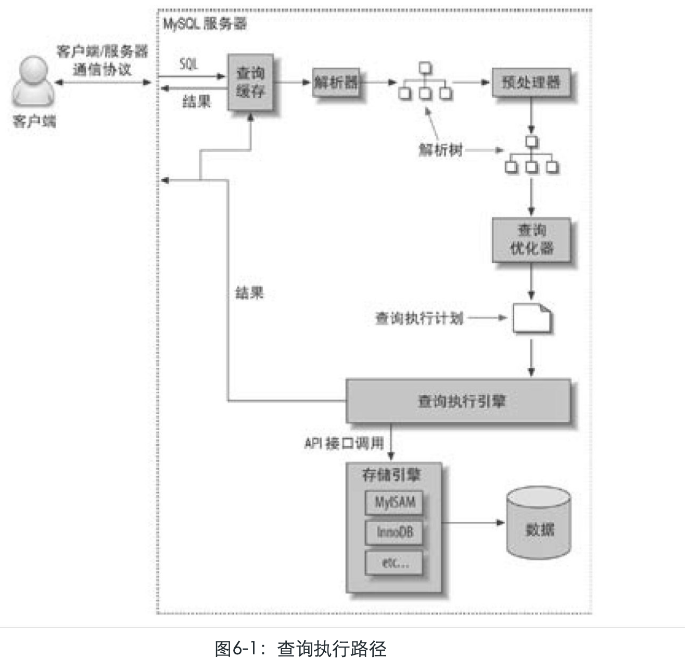
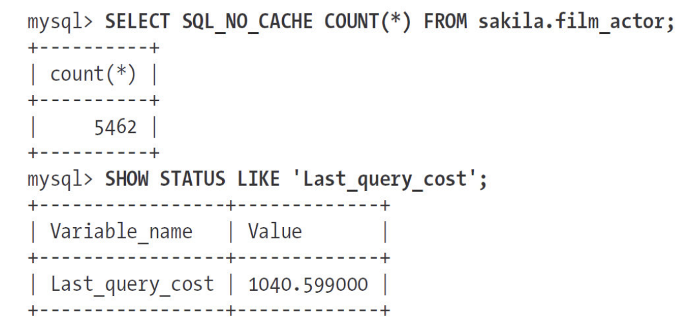

# 6.4-查询执行的基础

[TOC]

## 前言

当希望MySQL能够以更高的性能运行查询时，最好的办法就是弄清楚MySQL是如何优化和执行查询的。一旦理解这一点，很多查询优化工作实际上就是遵循一些原则让优化器能够按照预想的合理的方式运行。

换句话说，是时候回头看看我们前面讨论的内容了：MySQL执行一个查询的过程。根据图6-1，我们可以看到当向MySQL发送一个请求的时候，MySQL到底做了些什么：

1. 客户端发送一条查询给服务器。
2. 服务器先检查查询缓存，如果命中了缓存，则立刻返回存储在缓存中的结果。否则进入下一阶段。
3. 服务器端进行SQL解析、预处理，再由优化器生成对应的执行计划。
4. MySQL根据优化器生成的执行计划，调用存储引擎的API来执行查询。
5. 将结果返回给客户端。

上面的每一步都比想象的复杂，我们在后续章节中将继续讨论。我们会看到在每一个阶段查询处于何种状态。查询优化器是其中特别复杂也特别难理解的部分。还有很多的例外情况，例如，当查询使用绑定变量后，执行路径会有所不同，我们将在下一章讨论这点。

### 6.4.1　MySQL客户端/服务器通信协议

- "半双工" : 

这种协议让MySQL通信简单快速，但是也从很多地方限制了MySQL。一个明显的限制是，这意味着没法进行流量控制。一旦一端开始发生消息，另一端要接收完整个消息才能响应它。这就像来回抛球的游戏：。

- max_allowed_packet

### 6.4.2　查询缓存

在解析一个查询语句之前，如果查询缓存是打开的，那么MySQL会优先检查这个查询是否命中查询缓存中的数据。这个检查是通过一个对大小写敏感的哈希查找实现的。查询和缓存中的查询即使只有一个字节不同，那也不会匹配缓存结果[(11)](https://www.neat-reader.cn/part0013.xhtml#ch11)，这种情况下查询就会进入下一阶段的处理。

### 6.4.3　查询优化处理

查询的生命周期的下一步是将一个SQL转换成一个执行计划，MySQL再依照这个执行计划和存储引擎进行交互。这包括多个子阶段：

1. 解析SQL
2. 预处理
3. 优化SQL执行计划

这个过程中任何错误（例如语法错误）都可能终止查询。

#### 语法解析器和预处理

首先，MySQL通过关键字将SQL语句进行解析，并生成一棵对应的“解析树”。MySQL解析器将使用MySQL语法规则验证和解析查询。例如，它将验证是否使用错误的关键字，或者使用关键字的顺序是否正确等，再或者它还会验证引号是否能前后正确匹配。

预处理器则根据一些MySQL规则进一步检查解析树是否合法，例如，这里将检查数据表和数据列是否存在，还会解析名字和别名，看看它们是否有歧义。

下一步预处理器会验证权限。这通常很快，除非服务器上有非常多的权限配置。

#### 查询优化器

现在语法树被认为是合法的了，并且由优化器将其转化成执行计划。一条查询可以有很多种执行方式，最后都返回相同的结果。优化器的作用就是找到这其中最好的执行计划。

**MySQL使用基于成本的优化器**，它将尝试预测一个查询使用某种执行计划时的成本，并选择其中成本最小的一个。最初，成本的最小单位是随机读取一个4K数据页的成本，后来（成本计算公式）变得更加复杂，并且引入了一些“因子”来估算某些操作的代价，如当执行一次WHERE条件比较的成本。可以通过查询当前会话的Last_query_cost的值来得知MySQL计算的当前查询的成本。

这个结果表示MySQL的优化器认为大概需要做1040个数据页的随机查找才能完成上面的查询。这是根据一系列的统计信息计算得来的：每个表或者索引的页面个数、索引的基数（索引中不同值的数量）、索引和数据行的长度、索引分布情况。优化器在评估成本的时候并不考虑任何层面的缓存，它假设读取任何数据都需要一次磁盘I/O。

有很多种原因会导致MySQL优化器选择错误的执行计划，如下所示：

- 统计信息不准确。MySQL依赖存储引擎提供的统计信息来评估成本，但是有的存储引擎提供的信息是准确的，有的偏差可能非常大。例如，InnoDB因为其MVCC的架构，并不能维护一个数据表的行数的精确统计信息。
- **执行计划中的成本估算不等同于实际执行的成本。**所以即使统计信息精准，优化器给出的执行计划也可能不是最优的。例如有时候某个执行计划虽然需要读取更多的页面，但是它的成本却更小。因为如果这些页面都是顺序读或者这些页面都已经在内存中的话，那么它的访问成本将很小。MySQL层面并不知道哪些页面在内存中、哪些在磁盘上，所以查询实际执行过程中到底需要多少次物理I/O是无法得知的。
- MySQL的最优可能和你想的最优不一样。你可能希望执行时间尽可能的短，但是 MySQL只是基于其成本模型选择最优的执行计划，而有些时候这并不是最快的执行方式。所以，这里我们看到根据执行成本来选择执行计划并不是完美的模型。
- MySQL从不考虑其他并发执行的查询，这可能会影响到当前查询的速度。
- MySQL也并不是任何时候都是基于成本的优化。有时也会基于一些固定的规则，例如，如果存在全文搜索的MATCH()子句，则在存在全文索引的时候就使用全文索引。即使有时候使用别的索引和WHERE条件可以远比这种方式要快，MySQL也仍然会使用对应的全文索引。
- MySQL不会考虑不受其控制的操作的成本，例如执行存储过程或者用户自定义函数的成本。
- 后面我们还会看到，优化器有时候无法去估算所有可能的执行计划，所以它可能错过实际上最优的执行计划。

#### MySQL 查询优化器的优化策略

MySQL的查询优化器是一个非常复杂的部件，它使用了很多优化策略来生成一个最优的执行计划。优化策略可以简单地分为两种，

- 一种是静态优化，
- 一种是动态优化。

##### 静态优化

静态优化可以直接对解析树进行分析，并完成优化。

例如，优化器可以通过一些简单的代数变换将WHERE条件转换成另一种等价形式。静态优化不依赖于特别的数值，如WHERE条件中带入的一些常数等。静态优化在第一次完成后就一直有效，即使使用不同的参数重复执行查询也不会发生变化。可以认为这是一种“编译时优化”。

##### 动态优化

相反，动态优化则和查询的上下文有关，也可能和很多其他因素有关，例如WHERE条件中的取值、索引中条目对应的数据行数等。这需要在每次查询的时候都重新评估，可以认为这是“运行时优化”。

在执行语句和存储过程的时候，动态优化和静态优化的区别非常重要。MySQL对查询的静态优化只需要做一次，但对查询的动态优化则在每次执行时都需要重新评估。有时候甚至在查询的执行过程中也会重新优化。[(12)](https://www.neat-reader.cn/part0013.xhtml#ch12)

下面是一些MySQL能够处理的优化类型：

