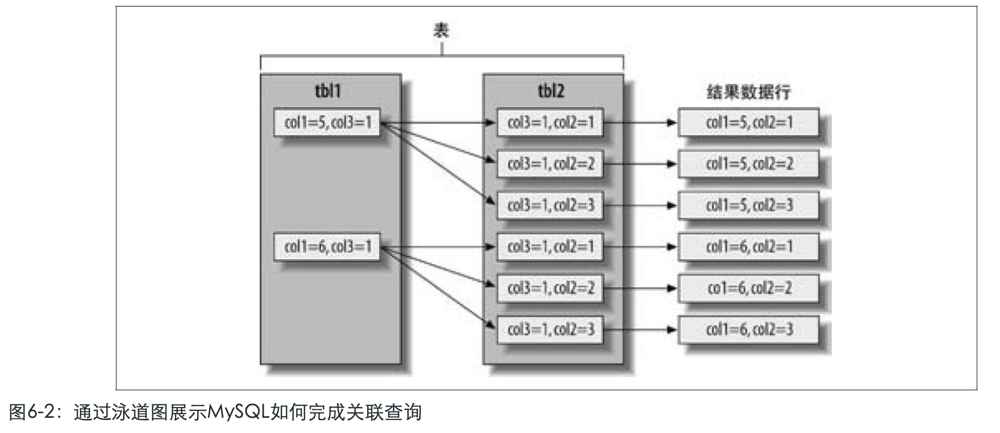
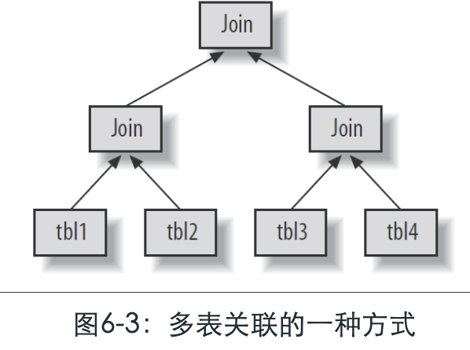
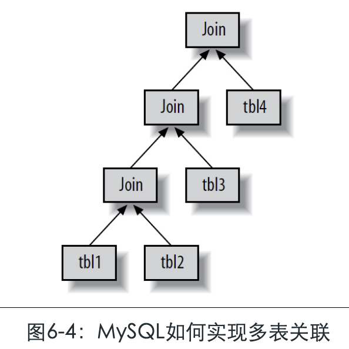

# 6.4.3.1-MySQL如何执行关联查询

[TOC]

## 简介

MySQL中“关联”[(14)](https://www.neat-reader.cn/part0013.xhtml#ch14)一词所包含的意义比一般意义上理解的要更广泛。

总的来说，**MySQL认为任何一个查询都是一次“关联”**——并不仅仅是一个查询需要到两个表匹配才叫关联，所以在MySQL中，每一个查询，每一个片段（包括子查询，甚至基于单表的SELECT）都可能是关联。

所以，理解MySQL如何执行关联查询至关重要。我们先来看一个UNION查询的例子。对于UNION查询，MySQL先将一系列的单个查询结果放到一个临时表中，然后再重新读出临时表数据来完成UNION查询。

在MySQL的概念中，每个查询都是一次关联，所以读取结果临时表也是一次关联。

## MySQL关联执行的策略

当前MySQL关联执行的策略很简单：**MySQL对任何关联都执行嵌套循环关联操作**，即MySQL先在一个表中循环取出单条数据，然后再嵌套循环到下一个表中寻找匹配的行，依次下去，直到找到所有表中匹配的行为止。然后根据各个表匹配的行，返回查询中需要的各个列。

MySQL会尝试在最后一个关联表中找到所有匹配的行，如果最后一个联表无法找到更多的行以后，MySQL返回到上一层次关联表，看是否能够找到更多的匹配记录，依此类推迭代执行。

## 嵌套循环关联

按照这样的方式查找第一个表记录，再嵌套查询下一个关联表，然后回溯到上一个表，在MySQL中是通过嵌套循环的方式实现——正如其名“嵌套循环关联”。请看下面的例子中的简单查询：

```sql
SELECT
	tbl1.col1,
	tbl2.col2 
FROM
	tbl1
	INNER JOIN tbl2 USING ( col3 ) 
WHERE
	tbl1.col1 IN(5,6)
```

假设MySQL按照查询中的表顺序进行关联操作，我们则可以用下面的伪代码表示MySQL将如何完成这个查询：

```java
    outer_iter = iterator over tbl1 where col1 IN(5,6)  -- 查出驱动表 tbl1 中满足条件的数据
    outer_row  = outer_iter.next
    while outer_row
       inner_iter = iterator over tbl2 where col3 = outer_row.col3 -- 嵌套取出所有满足条件的tbl2
       inner_row  = inner_iter.next
       while inner_row
          output [ outer_row.col1, inner_row.col2 ]
          inner_row = inner_iter.next
       end
       outer_row = outer_iter.netxt
    end
```

另一种可视化查询执行计划的方法是根据优化器执行的路径绘制出对应的“泳道图”。如图6-2所示，绘制了前面示例中内连接的泳道图，请从左至右，从上至下地看这幅图。



上面的执行计划对于单表查询和多表关联查询都适用，如果是一个单表查询，那么只需完成上面外层的基本操作。对于外连接上面的执行过程仍然适用。例如，我们将上面查询修改如下：

```
SELECT
	tbl1.col1,
	tbl2.col2 
FROM
	tbl1
	LEFT OUTER JOIN tbl2 USING ( col3 ) 
WHERE
	tbl1.col1 IN ( 5, 6 );
```

对应的伪代码如下

```java
    outer_iter = iterator over tbl1 where col1 IN(5,6)
    outer_row  = outer_iter.next
    while outer_row
       inner_iter = iterator over tbl2 where col3 = outer_row.col3
       inner_row  = inner_iter.next
       if inner_row
          while inner_row
             output [ outer_row.col1, inner_row.col2 ]
             inner_row = inner_iter.next
          end
     else
          output [ outer_row.col1, NULL ]
       end
       outer_row = outer_iter.next
    end
```

从本质上说，MySQL对所有的类型的查询都以同样的方式运行。

例如，MySQL在FROM子句中遇到子查询时，先执行子查询并将其结果放到一个临时表中[(16)](https://www.neat-reader.cn/part0013.xhtml#ch16)，然后将这个临时表当作一个普通表对待（正如其名“派生表”）。

MySQL在执行UNION查询时也使用类似的临时表，在遇到右外连接的时候，MySQL将其改写成等价的左外连接。简而言之，当前版本的MySQL会将所有的查询类型都转换成类似的执行计划。[(17)](https://www.neat-reader.cn/part0013.xhtml#ch17)

不过，不是所有的查询都可以转换成上面的形式。例如，全外连接就无法通过嵌套循环和回溯的方式完成，这时当发现关联表中没有找到任何匹配行的时候，则可能是因为关联是恰好从一个没有任何匹配的表开始。这大概也是MySQL并不支持全外连接的原因。还有些场景，虽然可以转换成嵌套循环的方式，但是效率却非常差，后面我们会看一个这样的例子。

## 执行计划

和很多其他关系数据库不同，MySQL并不会生成查询字节码来执行查询。

MySQL生成查询的一棵指令树，然后通过存储引擎执行完成这棵指令树并返回结果。最终的执行计划包含了重构查询的全部信息。如果对某个查询执行EXPLAIN EXTENDED后，再执行SHOW WARNINGS，就可以看到重构出的查询[(18)](https://www.neat-reader.cn/part0013.xhtml#ch18)。

任何多表查询都可以使用一棵树表示，例如，可以按照图6-3执行一个四表的关联操作



在计算机科学中，这被称为一颗平衡树。但是，这并不是MySQL执行查询的方式。正如我们前面章节介绍的，MySQL总是从一个表开始一直嵌套循环、回溯完成所有表关联。所以，MySQL的执行计划总是如图6-4所示，是一棵左测深度优先的树。



## 关联查询优化器

MySQL优化器最重要的一部分就是关联查询优化，它决定了多个表关联时的顺序。通常多表关联的时候，可以有多种不同的关联顺序来获得相同的执行结果。关联查询优化器则通过评估不同顺序时的成本来选择一个代价最小的关联顺序。

下面的查询可以通过不同顺序的关联最后都获得相同的结果：

```sql
SELECT
	film.film_id,
	film.title,
	film.release_year,
	actor.actor_id,
	actor.first_name,
	actor.last_name 
FROM
	sakila.film
	INNER JOIN sakila.film_actor USING ( film_id )
	INNER JOIN sakila.actor USING ( actor_id );
```

容易看出，可以通过一些不同的执行计划来完成上面的查询。

例如，MySQL可以从film表开始，使用film_actor表的索引film_id来查找对应的actor_id值，然后再根据actor表的主键找到对应的记录。

Oracle用户会用下面的术语描述：“film表作为驱动表先查找fle_actor表，然后以此结果为驱动表再查找actor表”。这样做效率应该会不错，我们再使用EXPLAIN看看MySQL将如何执行这个查询：

```sql
*************************** 1. row ***************************
               id: 1
      select_type: SIMPLE
            table: actor  -- 驱动表是 actor 表
             type: ALL
    possible_keys: PRIMARY
              key: NULL
          key_len: NULL
              ref: NULL
             rows: 200
            Extra:
    *************************** 2. row ***************************
               id: 1
      select_type: SIMPLE
            table: film_actor
             type: ref
    possible_keys: PRIMARY,idx_fk_film_id
              key: PRIMARY
          key_len: 2
              ref: sakila.actor.actor_id
             rows: 1
            Extra: Using index 
    *************************** 3. row ***************************
               id: 1
      select_type: SIMPLE
            table: film
             type: eq_ref
    possible_keys: PRIMARY
              key: PRIMARY
          key_len: 2
              ref: sakila.film_actor.film_id
             rows: 1
            Extra:
```

这和我们前面给出的执行计划完全不同。

- MySQL从actor表开始（我们从上面的EXPLAIN结果的第一行输出可以看出这点），
- 驱动表是 actor 表, 我们最初认为 film 会是驱动表, 但是 MySQL 选择了更小的 actor 表

我们来看看，我们先使用STRAIGHT_JOIN关键字，按照我们之前的顺序执行，这里是对应的EXPLAIN输出结果：

```sql
mysql> EXPLAIN SELECT STRAIGHT_JOIN film.film_id...\G
    *************************** 1. row ***************************
               id: 1
      select_type: SIMPLE
            table: film
             type: ALL
    possible_keys: PRIMARY
              key: NULL
          key_len: NULL
              ref: NULL
             rows: 951
            Extra:
    *************************** 2. row ***************************
               id: 1
      select_type: SIMPLE
            table: film_actor
             type: ref
    possible_keys: PRIMARY,idx_fk_film_id
              key: idx_fk_film_id
          key_len: 2
              ref: sakila.film.film_id
             rows: 1
            Extra: Using index
    *************************** 3. row ***************************
               id: 1
      select_type: SIMPLE
            table: actor
             type: eq_ref
    possible_keys: PRIMARY
              key: PRIMARY
          key_len: 2
              ref: sakila.film_actor.actor_id
             rows: 1
            Extra:
```

## 为什么关联顺序会倒置

我们来分析一下为什么MySQL会将关联顺序倒转过来：

- 可以看到，关联顺序倒转后的第一个关联表只需要扫描很少的行数[(19)](https://www.neat-reader.cn/part0013.xhtml#ch19)。

在两种关联顺序下，第二个和第三个关联表都是根据索引查询，速度都很快，不同的是需要扫描的索引项的数量是不同的：

- 将film表作为第一个关联表时，会找到951条记录，然后对film_actor和actor表进行嵌套循环查询。
- 如果MySQL选择首先扫描actor表，只会返回200条记录进行后面的嵌套循环查询。

**换句话说，倒转的关联顺序会让查询进行更少的嵌套循环和回溯操作。**

> 为了验证优化器的选择是否正确，我们单独执行这两个查询，并且看看对应的Last_query_cost状态值。我们看到倒转的关联顺序的预估成本[(20)](https://www.neat-reader.cn/part0013.xhtml#ch20)为241，而原来的查询的预估成本为1 154。

## 自动选择关联顺序让查询成本更低

这个简单的例子主要想说明MySQL是如何选择合适的关联顺序来让查询执行的成本尽可能低的。重新定义关联的顺序是优化器非常重要的一部分功能。不过有的时候，优化器给出的并不是最优的关联顺序。

- 这时可以使用STRAIGHT_JOIN关键字重写查询，让优化器按照你认为的最优的关联顺序执行——不过老实说，人的判断很难那么精准。**绝大多数时候，优化器做出的选择都比普通人的判断要更准确。**

关联优化器会尝试在所有的关联顺序中选择一个成本最小的来生成执行计划树。如果可能，优化器会遍历每一个表然后逐个做嵌套循环计算每一棵可能的执行计划树的成本，最后返回一个最优的执行计划。

#### 搜索空间

不过，糟糕的是，如果有超过n个表的关联，那么需要检查n的阶乘种关联顺序。我们称之为所有可能的执行计划的“搜索空间”，搜索空间的增长速度非常块——例如，若是10个表的关联，那么共有3628800种不同的关联顺序！当搜索空间非常大的时候，优化器不可能逐一评估每一种关联顺序的成本。

**这时，优化器选择使用“贪婪”搜索的方式查找“最优”的关联顺序**。实际上，当需要关联的表超过optimizer_search_depth的限制的时候，就会选择“贪婪”搜索模式了（optimizer_search_depth参数可以根据需要指定大小）。

在MySQL这些年的发展过程中，优化器积累了很多“启发式”的优化策略来加速执行计划的生成。绝大多数情况下，这都是有效的，但因为不会去计算每一种关联顺序的成本，所以偶尔也会选择一个不是最优的执行计划。

有时，各个查询的顺序并不能随意安排，这时关联优化器可以根据这些规则大大减少搜索空间，例如，左连接、相关子查询（后面我将继续讨论子查询）。这是因为，后面的表的查询需要依赖于前面表的查询结果。这种依赖关系通常可以帮助优化器大大减少需要扫描的执行计划数量。