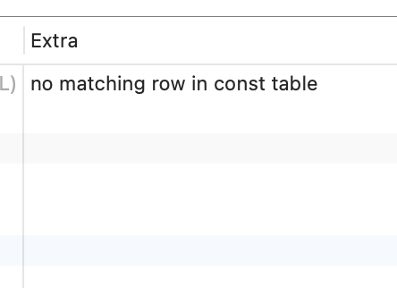

# 6.4.1-MySQL能够处理的优化类型

[TOC]

## 优化类型1: 重新定义关联表的顺序

数据表的关联并不总是按照在查询中指定的顺序进行。决定关联的顺序是优化器很重要的一部分功能，本章后面将深入介绍这一点。

## 优化类型2:将外连接转化成内连接

并不是所有的OUTER JOIN语句都必须以外连接的方式执行。诸多因素，例如WHERE条件、库表结构都可能会让外连接等价于一个内连接。MySQL能够识别这点并重写查询，让其可以调整关联顺序。

> JC: 内连接的效率要高于外链接

## 优化类型3:使用等价变换规则

MySQL可以使用一些等价变换来简化并规范表达式。它可以合并和减少一些比较，还可以移除一些恒成立和一些恒不成立的判断。例如，

- `（5=5 AND a>5）`将被改写为a>5。
- 类似的，如果有`（a<b AND b=c） AND a=5`则会改写为`b>5 AND b=c AND a=5`。

这些规则对于我们编写条件语句很有用，我们将在本章后续继续讨论。

## 优化类型4:优化COUNT()、MIN()和MAX()

索引和列是否可为空通常可以帮助MySQL优化这类表达式。

例如，要找到某一列的最小值，只需要查询对应B-Tree索引最左端的记录，MySQL可以直接获取索引的第一行记录。

在优化器生成执行计划的时候就可以利用这一点，在B-Tree索引中，优化器会将这个表达式作为一个常数对待。类似的,如果要查找一个最大值，也只需读取B-Tree索引的最后一条记录。

如果MySQL使用了这种类型的优化，那么在EXPLAIN中就可以看到“Select tables optimized away”。从字面意思可以看出，它表示优化器已经从执行计划中移除了该表，并以一个常数取而代之。

类似的，没有任何WHERE条件的COUNT（*）查询通常也可以使用存储引擎提供的一些优化（例如，MyISAM维护了一个变量来存放数据表的行数）。

## 优化类型5:预估并转化为常数表达式

当MySQL检测到一个表达式可以转化为常数的时候，就会一直把该表达式作为常数进行优化处理。

例如，一个用户自定义变量在查询中没有发生变化时就可以转换为一个常数。数学表达式则是另一种典型的例子。

让人惊讶的是，在优化阶段，有时候甚至一个查询也能够转化为一个常数。

一个例子是在索引列上执行MIN()函数。甚至是主键或者唯一键查找语句也可以转换为常数表达式。

如果WHERE子句中使用了该类索引的常数条件，MySQL可以在查询开始阶段就先查找到这些值，这样优化器就能够知道并转换为常数表达式。下面是一个例子：

```sql
EXPLAIN select film.film_id,
       film_actor.actor_id
from film
         inner join film_actor using (film_id)
where film_id = 1
```

| id   | select\_type | table       | partitions | type  | possible\_keys    | key               | key\_len | ref   | rows | filtered | Extra       |
| :--- | :----------- | :---------- | :--------- | :---- | :---------------- | :---------------- | :------- | :---- | :--- | :------- | :---------- |
| 1    | SIMPLE       | film        | NULL       | const | PRIMARY           | PRIMARY           | 2        | const | 1    | 100      | Using index |
| 1    | SIMPLE       | film\_actor | NULL       | ref   | idx\_fk\_film\_id | idx\_fk\_film\_id | 2        | const | 10   | 100      | Using index |


MySQL分两步来执行这个查询，也就是上面执行计划的两行输出。

- 第一步先从film表找到需要的行。因为在film_id字段上有主键索引，所以MySQL优化器知道这只会返回一行数据，优化器在生成执行计划的时候，就已经通过索引信息知道将返回多少行数据。因为优化器已经明确知道有多少个值（WHERE条件中的值）需要做索引查询，所以这里的表访问类型是const。

- 在执行计划的第二步，MySQL将第一步中返回的film_id列当作一个已知取值的列来处理。因为优化器清楚在第一步执行完成后，该值就会是明确的了。注意到正如第一步中一样，使用flm_actor字段对表的访问类型也是const。

另一种会看到常数条件的情况是通过等式将常数值从一个表传到另一个表，这可以通过WHERE、USING或者ON语句来限制某列取值为常数。在上面的例子中，因为使用了USING子句，优化器知道这也限制了film_id在整个查询过程中都始终是一个常量——因为它必须等于WHERE子句中的那个取值。

## 优化类型5 :覆盖索引扫描

当索引中的列包含所有查询中需要使用的列的时候，MySQL就可以使用索引返回需要的数据，而无须查询对应的数据行，在前面的章节中我们已经讨论过这点了。

## 优化类型6 :子查询优化

MySQL在某些情况下可以将子查询转换一种效率更高的形式，从而减少多个查询多次对数据进行访问。

## 优化类型7 :提前终止查询

在发现已经满足查询需求的时候，MySQL总是能够立刻终止查询。一个典型的例子就是当使用了LIMIT子句的时候。除此之外，MySQL还有几类情况也会提前终止查询，**例如发现了一个不成立的条件，这时MySQL可以立刻返回一个空结果**。从下面的例子可以看到这一点：

```sql
EXPLAIN SELECT film.film_id FROM film WHERE film_id = -1
```



从这个例子看到查询在优化阶段就已经终止。除此之外，MySQL在执行过程中，如果发现某些特殊的条件，则会提前终止查询。当存储引擎需要检索“不同取值”或者判断存在性的时候，MySQL都可以使用这类优化。例如，我们现在需要找到没有演员的所有电影[(13)](https://www.neat-reader.cn/part0013.xhtml#ch13)：

```sql
SELECT
	film.film_id 
FROM
	sakila.film
	LEFT OUTER JOIN sakila.film_actor USING ( film_id ) 
WHERE
	film_actor.film_id IS NULL;
```

这个查询将会过滤掉所有有演员的电影。

每一部电影可能会有很多的演员，但是上面的查询一旦找到任何一个，就会停止并立刻判断下一部电影，因为只要有一名演员，那么WHERE条件则会过滤掉这类电影。

类似这种“不同值/不存在”的优化一般可用于DISTINCT、NOT EXIST()或者LEFT JOIN类型的查询。

## 优化类型8: 等值传播

如果两个列的值通过等式关联，那么MySQL能够把其中一个列的WHERE条件传递到另一列上。例如，我们看下面的查询：

```
SELECT
	film.film_id 
FROM
	sakila.film
	INNER JOIN sakila.film_actor USING ( film_id ) 
WHERE
	film.film_id > 500
```

因为这里使用了film_id字段进行等值关联，MySQL知道这里的WHERE子句不仅适用于flm表，而且对于flm_actor表同样适用。

如果使用的是其他的数据库管理系统，可能还需要手动通过一些条件来告知优化器这个WHERE条件适用于两个表，那么写法就会如下：

```sql
...
WHERE
	film.film_id > 500 
	AND film_actor.film_id > 500
```

在MySQL中这是不必要的，这样写反而会让查询更难维护。

## 优化类型9:列表IN()的比较

在很多数据库系统中，IN()完全等同于多个OR条件的子句，因为这两者是完全等价的。

在MySQL中这点是不成立的，MySQL将IN()列表中的数据先进行排序，然后通过二分查找的方式来确定列表中的值是否满足条件，这是一个O（log *n*）复杂度的操作，等价地转换成OR查询的复杂度为O（*n*），对于IN()列表中有大量取值的时候，MySQL的处理速度将会更快。

## 总结

上面列举的远不是MySQL优化器的全部，MySQL还会做大量其他的优化，即使本章全部用来描述也会篇幅不足，但上面的这些例子已经足以让大家明白优化器的复杂性和智能性了。

如果说从上面这段讨论中我们应该学到什么，那就是“**不要自以为比优化器更聪明**”。最终你可能会占点便宜，但是更有可能会使查询变得更加复杂而难以维护，而最终的收益却为零。让优化器按照它的方式工作就可以了。

当然，虽然优化器已经很智能了，但是有时候也无法给出最优的结果。

- 有时候你可能比优化器更了解数据，
- 例如，由于应用逻辑使得某些条件总是成立；
- 还有时，优化器缺少某种功能特性，如哈希索引；
- 再如前面提到的，从优化器的执行成本角度评估出来的最优执行计划，实际运行中可能比其他的执行计划更慢。

如果能够确认优化器给出的不是最佳选择，并且清楚背后的原理，那么也可以帮助优化器做进一步的优化。例如，可以在查询中添加hint提示，也可以重写查询，或者重新设计更优的库表结构，或者添加更合适的索引。