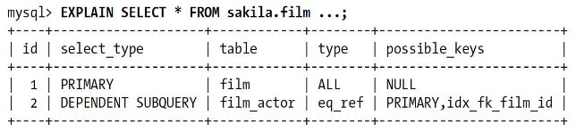
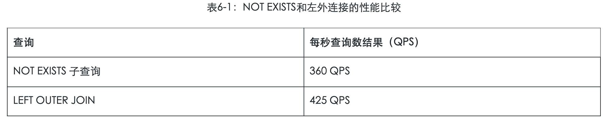
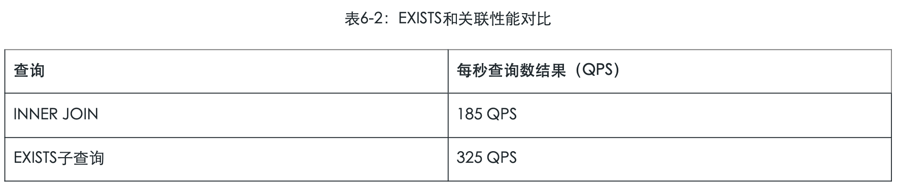

# 6.5.1-MySQL关联子查询的局限性

[TOC]

## 总结

- 一定要用熟 in-> exists -> join 三者的等价转换
  - 熟练使用 no exist -> left join where xxx = null
- 如果驱动表很大, 则考虑使用 in 或者 join

## MySQL对in改写成 exists

#### 测试后发现5.7 已经优化

```sql
EXPLAIN EXTENDED SELECT
    *
FROM
    sakila.film
WHERE
    film_id IN (SELECT
            film_id
        FROM
            sakila.film_actor
        WHERE
            actor_id = 1);
```

| id   | select\_type | table       | type    | possible\_keys            | key     | ref                         | rows | filtered | Extra       |
| :--- | :----------- | :---------- | :------ | :------------------------ | :------ | :-------------------------- | :--- | :------- | :---------- |
| 1    | SIMPLE       | film\_actor | ref     | PRIMARY,idx\_fk\_film\_id | PRIMARY | const                       | 19   | 100      | Using index |
| 1    | SIMPLE       | film        | eq\_ref | PRIMARY                   | PRIMARY | sakila.film\_actor.film\_id | 1    | 100      | NULL        |

## 原文

MySQL的子查询实现得非常糟糕。最糟糕的一类查询是WHERE条件中包含IN()的子查询语句。

例如，我们希望找到Sakila数据库中，演员Penelope Guiness（他的actor_id为1）参演过的所有影片信息。很自然的，我们会按照下面的方式用子查询实现：

```sql
SELECT 
    *
FROM
    sakila.film
WHERE
    film_id IN (SELECT 
            film_id
        FROM
            sakila.film_actor
        WHERE
            actor_id = 1);
```

因为MySQL对IN()列表中的选项有专门的优化策略，一般会认为MySQL会先执行子查询返回所有包含actor_id为1的film_id。一般来说，IN()列表查询速度很快，所以我们会认为上面的查询会这样执行：

```
    -- SELECT * FROM sakila.film
    -- SELECT GROUP_CONCAT(film_id) FROM sakila.film_actor WHERE actor_id = 1;
    -- Result: 1,23,25,106,140,166,277,361,438,499,506,509,605,635,749,832,939,970,980
    SELECT * FROM sakila.film WHERE film_id
    IN(1,23,25,106,140,166,277,361,438,499,506,509,605,635,749,832,939,970,980);
```

很不幸，MySQL不是这样做的。MySQL会将相关的外层表压到子查询中，它认为这样可以更高效率地查找到数据行。也就是说，MySQL会将查询改写成下面的样子：

```mysql
    SELECT * FROM sakila.film
    WHERE EXISTS (
       SELECT * FROM sakila.film_actor WHERE actor_id = 1
       AND film_actor.film_id = film.film_id);
```

这时，子查询需要根据film_id来关联外部表film，因为需要film_id字段，所以MySQL认为无法先执行这个子查询。

通过EXPLAIN我们可以看到子查询是一个相关子查询（DEPENDENT SUBQUERY）（可以使用EXPLAIN EXTENDED来查看这个查询被改写成了什么样子）：



## 如果外层表很大, 重写

根据EXPLAIN的输出我们可以看到，MySQL先选择对file表进行全表扫描，然后根据返回的flm_id逐个执行子查询。

如果是一个很小的表，这个查询糟糕的性能可能还不会引起注意，但是如果外层的表是一个非常大的表，那么这个查询的性能会非常糟糕。当然我们很容易用下面的办法来重写这个查询：

```sql
SELECT film.* FROM sakila.film
    INNER JOIN sakila.film_actor USING(film_id)
 WHERE actor_id = 1;  -- cost:27.62
```

另一个优化的办法是使用函数GROUP_CONCAT()在IN()中构造一个由逗号分隔的列表。

有时这比上面的使用关联改写更快。

因为使用IN()加子查询，性能经常会非常糟，所以通常建议使用EXISTS()等效的改写查询来获取更好的效率。下面是另一种改写IN()加子查询的办法：

```sql
SELECT * FROM sakila.film
	WHERE EXISTS(
			SELECT * FROM sakila.film_actor WHERE actor_id = 1
AND film_actor.film_id = film.film_id);
```

## 如何用好关联子查询

并不是所有关联子查询的性能都会很差。如果有人跟你说：“别用关联子查询”，那么不要理他。先测试，然后做出自己的判断。很多时候，关联子查询是一种非常合理、自然，甚至是性能最好的写法。

我们看看下面的例子：

```sql
SELECT film_id, language_id FROM sakila.film
  WHERE NOT EXISTS(
  	SELECT * FROM sakila.film_actor
  WHERE film_actor.film_id = film.film_id)
```

| id   | select\_type       | table       | type  | possible\_keys    | key                   | ref                  | rows | filtered | Extra                    |
| :--- | :----------------- | :---------- | :---- | :---------------- | :-------------------- | :------------------- | :--- | :------- | :----------------------- |
| 1    | PRIMARY            | film        | index | NULL              | idx\_fk\_language\_id | NULL                 | 1000 | 100      | Using where; Using index |
| 2    | DEPENDENT SUBQUERY | film\_actor | ref   | idx\_fk\_film\_id | idx\_fk\_film\_id     | sakila.film.film\_id | 5    | 100      | Using index              |

一般会建议使用左外连接（LEFT OUTER JOIN）重写该查询，以代替子查询。理论上，改写后MySQL的执行计划完全不会改变。我们来看这个例子：

```sql
EXPLAIN SELECT film.film_id, film.language_id
       FROM sakila.film
       LEFT OUTER JOIN sakila.film_actor USING(film_id)
 WHERE film_actor.film_id IS NULL
```

| id   | select\_type | table       | type  | possible\_keys    | key                   | ref                  | rows | filtered | Extra                                |
| :--- | :----------- | :---------- | :---- | :---------------- | :-------------------- | :------------------- | :--- | :------- | :----------------------------------- |
| 1    | SIMPLE       | film        | index | NULL              | idx\_fk\_language\_id | NULL                 | 1000 | 100      | Using index                          |
| 1    | SIMPLE       | film\_actor | ref   | idx\_fk\_film\_id | idx\_fk\_film\_id     | sakila.film.film\_id | 5    | 100      | Using where; Not exists; Using index |

可以看到，这里的执行计划基本上一样，下面是一些微小的区别：

- 表flm_actor的访问类型一个是DEPENDENT SUBQUERY，而另一个是SIMPLE。这个不同是由于语句的写法不同导致的，一个是普通查询，一个是子查询。这对底层存储引擎接口来说，没有任何不同。
- 对film表，第二个查询的Extra中没有“Using where”，但这不重要，第二个查询的USING子句和第一个查询的WHERE子句实际上是完全一样的。
- 在第二个表film_actor的执行计划的Extra列有“Not exists”。这是我们前面章节中提到的提前终止算法（early-termination algorithm），MySQL通过使用“Not exists”优化来避免在表film_actor的索引中读取任何额外的行。这完全等效于直接编写NOT EXISTS子查询，这个执行计划中也是一样，一旦匹配到一行数据，就立刻停止扫描。

所以，从理论上讲，MySQL将使用完全相同的执行计划来完成这个查询。现实世界中，我们建议通过一些测试来判断使用哪种写法速度会更快。针对上面的案例，我们对两种写法进行了测试，表6-1中列出了测试结果。



不过每个具体的案例会各有不同，有时候子查询写法也会快些。例如，当返回结果中只有一个表中的某些列的时候。听起来，这种情况对于关联查询效率也会很好。具体情况具体分析，例如下面的关联，我们希望返回所有包含同一个演员参演的电影，因为一个电影会有很多演员参演，所以可能会返回一些重复的记录：

```sql
    mysql> SELECT film.film_id FROM sakila.film
        ->    INNER JOIN sakila.film_actor USING(film_id);
```

我们需要使用DISTINCT和GROUP BY来移除重复的记录：

```sql
    mysql> SELECT DISTINCT film.film_id FROM sakila.film
        ->    INNER JOIN sakila.film_actor USING(film_id);
```

但是，回头看看这个查询，到底这个查询返回的结果集意义是什么？

至少这样的写法会让SQL的意义很不明显。如果使用EXISTS则很容易表达“包含同一个参演演员”的逻辑，而且不需要使用DISTINCT和GROUP BY，也不会产生重复的结果集，我们知道一旦使用了DISTINCT和GROUP BY，那么在查询的执行过程中，通常需要产生临时中间表。下面我们用子查询的写法替换上面的关联：

```sql
SELECT film_id FROM sakila.film
     WHERE EXISTS(SELECT * FROM sakila.film_actor
     WHERE film.film_id = film_actor.film_id);
```

再一次，我们需要通过测试来对比这两种写法，哪个更快一些。测试结果参考表6-2。



在这个案例中，我们看到子查询速度要比关联查询更快些。

通过上面这个详细的案例，主要想说明两点：

- 一是不需要听取那些关于子查询的“绝对真理”，
- 二是应该用测试来验证对子查询的执行计划和响应时间的假设。

最后，关于子查询我们需要提到的是一个MySQL的bug。在MYSQL 5.1.48和之前的版本中，下面的写法会锁住table2中的一条记录：

```
    SELECT ... FROM table1 WHERE col = (SELECT ... FROM table2 WHERE ...);
```

如果遇到该bug，子查询在高并发情况下的性能，就会和在单线程测试时的性能相差甚远。这个bug的编号是46947，虽然这个问题已经被修复了，但是我们仍然要提醒读者：不要主观猜测，应该通过测试来验证猜想。