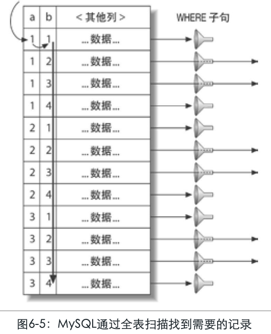
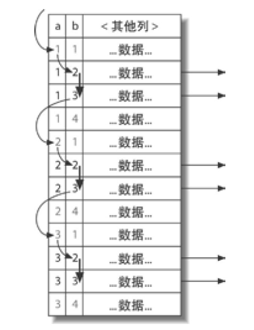

# 6.5.2-MySQL-UNION的限制等其他局限性.md

[TOC]

## 前言

有时，MySQL无法将限制条件从外层“下推”到内层，这使得原本能够限制部分返回结果的条件无法应用到内层查询的优化上。

如果希望UNION的各个子句能够根据LIMIT只取部分结果集，或者希望能够先排好序再合并结果集的话，就需要在UNION的各个子句中分别使用这些子句。

例如，想将两个子查询结果联合起来，然后再取前20条记录，那么MySQL会将两个表都存放到同一个临时表中，然后再取出前20行记录：

```sql
(SELECT first_name, last_name
 FROM sakila.actor
 ORDER BY last_name)
UNION ALL
(SELECT first_name, last_name
 FROM sakila.customer
 ORDER BY last_name)
LIMIT 20;
```

这条查询将会把actor中的200条记录和customer表中的599条记录存放在一个临时表中，然后再从临时表中取出前20条。可以通过在UNION的两个子查询中分别加上一个LIMIT 20来减少临时表中的数据：

```sql
(SELECT first_name, last_name
 FROM sakila.actor
 ORDER BY last_name
 LIMIT 20)
UNION ALL
(SELECT first_name, last_name
 FROM sakila.customer
 ORDER BY last_name
 LIMIT 20)
LIMIT 20;
```

现在中间的临时表只会包含40条记录了，除了性能考虑之外，在这里还需要注意一点：

从临时表中取出数据的顺序并不是一定的，所以如果想获得正确的顺序，还需要加上一个全局的ORDER BY和LIMIT操作。

## 索引合并优化

在前面的章节已经讨论过，在5.0和更新的版本中，当WHERE子句中包含多个复杂条件的时候，MySQL能够访问单个表的多个索引以合并和交叉过滤的方式来定位需要查找的行。

## 等值传递

某些时候，等值传递会带来一些意想不到的额外消耗。例如，有一个非常大的IN()列表，而MySQL优化器发现存在WHERE、ON或者USING的子句，将这个列表的值和另一个表的某个列相关联。

那么优化器会将IN()列表都复制应用到关联的各个表中。通常，因为各个表新增了过滤条件，优化器可以更高效地从存储引擎过滤记录。但是如果这个列表非常大，则会导致优化和执行都会变慢。在本书写作的时候，除了修改MySQL源代码，目前还没有什么办法能够绕过该问题（不过这个问题很少会碰到）。

## 并行执行

MySQL无法利用多核特性来并行执行查询。很多其他的关系型数据库能够提供这个特性，但是MySQL做不到。这里特别指出是想告诉读者不要花时间去尝试寻找并行执行查询的方法。

## 哈希关联

在本书写作的时候，MySQL并不支持哈希关联——MySQL的所有关联都是嵌套循环关联。不过，可以通过建立一个哈希索引来曲线地实现哈希关联。如果使用的是Memory存储引擎，则索引都是哈希索引，所以关联的时候也类似于哈希关联。可以参考第5章的“创建自定义哈希索引”部分。另外，MariaDB已经实现了真正的哈希关联。

## 松散索引扫描

由于历史原因，MySQL并不支持松散索引扫描，也就无法按照不连续的方式扫描一个索引。通常，MySQL的索引扫描需要先定义一个起点和终点，即使需要的数据只是这段索引中很少数的几个，MySQL仍需要扫描这段索引中每一个条目。

下面我们通过一个示例说明这点。假设我们有如下索引（a，b），有下面的查询：

```
SELECT ... FROM tbl WHERE b BETWEEN 2 AND 3;
```

因为索引的前导字段是列a，但是在查询中只指定了字段b，MySQL无法使用这个索引，从而只能通过全表扫描找到匹配的行，如图6-5所示。



了解索引的物理结构的话，不难发现还可以有一个更快的办法执行上面的查询。索引的物理结构（不是存储引擎的API）使得可以先扫描a列第一个值对应的b列的范围，然后再跳到a列第二个不同值扫描对应的b列的范围。图6-6展示了如果由MySQL来实现这个过程会怎样。



使用松散索引扫描效率会更高，但是MySQL现在还不支持这么做

注意到，这时就无须再使用WHERE子句过滤，因为松散索引扫描已经跳过了所有不需要的记录。

上面是一个简单的例子，除了松散索引扫描，新增一个合适的索引当然也可以优化上述查询。但对于某些场景，增加索引是没用的，例如，对于第一个索引列是范围条件，第二个索引列是等值条件的查询，靠增加索引就无法解决问题。

MySQL 5.0之后的版本，在某些特殊的场景下是可以使用松散索引扫描的，例如，在一个分组查询中需要找到分组的最大值和最小值：

```sql
    mysql> EXPLAIN SELECT actor_id, MAX(film_id)
        -> FROM sakila.film_actor
        -> GROUP BY actor_id\G
    *************************** 1. row ***************************
               id: 1
      select_type: SIMPLE
            table: film_actor
             type: range
    possible_keys: NULL
              key: PRIMARY
          key_len: 2
              ref: NULL
             rows: 396
            Extra: Using index for group-by
```

在EXPLAIN中的Extra字段显示“Using index for group-by”，表示这里将使用松散索引扫描，不过如果MySQL能写上“loose index probe”，相信会更好理解。

在MySQL很好地支持松散索引扫描之前，一个简单的绕过问题的办法就是给前面的列加上可能的常数值。在前面索引案例学习的章节中，我们已经看到这样做的好处了。

在MySQL 5.6之后的版本，关于松散索引扫描的一些限制将会通过“索引条件下推（index condition pushdown）”的方式解决。

### 最大值和最小值优化

对于MIN()和MAX()查询，MySQL的优化做得并不好。这里有一个例子：

```
    mysql> SELECT MIN(actor_id) FROM sakila.actor WHERE first_name='PENELOPE';
```

因为在first_name字段上并没有索引，因此MySQL将会进行一次全表扫描。如果MySQL能够进行主键扫描，那么理论上，当MySQL读到第一个满足条件的记录的时候，就是我们需要找的最小值了，因为主键是严格按照actor_id字段的大小顺序排列的。但是MySQL这时只会做全表扫描，我们可以通过查看SHOW STATUS的全表扫描计数器来验证这一点。一个曲线的优化办法是移除MIN()，然后使用LIMIT来将查询重写如下：

```
SELECT actor_id FROM sakila.actor USE INDEX(PRIMARY)
WHERE first_name = 'PENELOPE' LIMIT 1;
```

这个策略可以让MySQL扫描尽可能少的记录数。如果你是一个完美主义者，可能会说这个SQL已经无法表达她的本意了。一般我们通过SQL告诉服务器我们需要什么数据，由服务器来决定如何最优地获取数据，不过在这个案例中，我们其实是告诉MySQL如何去获取我们需要的数据，通过SQL并不能一眼就看出我们其实是想要一个最小值。确实如此，有时候为了获得更高的性能，我们不得不放弃一些原则。

## 在同一个表上查询和更新

MySQL不允许对同一张表同时进行查询和更新。这其实并不是优化器的限制，如果清楚MySQL是如何执行查询的，就可以避免这种情况。下面是一个无法运行的SQL，虽然这是一个符合标准的SQL语句。这个SQL语句尝试将两个表中相似行的数量记录到字段cnt中：

```SQL
UPDATE tbl AS outer_tbl
      SET cnt = (
      SELECT count(*) FROM tbl AS inner_tbl
      WHERE inner_tbl.type = outer_tbl.type
      );
 ERROR 1093 (HY000): You can't specify target table 'outer_tbl' for update in FROM
    clause
```

可以通过使用生成表的形式来绕过上面的限制，因为MySQL只会把这个表当作一个临时表来处理。实际上，这执行了两个查询：一个是子查询中的SELECT语句，另一个是多表关联UPDATE，只是关联的表是一个临时表。子查询会在UPDATE语句打开表之前就完成，所以下面的查询将会正常执行：

```
    mysql> UPDATE tbl
        ->    INNER JOIN(www.it-eboo
        ->       SELECT type, count(*) AS cnt
        ->       FROM tbl
        ->       GROUP BY type
        ->    ) AS der USING(type)
        -> SET tbl.cnt = der.cnt;
```