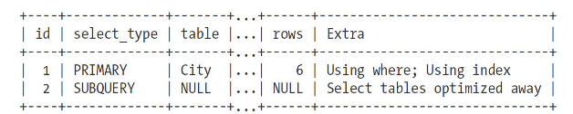

# 6.7.1-优化COUNT查询

[TOC]

# 前言

COUNT()聚合函数，以及如何优化使用了该函数的查询，很可能是MySQL中最容易被误解的前10个话题之一。在网上随便搜索一下就能看到很多错误的理解，可能比我们想象的多得多。

在做优化之前，先来看看COUNT()函数真正的作用是什么。

#### COUNT()的作用

COUNT()是一个特殊的函数，有两种非常不同的作用：它可以统计某个列值的数量，也可以统计行数。在统计列值时要求列值是非空的（不统计NULL）。

如果在COUNT()的括号中指定了列或者列的表达式，则统计的就是这个表达式有值的结果数[(24)](https://www.neat-reader.cn/part0013.xhtml#ch24)。因为很多人对NULL理解有问题，所以这里很容易产生误解。如果想了解更多关于SQL语句中NULL的含义，建议阅读一些关于SQL语句基础的书籍。（关于这个话题，互联网上的一些信息是不够精确的。）

COUNT()的另一个作用是统计结果集的行数。当MySQL确认括号内的表达式值不可能为空时，实际上就是在统计行数。最简单的就是当我们使用COUNT（*）的时候，这种情况下通配符*并不会像我们猜想的那样扩展成所有的列，实际上，它会忽略所有的列而直接统计所有的行数。

我们发现一个最常见的错误就是，在括号内指定了一个列却希望统计结果集的行数。如果希望知道的是结果集的行数，最好使用COUNT（*），这样写意义清晰，性能也会很好。

#### 关于MyISAM的神话

一个容易产生的误解就是：MyISAM的COUNT()函数总是非常快，不过这是有前提条件的，即只有没有任何WHERE条件的COUNT（*）才非常快，因为此时无须实际地去计算表的行数。MySQL可以利用存储引擎的特性直接获得这个值。如果MySQL知道某列col不可能为NULL值，那么MySQL内部会将COUNT（col）表达式优化为COUNT（*）。

当统计带WHERE子句的结果集行数，可以是统计某个列值的数量时，MyISAM的COUNT()和其他存储引擎没有任何不同，就不再有神话般的速度了。所以在MyISAM引擎表上执行COUNT()有时候比别的引擎快，有时候比别的引擎慢，这受很多因素影响，要视具体情况而定。

#### 简单的优化

有时候可以使用MyISAM在COUNT（*）全表非常快的这个特性，来加速一些特定条件的COUNT()的查询。在下面的例子中，我们使用标准数据库world来看看如何快速查找到所有ID大于5的城市。可以像下面这样来写这个查询：

```
    mysql> SELECT COUNT（*） FROM world.City WHERE ID>5;
```

通过SHOW STATUS的结果可以看到该查询需要扫描4097行数据。如果将条件反转一下，先查找ID小于等于5的城市数，然后用总城市数一减就能得到同样的结果，却可以将扫描的行数减少到5行以内：

```
    mysql> SELECT (SELECT COUNT(*) FROM world.City) - COUNT(*)
        -> FROM world.City WHERE ID <= 5;
```

这样做可以大大减少需要扫描的行数，是因为在查询优化阶段会将其中的子查询直接当作一个常数来处理，我们可以通过EXPLAIN来验证这点：



在邮件组和IRC聊天频道中，通常会看到这样的问题：

如何在同一个查询中统计同一个列的不同值的数量，以减少查询的语句量。

例如，假设可能需要通过一个查询返回各种不同颜色的商品数量，

- 此时不能使用OR语句（比如SELECT COUNT（color='blue' OR color='red'） FROM items;），因为这样做就无法区分不同颜色的商品数量；
- 也不能在WHERE条件中指定颜色（比如SELECT COUNT（*） FROM items WHERE color='blue' AND color='RED';），因为颜色的条件是互斥的。下面的查询可以在一定程度上解决这个问题[(25)](https://www.neat-reader.cn/part0013.xhtml#ch25)。

```
    mysql> SELECT SUM(IF(color = 'blue', 1, 0)) AS blue,SUM(IF(color = 'red', 1, 0))
        -> AS red FROM items;
```

也可以使用COUNT()而不是SUM()实现同样的目的，只需要将满足条件设置为真，不满足条件设置为NULL即可：

```
    mysql> SELECT COUNT(color = 'blue' OR NULL) AS blue, COUNT(color = 'red' OR NULL)
        -> AS red FROM items;
```

#### 使用近似值

有时候某些业务场景并不要求完全精确的COUNT值，此时可以用近似值来代替。EXPLAIN出来的优化器估算的行数就是一个不错的近似值，执行EXPLAIN并不需要真正地去执行查询，所以成本很低。

很多时候，计算精确值的成本非常高，而计算近似值则非常简单。曾经有一个客户希望我们统计他的网站的当前活跃用户数是多少，这个活跃用户数保存在缓存中，过期时间为30分钟，所以每隔30分钟需要重新计算并放入缓存。因此这个活跃用户数本身就不是精确值，所以使用近似值代替是可以接受的。另外，如果要精确统计在线人数，通常WHERE条件会很复杂，一方面需要剔除当前非活跃用户，另一方面还要剔除系统中某些特定ID的“默认”用户，去掉这些约束条件对总数的影响很小，但却可能很好地提升该查询的性能。更进一步地优化则可以尝试删除DISTINCT这样的约束来避免文件排序。这样重写过的查询要比原来的精确统计的查询快很多，而返回的结果则几乎相同。

#### 更复杂的优化

通常来说，COUNT()都需要扫描大量的行（意味着要访问大量数据）才能获得精确的结果，因此是很难优化的。除了前面的方法，在MySQL层面还能做的就只有索引覆盖扫描了。如果这还不够，就需要考虑修改应用的架构，可以增加汇总表（第4章已经介绍过），或者增加类似*Memcached*这样的外部缓存系统。可能很快你就会发现陷入到一个熟悉的困境，

- 快速

- 精确

- 实现简单

三者永远只能满足其二，必须舍掉其中一个。

安全/收益/