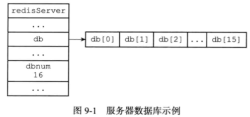
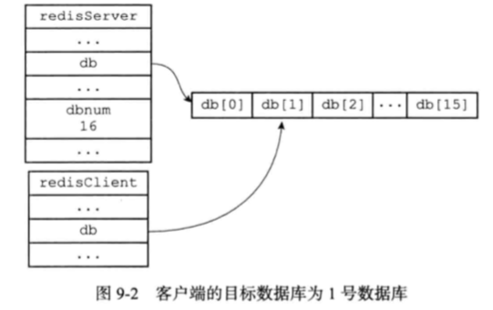

# 020-RedisServer数据结构

[TOC]

## 什么是RedisServer

Redis服务器将所有数据库都保存在服务器状态 redis.h/redisServer 结构的 db 数组中:

```java
struct redisServer{
  //...
  //一个数组,保存着服务器中的所有数据库
  redisDb *db;
  //...
  //服务器的数据库数量
  int dbnum;
};
```

db 数组的每个项都是一个 redis.h/redisDb 结构, 每个 redisDb 结构代表一个数据库

## database的数量:dbnum

dbnum 属性的值由服务器配置的 database 选项决定的,默认是 16, 所以 Redis 服务器默认会创建 16 个数据库



## 切换数据库

每个Redis 客户端都有自己的目标数据库, 每当客户端执行数据库写命令或者数据库读命令的时候, 目标数据库就会成为这些命令的操作对象

当我们使用 select db 命令的时候,实际上就是将 客户端结构的 db 属性指向 redisDb 结构的指针

```c
typeof struct redisClient{
  // 记录客户端当前正阿紫使用的数据库
	redisDb *db;
}
```



> EC: 可以看出 RedisServer 指向和 redisClient 指向的是同一个数组