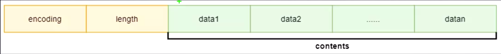

# 020-Redis-hash-底层存储

[TOC]

Set 是无序的,自动去重的集合数据类型, Set 数据结构底层实现为一个 value 为 null 的字典(dict) ,

- 当数据可以用整型表示的时候, Set 集合将被编码为 intset 数据结构
- 当元素大于 set-max-intset-entries 或者 元素无法用整型表示的时候 .使用 hashtable 存储

## 常用属性

```
set-max-intset-entrues 512 // intset 能存储的最大元素个数,超过则用 hashtable 编码
```

## 源码

```CQL
typedef struct intset {
    uint32_t encoding; // 编码类型
    uint32_t length;   // 元素长度
    int8_t contents[]; // 元素存储
} intset;
```

## 图示



- 查找的时间复杂度是 log(n)