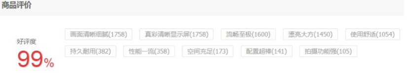
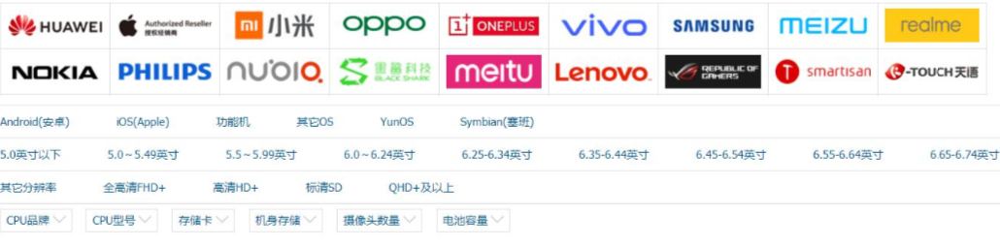

# 030-Redis-hash-应用场景

- 抽奖

  > 随机获取元素 spop myset

- [点赞、签到、打卡](#点赞、签到、打卡)

> 这条微博的 ID 是 t1001，用户 ID 是 u3001。
> 用 like:t1001 来维护 t1001 这条微博的所有点赞用户。 点赞了这条微博:sadd like:t1001 u3001 取消点赞:srem like:t1001 u3001 是否点赞:sismember like:t1001 u3001 点赞的所有用户:smembers like:t1001 点赞数:scard like:t1001
> 比关系型数据库简单许多。

- [商品标签](#商品标签)
- [商品筛选](#商品筛选)

## 点赞、签到、打卡

## 商品标签

用 tags:i5001 来维护商品所有的标签。



- sadd tags:i5001 画面清晰细腻 

- sadd tags:i5001 真彩清晰显示屏 

- sadd tags:i5001 流畅至极

## 商品筛选

获取差集

> sdiff set1 set2

获取交集(intersection )

> sinter set1 set2

获取并集

> sunion set1 set2



```
iPhone11 上市了。
sadd brand:apple iPhone11
sadd brand:ios iPhone11
sad screensize:6.0-6.24 iPhone11 sad screentype:lcd iPhone11
筛选商品，苹果的，iOS 的，屏幕在 6.0-6.24 之间的，屏幕材质是 LCD 屏幕 sinter brand:apple brand:ios screensize:6.0-6.24 screentype:lcd
```

