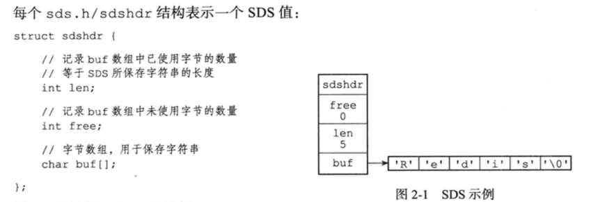
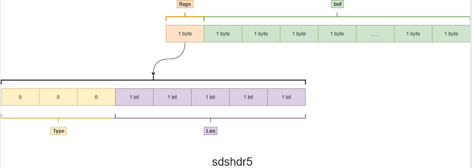
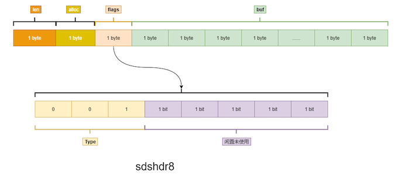
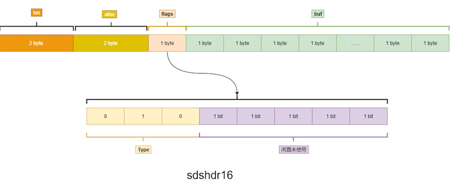
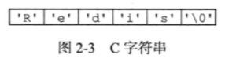
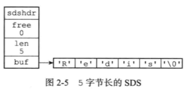

# RedisString类型底层实现

- 什么是 SDS

[为什么要设计 SDS ,不直接用 C语言里面的字符串?](#为什么要设计 SDS ,不直接用 C语言里面的字符串?)

## 一句话概括

字符串最大 512M

SDS , 一个带长度信息的字节数组, 3.2 之前, 用 int 的 len 和 free 分别表示数组长度和未使用的字节数量, 3.2之后引入五种sdshdr类型,目的是为了满足不同长度字符串可以使用不同大小的Header，从而节省内存，每次在创建一个sds时根据sds的实际长度判断应该选择什么类型的sdshdr，不同类型的sdshdr占用的内存空 间不同。

长度 + 数组容量 + 标志位 + 数组

sdshdr5 时 

- 长度和分配空间使用的是标志位来表示的, 低三位表示类型,高 5 位表示长度

sdshdr8

- 长度用 8 位,分配空间也用 8 位

sdshdr16

- 长度用 16 位,分配空间也用 16 位来标识

[为什么要设计 SDS ,不直接用 C语言里面的字符串?](#为什么要设计 SDS ,不直接用 C语言里面的字符串?)

## 什么是 SDS

(Simple Dynamic String) 本质上是一个 **带长度信息的字节数组**

#### 3.2之前



- int len  : 4个字节 32 位
- int free : 4个字节 32 位
- char buf[] : 存储字符串

#### 3.2之后

可以看到上面 3.2 之前, 不装任何的字符, 就消耗掉 8 个字节 (2^63-1的表示范围) 这显然是浪费的

```c
typedef char *sds;

/* 表示 0-31  2^5-1*/
/* Note: sdshdr5 is never used, we just access the flags byte directly.
 * However is here to document the layout of type 5 SDS strings. */
struct __attribute__ ((__packed__)) sdshdr5 { 
    unsigned char flags; /* 3 lsb of type, and 5 msb of string length */
    char buf[];
};
```



- flags 用来表示类型和长度 ,低 3 位用来表示 type , 后 5 位用来表示数组的长度

我们在看一下 sdshdr8 实际上有

```c
struct __attribute__ ((__packed__)) sdshdr8 {
    uint8_t len; /* used */
    uint8_t alloc; /* excluding the header and null terminator */
    unsigned char flags; /* 3 lsb of type, 5 unused bits */
    char buf[];
};
```



- uint8_t len; 占一个字节
- uint8_t alloc 占一个字节, 用来表示分配的空间
- unsigned char flags; 一个字节,表示类型

同理,sdshdr16

```c
struct __attribute__ ((__packed__)) sdshdr16 {
    uint16_t len; /* used */
    uint16_t alloc; /* excluding the header and null terminator */
    unsigned char flags; /* 3 lsb of type, 5 unused bits */
    char buf[];
};
```




- uint8_t len; 占2个字节
- uint8_t alloc 占2个字节, 用来表示分配的空间
- unsigned char flags; 一个字节,表示类型

剩下还设有 sdshdr32 和 sdshdr64

```java


struct __attribute__ ((__packed__)) sdshdr32 {
    uint32_t len; /* used */
    uint32_t alloc; /* excluding the header and null terminator */
    unsigned char flags; /* 3 lsb of type, 5 unused bits */
    char buf[];
};
struct __attribute__ ((__packed__)) sdshdr64 {
    uint64_t len; /* used */
    uint64_t alloc; /* excluding the header and null terminator */
    unsigned char flags; /* 3 lsb of type, 5 unused bits */
    char buf[];
};
```

## 为什么要设计 SDS ,不直接用 C语言里面的字符串?

| 描述                                  | C 字符串                                    | SDS                                |
| ------------------------------------- | ------------------------------------------- | ---------------------------------- |
| [时间复杂度](#时间复杂度)             | 获取字符串长度的复杂度是 O(n)               | 获取字符串长度的复杂度是O(1)       |
| [缓冲区溢出](#缓冲区溢出)             | API 是不安全的,可能会造成缓冲区溢出         | API是安全的,不会造成缓冲区溢出     |
| [减少内存分配次数](#减少内存分配次数) | 修改字符串长度 N 次必然需要执行 N次内存分配 | 最多需要 N次                       |
| [二进制安全](#二进制安全)             | 只能保存文本数据                            | 可以保存文本数据或者二进制数据     |
| 库函数                                | 可以使用所有<string.h>库中的函数            | 可以使用一部分<String.h>库中的函数 |

### 时间复杂度

**通过使用 SDS 而不是 C 字符串, Redis 将获取字符串长度所需要的复杂度从 O(N) 降到了 O(1) 确保了获取字符串长度不会成为 Redis 的性能瓶颈**

#### C 语言中的获取字符串长度

**C 语言使用长度为 N+1 的字符数组来标识长度为 N 的字符串 , 并且字符数组的最后一个元素总是空字符 `\0`**



因为要获取以 NULL (`0x\0` ) 结尾的字符数组的长度使用的是 **strlen** 标准库函数, 这个函数的算法复杂度是 **O(n)** . 它需要对字节数组进行遍历扫描 , 效率低, 单线程的 Redis 受不起

#### SDS 中获取字符串长度



对于SDS来说,长须只要访问 SDS 的 len 属性,就可以立即知道 SDS 的长度为 11 字节

### 缓冲区溢出

C 字符串自身不记录长度,分配了以后需要手动去扩容.如果程序员忘记扩容,就会溢出

SDS 在修改是,会先检查空间是否满足修改要求,如果不满足,API 会扩容

## 减少内存分配次数

C 字符串增长和缩短字符串都需要对字符数组进行扩容或者缩容,

- 如果忘记扩容,会缓冲区溢出
- 如果忘记缩容,会产生内存泄漏

SDS 会使用空间预分配策略

- 如果小于 1M 则 双倍
- 如果大于等于 1M 则每次扩容 1M

### 二进制安全

C 字符串不能在中间包含空字符,否则会任务世界树,不能保存图片音频等2 进制文件

SDS 会以处理二进制的方式来处理 SDS存放, 不会做任何限制,数据写入是什么样,读取时就是什么样