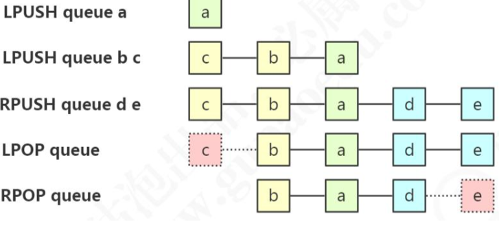

# 数据结构-list-基础命令

| 序号 | 命令及描述                |                                                              |
| :--- | :------------------------ | ------------------------------------------------------------ |
| 1    | [blpop](#blpop)           | 移出并获取列表的第一个元素， 如果列表没有元素会阻塞列表直到等待超时或发现可弹出元素为止。 |
| 2    | [brpop](#brpop)           | 移出并获取列表的最后一个元素， 如果列表没有元素会阻塞列表直到等待超时或发现可弹出元素为止。 |
| 3    | [brpoplpush](#brpoplpush) | 从列表中弹出一个值，将弹出的元素插入到另外一个列表中并返回它； 如果列表没有元素会阻塞列表直到等待超时或发现可弹出元素为止。 |
| 4    | [lindex](#lindex)         | 通过索引获取列表中的元素                                     |
| 5    | [linsert](#linsert)       | 在列表的元素前或者后插入元素                                 |
| 6    | [llen](#llen)             | 获取列表长度                                                 |
| 7    | [lpop](#lpop)             | 移出并获取列表的第一个元素                                   |
| 8    | [lpush](#lpush)           | 将一个或多个值插入到列表头部                                 |
| 9    | [lpushx](#lpushx)         | 将一个值插入到已存在的列表头部                               |
| 10   | [lrange](#lrange)         | 获取列表指定范围内的元素                                     |
| 11   | [lrem](#lrem)             | 移除列表元素                                                 |
| 12   | [lset](#lset)             | 通过索引设置列表元素的值                                     |
| 13   | [ltrim](#ltrim)           | 对一个列表进行修剪(trim)，就是说，让列表只保留指定区间内的元素，不在指定区间之内的元素都将被删除。 |
| 14   | [rpop](#rpop)             | 移除列表的最后一个元素，返回值为移除的元素。                 |
| 15   | [rpoplpush](#rpoplpush)   | 移除列表的最后一个元素，并将该元素添加到另一个列表并返回     |
| 16   | [rpush](#rpush)           | 在列表中添加一个或多个值                                     |
| 17   | [rpushx](#rpushx)         | 为已存在的列表添加值                                         |



## lpush

> 可用版本： >= 1.0.0
>
> 时间复杂度： O(1)

将一个或多个值 `value` 插入到列表 `key` 的表头

如果有多个 `value` 值，那么各个 `value` 值按从左到右的顺序依次插入到表头： 比如说，对空列表 `mylist` 执行命令 `LPUSH mylist a b c` ，列表的值将是 `c b a` ，这等同于原子性地执行 `LPUSH mylist a` 、 `LPUSH mylist b` 和 `LPUSH mylist c` 三个命令。

如果 `key` 不存在，一个空列表会被创建并执行 [LPUSH](http://redisdoc.com/list/lpush.html#lpush) 操作。

当 `key` 存在但不是列表类型时，返回一个错误。

Note

在Redis 2.4版本以前的 [LPUSH](http://redisdoc.com/list/lpush.html#lpush) 命令，都只接受单个 `value` 值。

### 返回值

执行 [LPUSH](http://redisdoc.com/list/lpush.html#lpush) 命令后，列表的长度。

### 代码示例

```
# 加入单个元素

redis> LPUSH languages python
(integer) 1


# 加入重复元素

redis> LPUSH languages python
(integer) 2

redis> LRANGE languages 0 -1     # 列表允许重复元素
1) "python"
2) "python"


# 加入多个元素

redis> LPUSH mylist a b c
(integer) 3

redis> LRANGE mylist 0 -1
1) "c"
2) "b"
3) "a"
```

## lpushx

> 可用版本： >= 2.2.0
>
> 时间复杂度： O(1)

将值 `value` 插入到列表 `key` 的表头，当且仅当 `key` 存在并且是一个列表。

和 [LPUSH key value [value …\]](http://redisdoc.com/list/lpush.html#lpush) 命令相反，当 `key` 不存在时， [LPUSHX](http://redisdoc.com/list/lpushx.html#lpushx) 命令什么也不做。

### 返回值

[LPUSHX](http://redisdoc.com/list/lpushx.html#lpushx) 命令执行之后，表的长度。

### 代码示例

```
# 对空列表执行 LPUSHX

redis> LLEN greet                       # greet 是一个空列表
(integer) 0

redis> LPUSHX greet "hello"             # 尝试 LPUSHX，失败，因为列表为空
(integer) 0


# 对非空列表执行 LPUSHX

redis> LPUSH greet "hello"              # 先用 LPUSH 创建一个有一个元素的列表
(integer) 1

redis> LPUSHX greet "good morning"      # 这次 LPUSHX 执行成功
(integer) 2

redis> LRANGE greet 0 -1
1) "good morning"
2) "hello"
```

## rpush

> 可用版本： >= 1.0.0
>
> 时间复杂度： O(1)

将一个或多个值 `value` 插入到列表 `key` 的表尾(最右边)。

如果有多个 `value` 值，那么各个 `value` 值按从左到右的顺序依次插入到表尾：比如对一个空列表 `mylist` 执行 `RPUSH mylist a b c` ，得出的结果列表为 `a b c` ，等同于执行命令 `RPUSH mylist a` 、 `RPUSH mylist b` 、 `RPUSH mylist c` 。

如果 `key` 不存在，一个空列表会被创建并执行 [RPUSH](http://redisdoc.com/list/rpush.html#rpush) 操作。

当 `key` 存在但不是列表类型时，返回一个错误。

Note

在 Redis 2.4 版本以前的 [RPUSH](http://redisdoc.com/list/rpush.html#rpush) 命令，都只接受单个 `value` 值。

### 返回值

执行 [RPUSH](http://redisdoc.com/list/rpush.html#rpush) 操作后，表的长度。

### 代码示例

```
# 添加单个元素

redis> RPUSH languages c
(integer) 1


# 添加重复元素

redis> RPUSH languages c
(integer) 2

redis> LRANGE languages 0 -1 # 列表允许重复元素
1) "c"
2) "c"


# 添加多个元素

redis> RPUSH mylist a b c
(integer) 3

redis> LRANGE mylist 0 -1
1) "a"
2) "b"
3) "c"
```

## rpushx

> 可用版本： >= 2.2.0
>
> 时间复杂度： O(1)

将值 `value` 插入到列表 `key` 的表尾，当且仅当 `key` 存在并且是一个列表。

和 [RPUSH key value [value …\]](http://redisdoc.com/list/rpush.html#rpush) 命令相反，当 `key` 不存在时， [RPUSHX](http://redisdoc.com/list/rpushx.html#rpushx) 命令什么也不做。

### 返回值

[RPUSHX](http://redisdoc.com/list/rpushx.html#rpushx) 命令执行之后，表的长度。

### 代码示例

```
# key不存在

redis> LLEN greet
(integer) 0

redis> RPUSHX greet "hello"     # 对不存在的 key 进行 RPUSHX，PUSH 失败。
(integer) 0


# key 存在且是一个非空列表

redis> RPUSH greet "hi"         # 先用 RPUSH 插入一个元素
(integer) 1

redis> RPUSHX greet "hello"     # greet 现在是一个列表类型，RPUSHX 操作成功。
(integer) 2

redis> LRANGE greet 0 -1
1) "hi"
2) "hello"
```

## lpop

> 可用版本： >= 1.0.0
>
> 时间复杂度： O(1)

移除并返回列表 `key` 的头元素。

### 返回值

列表的头元素。 当 `key` 不存在时，返回 `nil` 。

### 代码示例

```
redis> LLEN course
(integer) 0

redis> RPUSH course algorithm001
(integer) 1

redis> RPUSH course c++101
(integer) 2

redis> LPOP course  # 移除头元素
"algorithm001"
```

## rpop

> 可用版本： >= 1.0.0
>
> 时间复杂度： O(1)

移除并返回列表 `key` 的尾元素。

### 返回值

列表的尾元素。 当 `key` 不存在时，返回 `nil` 。

#### 代码示例

```
redis> RPUSH mylist "one"
(integer) 1

redis> RPUSH mylist "two"
(integer) 2

redis> RPUSH mylist "three"
(integer) 3

redis> RPOP mylist           # 返回被弹出的元素
"three"

redis> LRANGE mylist 0 -1    # 列表剩下的元素
1) "one"
2) "two"
```

## rpoplpush

> 可用版本： >= 1.2.0
>
> 时间复杂度： O(1)

命令 [RPOPLPUSH](http://redisdoc.com/list/rpoplpush.html#rpoplpush) 在一个原子时间内，执行以下两个动作：

- 将列表 `source` 中的最后一个元素(尾元素)弹出，并返回给客户端。
- 将 `source` 弹出的元素插入到列表 `destination` ，作为 `destination` 列表的的头元素。

举个例子，你有两个列表 `source` 和 `destination` ， `source` 列表有元素 `a, b, c` ， `destination` 列表有元素 `x, y, z` ，执行 `RPOPLPUSH source destination` 之后， `source` 列表包含元素 `a, b` ， `destination` 列表包含元素 `c, x, y, z` ，并且元素 `c` 会被返回给客户端。

如果 `source` 不存在，值 `nil` 被返回，并且不执行其他动作。

如果 `source` 和 `destination` 相同，则列表中的表尾元素被移动到表头，并返回该元素，可以把这种特殊情况视作列表的旋转(rotation)操作。

#### 返回值

被弹出的元素。

#### 代码示例

```
# source 和 destination 不同

redis> LRANGE alpha 0 -1         # 查看所有元素
1) "a"
2) "b"
3) "c"
4) "d"

redis> RPOPLPUSH alpha reciver   # 执行一次 RPOPLPUSH 看看
"d"

redis> LRANGE alpha 0 -1
1) "a"
2) "b"
3) "c"

redis> LRANGE reciver 0 -1
1) "d"

redis> RPOPLPUSH alpha reciver   # 再执行一次，证实 RPOP 和 LPUSH 的位置正确
"c"

redis> LRANGE alpha 0 -1
1) "a"
2) "b"

redis> LRANGE reciver 0 -1
1) "c"
2) "d"


# source 和 destination 相同

redis> LRANGE number 0 -1
1) "1"
2) "2"
3) "3"
4) "4"

redis> RPOPLPUSH number number
"4"

redis> LRANGE number 0 -1           # 4 被旋转到了表头
1) "4"
2) "1"
3) "2"
4) "3"

redis> RPOPLPUSH number number
"3"

redis> LRANGE number 0 -1           # 这次是 3 被旋转到了表头
1) "3"
2) "4"
3) "1"
4) "2"
```

#### 两个模式可以基于这个命令来进行操作

-  [010-模式-安全队列.md](../130-模式/010-模式-安全队列.md) 

- [020-模式-循环列表.md](../130-模式/020-模式-循环列表.md) 

## lrem

> 可用版本： >= 1.0.0
>
> 时间复杂度： O(N)， `N` 为列表的长度。

根据参数 `count` 的值，移除列表中与参数 `value` 相等的元素。

`count` 的值可以是以下几种：

- `count > 0` : 从表头开始向表尾搜索，移除与 `value` 相等的元素，数量为 `count` 。
- `count < 0` : 从表尾开始向表头搜索，移除与 `value` 相等的元素，数量为 `count` 的绝对值。
- `count = 0` : 移除表中所有与 `value` 相等的值。

#### 返回值

被移除元素的数量。 因为不存在的 `key` 被视作空表(empty list)，所以当 `key` 不存在时， [LREM](http://redisdoc.com/list/lrem.html#lrem) 命令总是返回 `0` 。

#### 代码示例

```
# 先创建一个表，内容排列是
# morning hello morning helllo morning

redis> LPUSH greet "morning"
(integer) 1
redis> LPUSH greet "hello"
(integer) 2
redis> LPUSH greet "morning"
(integer) 3
redis> LPUSH greet "hello"
(integer) 4
redis> LPUSH greet "morning"
(integer) 5

redis> LRANGE greet 0 4         # 查看所有元素
1) "morning"
2) "hello"
3) "morning"
4) "hello"
5) "morning"

redis> LREM greet 2 morning     # 移除从表头到表尾，最先发现的两个 morning
(integer) 2                     # 两个元素被移除

redis> LLEN greet               # 还剩 3 个元素
(integer) 3

redis> LRANGE greet 0 2
1) "hello"
2) "hello"
3) "morning"

redis> LREM greet -1 morning    # 移除从表尾到表头，第一个 morning
(integer) 1

redis> LLEN greet               # 剩下两个元素
(integer) 2

redis> LRANGE greet 0 1
1) "hello"
2) "hello"

redis> LREM greet 0 hello      # 移除表中所有 hello
(integer) 2                    # 两个 hello 被移除

redis> LLEN greet
(integer) 0
```

## lindex

> 可用版本： >= 1.0.0
>
> 时间复杂度：O(N)， `N` 为到达下标 `index` 过程中经过的元素数量。因此，对列表的头元素和尾元素执行 [LINDEX](http://redisdoc.com/list/lindex.html#lindex) 命令，复杂度为O(1)。

返回列表 `key` 中，下标为 `index` 的元素。

下标(index)参数 `start` 和 `stop` 都以 `0` 为底，也就是说，以 `0` 表示列表的第一个元素，以 `1` 表示列表的第二个元素，以此类推。

你也可以使用负数下标，以 `-1` 表示列表的最后一个元素， `-2` 表示列表的倒数第二个元素，以此类推。

如果 `key` 不是列表类型，返回一个错误。

### 返回值

列表中下标为 `index` 的元素。 如果 `index` 参数的值不在列表的区间范围内(out of range)，返回 `nil` 。

### 代码示例

```
redis> LPUSH mylist "World"
(integer) 1

redis> LPUSH mylist "Hello"
(integer) 2

redis> LINDEX mylist 0
"Hello"

redis> LINDEX mylist -1
"World"

redis> LINDEX mylist 3        # index不在 mylist 的区间范围内
(nil)
```


## lrange

> 可用版本： >= 1.0.0
>
> 时间复杂度: O(S+N)， `S` 为偏移量 `start` ， `N` 为指定区间内元素的数量。

返回列表 `key` 中指定区间内的元素，区间以偏移量 `start` 和 `stop` 指定。

下标(index)参数 `start` 和 `stop` 都以 `0` 为底，也就是说，以 `0` 表示列表的第一个元素，以 `1` 表示列表的第二个元素，以此类推。

你也可以使用负数下标，以 `-1` 表示列表的最后一个元素， `-2` 表示列表的倒数第二个元素，以此类推。

### 注意LRANGE命令和编程语言区间函数的区别

假如你有一个包含一百个元素的列表，对该列表执行 `LRANGE list 0 10` ，结果是一个包含11个元素的列表，这表明 `stop` 下标也在 [LRANGE](http://redisdoc.com/list/lrange.html#lrange) 命令的取值范围之内(闭区间)，这和某些语言的区间函数可能不一致，比如Ruby的 `Range.new` 、 `Array#slice` 和Python的 `range()` 函数。

### 超出范围的下标

超出范围的下标值不会引起错误。

如果 `start` 下标比列表的最大下标 `end` ( `LLEN list` 减去 `1` )还要大，那么 [LRANGE](http://redisdoc.com/list/lrange.html#lrange) 返回一个空列表。

如果 `stop` 下标比 `end` 下标还要大，Redis将 `stop` 的值设置为 `end` 。

### 返回值

一个列表，包含指定区间内的元素。

### 代码示例

```
redis> RPUSH fp-language lisp
(integer) 1

redis> LRANGE fp-language 0 0
1) "lisp"

redis> RPUSH fp-language scheme
(integer) 2

redis> LRANGE fp-language 0 1
1) "lisp"
2) "scheme"
```

## brpop

> 可用版本： >= 2.0.0
>
> 时间复杂度： O(1)

[BRPOP](http://redisdoc.com/list/brpop.html#brpop) 是列表的阻塞式(blocking)弹出原语。

它是 [RPOP key](http://redisdoc.com/list/rpop.html#rpop) 命令的阻塞版本，当给定列表内没有任何元素可供弹出的时候，连接将被 [BRPOP](http://redisdoc.com/list/brpop.html#brpop) 命令阻塞，直到等待超时或发现可弹出元素为止。

当给定多个 `key` 参数时，按参数 `key` 的先后顺序依次检查各个列表，弹出第一个非空列表的尾部元素。

关于阻塞操作的更多信息，请查看 [BLPOP key [key …\] timeout](http://redisdoc.com/list/blpop.html#blpop) 命令， [BRPOP](http://redisdoc.com/list/brpop.html#brpop) 除了弹出元素的位置和 [BLPOP key [key …\] timeout](http://redisdoc.com/list/blpop.html#blpop) 不同之外，其他表现一致。

##### 返回值

假如在指定时间内没有任何元素被弹出，则返回一个 `nil` 和等待时长。 反之，返回一个含有两个元素的列表，第一个元素是被弹出元素所属的 `key` ，第二个元素是被弹出元素的值。

##### 代码示例

```
redis> LLEN course
(integer) 0

redis> RPUSH course algorithm001
(integer) 1

redis> RPUSH course c++101
(integer) 2

redis> BRPOP course 30
1) "course"             # 被弹出元素所属的列表键
2) "c++101"             # 被弹出的元素
```


## brpoplpush

> 可用版本： >= 2.2.0
>
> 时间复杂度： O(1)

[BRPOPLPUSH](http://redisdoc.com/list/brpoplpush.html#brpoplpush) 是 [RPOPLPUSH source destination](http://redisdoc.com/list/rpoplpush.html#rpoplpush) 的阻塞版本，当给定列表 `source` 不为空时， [BRPOPLPUSH](http://redisdoc.com/list/brpoplpush.html#brpoplpush) 的表现和 [RPOPLPUSH source destination](http://redisdoc.com/list/rpoplpush.html#rpoplpush) 一样。

当列表 `source` 为空时， [BRPOPLPUSH](http://redisdoc.com/list/brpoplpush.html#brpoplpush) 命令将阻塞连接，直到等待超时，或有另一个客户端对 `source` 执行 [LPUSH key value [value …\]](http://redisdoc.com/list/lpush.html#lpush) 或 [RPUSH key value [value …\]](http://redisdoc.com/list/rpush.html#rpush) 命令为止。

超时参数 `timeout` 接受一个以秒为单位的数字作为值。超时参数设为 `0` 表示阻塞时间可以无限期延长(block indefinitely) 。

更多相关信息，请参考 [RPOPLPUSH source destination](http://redisdoc.com/list/rpoplpush.html#rpoplpush) 命令。

#### 返回值

假如在指定时间内没有任何元素被弹出，则返回一个 `nil` 和等待时长。 反之，返回一个含有两个元素的列表，第一个元素是被弹出元素的值，第二个元素是等待时长。

#### 代码示例

```
# 非空列表

redis> BRPOPLPUSH msg reciver 500
"hello moto"                        # 弹出元素的值
(3.38s)                             # 等待时长

redis> LLEN reciver
(integer) 1

redis> LRANGE reciver 0 0
1) "hello moto"


# 空列表

redis> BRPOPLPUSH msg reciver 1
(nil)
(1.34s)
```


## linsert

> 可用版本： >= 2.2.0
>
> 时间复杂度: O(N)， `N` 为寻找 `pivot` 过程中经过的元素数量。

将值 `value` 插入到列表 `key` 当中，位于值 `pivot` 之前或之后。

当 `pivot` 不存在于列表 `key` 时，不执行任何操作。

当 `key` 不存在时， `key` 被视为空列表，不执行任何操作。

如果 `key` 不是列表类型，返回一个错误。

#### 返回值

如果命令执行成功，返回插入操作完成之后，列表的长度。 如果没有找到 `pivot` ，返回 `-1` 。 如果 `key` 不存在或为空列表，返回 `0` 。

#### 代码示例

```
redis> RPUSH mylist "Hello"
(integer) 1

redis> RPUSH mylist "World"
(integer) 2

redis> LINSERT mylist BEFORE "World" "There"
(integer) 3

redis> LRANGE mylist 0 -1
1) "Hello"
2) "There"
3) "World"


# 对一个非空列表插入，查找一个不存在的 pivot

redis> LINSERT mylist BEFORE "go" "let's"
(integer) -1                                    # 失败


# 对一个空列表执行 LINSERT 命令

redis> EXISTS fake_list
(integer) 0

redis> LINSERT fake_list BEFORE "nono" "gogogog"
(integer) 0                                      # 失败
```

## llen

> 可用版本： >= 1.0.0
>
> 时间复杂度： O(1)

返回列表 `key` 的长度。

如果 `key` 不存在，则 `key` 被解释为一个空列表，返回 `0` .

如果 `key` 不是列表类型，返回一个错误。

### 返回值

列表 `key` 的长度。

### 代码示例

```
# 空列表

redis> LLEN job
(integer) 0


# 非空列表

redis> LPUSH job "cook food"
(integer) 1

redis> LPUSH job "have lunch"
(integer) 2

redis> LLEN job
(integer) 2
```

## lset

> 可用版本： >= 1.0.0
>
> 时间复杂度：对头元素或尾元素进行 [LSET](http://redisdoc.com/list/lset.html#lset) 操作，复杂度为 O(1)。其他情况下，为 O(N)， `N` 为列表的长度。

将列表 `key` 下标为 `index` 的元素的值设置为 `value` 。

当 `index` 参数超出范围，或对一个空列表( `key` 不存在)进行 [LSET](http://redisdoc.com/list/lset.html#lset) 时，返回一个错误。

关于列表下标的更多信息，请参考 [LINDEX key index](http://redisdoc.com/list/lindex.html#lindex) 命令。

### 返回值

操作成功返回 `ok` ，否则返回错误信息。

### 代码示例

```
# 对空列表(key 不存在)进行 LSET

redis> EXISTS list
(integer) 0

redis> LSET list 0 item
(error) ERR no such key


# 对非空列表进行 LSET

redis> LPUSH job "cook food"
(integer) 1

redis> LRANGE job 0 0
1) "cook food"

redis> LSET job 0 "play game"
OK

redis> LRANGE job  0 0
1) "play game"


# index 超出范围

redis> LLEN list                    # 列表长度为 1
(integer) 1

redis> LSET list 3 'out of range'
(error) ERR index out of range
```

## ltrim

> 可用版本： >= 1.0.0
>
> 时间复杂度: O(N)， `N` 为被移除的元素的数量。

对一个列表进行修剪(trim)，就是说，让列表只保留指定区间内的元素，不在指定区间之内的元素都将被删除。

举个例子，执行命令 `LTRIM list 0 2` ，表示只保留列表 `list` 的前三个元素，其余元素全部删除。

下标(index)参数 `start` 和 `stop` 都以 `0` 为底，也就是说，以 `0` 表示列表的第一个元素，以 `1` 表示列表的第二个元素，以此类推。

你也可以使用负数下标，以 `-1` 表示列表的最后一个元素， `-2` 表示列表的倒数第二个元素，以此类推。

当 `key` 不是列表类型时，返回一个错误。

[LTRIM](http://redisdoc.com/list/ltrim.html#ltrim) 命令通常和 [LPUSH key value [value …\]](http://redisdoc.com/list/lpush.html#lpush) 命令或 [RPUSH key value [value …\]](http://redisdoc.com/list/rpush.html#rpush) 命令配合使用，举个例子：

```
LPUSH log newest_log
LTRIM log 0 99
```

这个例子模拟了一个日志程序，每次将最新日志 `newest_log` 放到 `log` 列表中，并且只保留最新的 `100` 项。注意当这样使用 `LTRIM` 命令时，时间复杂度是O(1)，因为平均情况下，每次只有一个元素被移除。

#### 注意LTRIM命令和编程语言区间函数的区别

假如你有一个包含一百个元素的列表 `list` ，对该列表执行 `LTRIM list 0 10` ，结果是一个包含11个元素的列表，这表明 `stop` 下标也在 [LTRIM](http://redisdoc.com/list/ltrim.html#ltrim) 命令的取值范围之内(闭区间)，这和某些语言的区间函数可能不一致，比如Ruby的 `Range.new` 、 `Array#slice` 和Python的 `range()` 函数。

#### 超出范围的下标

超出范围的下标值不会引起错误。

如果 `start` 下标比列表的最大下标 `end` ( `LLEN list` 减去 `1` )还要大，或者 `start > stop` ， [LTRIM](http://redisdoc.com/list/ltrim.html#ltrim) 返回一个空列表(因为 [LTRIM](http://redisdoc.com/list/ltrim.html#ltrim) 已经将整个列表清空)。

如果 `stop` 下标比 `end` 下标还要大，Redis将 `stop` 的值设置为 `end` 。

#### 返回值

命令执行成功时，返回 `ok` 。

#### 代码示例

```
# 情况 1： 常见情况， start 和 stop 都在列表的索引范围之内

redis> LRANGE alpha 0 -1       # alpha 是一个包含 5 个字符串的列表
1) "h"
2) "e"
3) "l"
4) "l"
5) "o"

redis> LTRIM alpha 1 -1        # 删除 alpha 列表索引为 0 的元素
OK

redis> LRANGE alpha 0 -1       # "h" 被删除了
1) "e"
2) "l"
3) "l"
4) "o"


# 情况 2： stop 比列表的最大下标还要大


redis> LTRIM alpha 1 10086     # 保留 alpha 列表索引 1 至索引 10086 上的元素
OK

redis> LRANGE alpha 0 -1       # 只有索引 0 上的元素 "e" 被删除了，其他元素还在
1) "l"
2) "l"
3) "o"


# 情况 3： start 和 stop 都比列表的最大下标要大，并且 start < stop

redis> LTRIM alpha 10086 123321
OK

redis> LRANGE alpha 0 -1        # 列表被清空
(empty list or set)


# 情况 4： start 和 stop 都比列表的最大下标要大，并且 start > stop

redis> RPUSH new-alpha "h" "e" "l" "l" "o"     # 重新建立一个新列表
(integer) 5

redis> LRANGE new-alpha 0 -1
1) "h"
2) "e"
3) "l"
4) "l"
5) "o"

redis> LTRIM new-alpha 123321 10086    # 执行 LTRIM
OK

redis> LRANGE new-alpha 0 -1           # 同样被清空
(empty list or set)
```

## blpop

> 可用版本： >= 2.0.0
>
> 时间复杂度： O(1)

[BLPOP](http://redisdoc.com/list/blpop.html#blpop) 是列表的阻塞式(blocking)弹出原语。

它是 [LPOP key](http://redisdoc.com/list/lpop.html#lpop) 命令的阻塞版本，当给定列表内没有任何元素可供弹出的时候，连接将被 [BLPOP](http://redisdoc.com/list/blpop.html#blpop) 命令阻塞，直到等待超时或发现可弹出元素为止。

当给定多个 `key` 参数时，按参数 `key` 的先后顺序依次检查各个列表，弹出第一个非空列表的头元素。

### 非阻塞行为

当 [BLPOP](http://redisdoc.com/list/blpop.html#blpop) 被调用时，如果给定 `key` 内至少有一个非空列表，那么弹出遇到的第一个非空列表的头元素，并和被弹出元素所属的列表的名字一起，组成结果返回给调用者。

当存在多个给定 `key` 时， [BLPOP](http://redisdoc.com/list/blpop.html#blpop) 按给定 `key` 参数排列的先后顺序，依次检查各个列表。

假设现在有 `job` 、 `command` 和 `request` 三个列表，其中 `job` 不存在， `command` 和 `request` 都持有非空列表。考虑以下命令：

```
BLPOP job command request 0
```

[BLPOP](http://redisdoc.com/list/blpop.html#blpop) 保证返回的元素来自 `command` ，因为它是按”查找 `job` -> 查找 `command` -> 查找 `request` “这样的顺序，第一个找到的非空列表。

```
redis> DEL job command request           # 确保key都被删除
(integer) 0

redis> LPUSH command "update system..."  # 为command列表增加一个值
(integer) 1

redis> LPUSH request "visit page"        # 为request列表增加一个值
(integer) 1

redis> BLPOP job command request 0       # job 列表为空，被跳过，紧接着 command 列表的第一个元素被弹出。
1) "command"                             # 弹出元素所属的列表
2) "update system..."                    # 弹出元素所属的值
```

### 阻塞行为

如果所有给定 `key` 都不存在或包含空列表，那么 [BLPOP](http://redisdoc.com/list/blpop.html#blpop) 命令将阻塞连接，直到等待超时，或有另一个客户端对给定 `key` 的任意一个执行 [LPUSH key value [value …\]](http://redisdoc.com/list/lpush.html#lpush) 或 [RPUSH key value [value …\]](http://redisdoc.com/list/rpush.html#rpush) 命令为止。

超时参数 `timeout` 接受一个以秒为单位的数字作为值。超时参数设为 `0` 表示阻塞时间可以无限期延长(block indefinitely) 。

```
redis> EXISTS job                # 确保两个 key 都不存在
(integer) 0
redis> EXISTS command
(integer) 0

redis> BLPOP job command 300     # 因为key一开始不存在，所以操作会被阻塞，直到另一客户端对 job 或者 command 列表进行 PUSH 操作。
1) "job"                         # 这里被 push 的是 job
2) "do my home work"             # 被弹出的值
(26.26s)                         # 等待的秒数

redis> BLPOP job command 5       # 等待超时的情况
(nil)
(5.66s)                          # 等待的秒数
```

#### 相同的key被多个客户端同时阻塞

相同的 `key` 可以被多个客户端同时阻塞。

不同的客户端被放进一个队列中，按『先阻塞先服务』(first-BLPOP，first-served)的顺序为 `key` 执行 [BLPOP](http://redisdoc.com/list/blpop.html#blpop) 命令。

#### 在MULTI/EXEC事务中的BLPOP

[BLPOP](http://redisdoc.com/list/blpop.html#blpop) 可以用于流水线(pipline,批量地发送多个命令并读入多个回复)，但把它用在 [MULTI](http://redisdoc.com/transaction/multi.html#multi) / [EXEC](http://redisdoc.com/transaction/exec.html#exec) 块当中没有意义。因为这要求整个服务器被阻塞以保证块执行时的原子性，该行为阻止了其他客户端执行 [LPUSH key value [value …\]](http://redisdoc.com/list/lpush.html#lpush) 或 [RPUSH key value [value …\]](http://redisdoc.com/list/rpush.html#rpush) 命令。

因此，一个被包裹在 [MULTI](http://redisdoc.com/transaction/multi.html#multi) / [EXEC](http://redisdoc.com/transaction/exec.html#exec) 块内的 [BLPOP](http://redisdoc.com/list/blpop.html#blpop) 命令，行为表现得就像 [LPOP key](http://redisdoc.com/list/lpop.html#lpop) 一样，对空列表返回 `nil` ，对非空列表弹出列表元素，不进行任何阻塞操作。

```
# 对非空列表进行操作

redis> RPUSH job programming
(integer) 1

redis> MULTI
OK

redis> BLPOP job 30
QUEUED

redis> EXEC           # 不阻塞，立即返回
1) 1) "job"
   2) "programming"


# 对空列表进行操作

redis> LLEN job      # 空列表
(integer) 0

redis> MULTI
OK

redis> BLPOP job 30
QUEUED

redis> EXEC         # 不阻塞，立即返回
1) (nil)
```

### 返回值

如果列表为空，返回一个 `nil` 。 否则，返回一个含有两个元素的列表，第一个元素是被弹出元素所属的 `key` ，第二个元素是被弹出元素的值。

