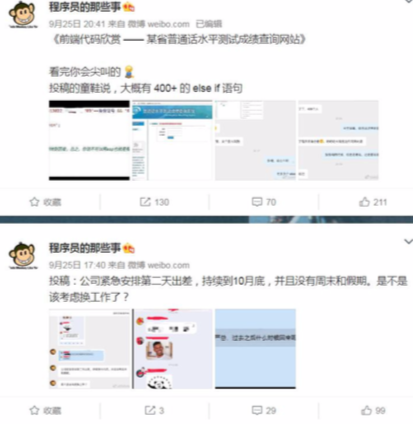

# 应用场景

- [用户消息时间线timeline](#用户消息时间线timeline)
- [消息队列](#消息队列)

## 用户消息时间线timeline

因为 List 是有序的，可以用来做用户时间线

## 消息队列

List 提供了两个阻塞的弹出操作:BLPOP/BRPOP，可以设置超时时间。

- BLPOP:BLPOP key1 timeout 移出并获取列表的第一个元素， 如果列表没有元素 会阻塞列表直到等待超时或发现可弹出元素为止。
- BRPOP:BRPOP key1 timeout 移出并获取列表的最后一个元素， 如果列表没有元 素会阻塞列表直到等待超时或发现可弹出元素为止。

队列:先进先出:rpush blpop，左头右尾，右边进入队列，左边出队列。 栈:先进后出:rpush brpop